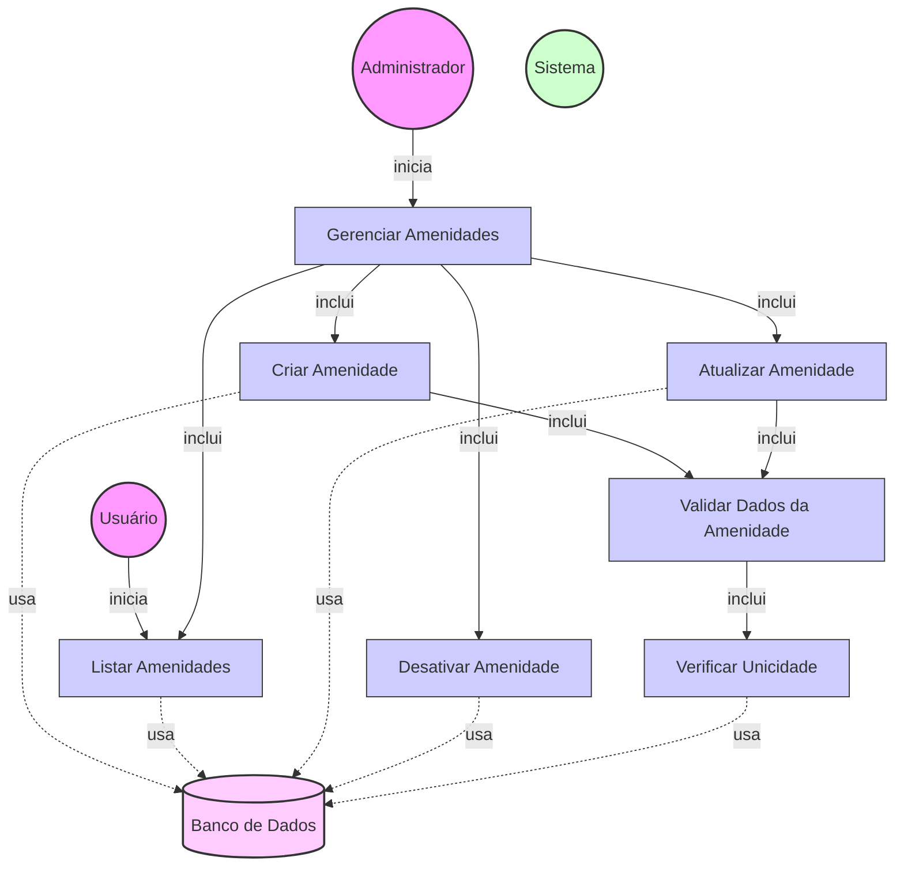

# Diagrama de Caso de Uso - Gerenciamento de Amenidades

## Descrição do Diagrama de Caso de Uso

Este diagrama representa o processo de gerenciamento de amenidades no sistema tuhogar-api. As amenidades são características ou facilidades de um imóvel que podem ser selecionadas durante a criação ou edição de anúncios imobiliários.

### Atores
- **Administrador**: Usuário com permissões administrativas que pode criar, atualizar e desativar amenidades
- **Usuário**: Usuário comum que pode visualizar a lista de amenidades disponíveis
- **Sistema**: O sistema tuhogar-api
- **Banco de Dados**: Armazenamento persistente das amenidades

### Casos de Uso
1. **Gerenciar Amenidades**: Caso de uso principal que representa o processo completo de gerenciamento de amenidades
2. **Criar Amenidade**: Adição de uma nova amenidade ao sistema
3. **Listar Amenidades**: Visualização da lista de amenidades disponíveis
4. **Atualizar Amenidade**: Modificação de uma amenidade existente
5. **Desativar Amenidade**: Marcação de uma amenidade como inativa
6. **Validar Dados da Amenidade**: Verificação da validade dos dados fornecidos
7. **Verificar Unicidade**: Verificação se já existe uma amenidade com o mesmo nome

## Fluxo Principal - Criar Amenidade

1. O Administrador acessa a interface de gerenciamento de amenidades
2. O Administrador seleciona a opção para criar uma nova amenidade
3. O Sistema apresenta um formulário com os campos necessários:
   - Nome da amenidade
   - Descrição (opcional)
   - Categoria (opcional)
   - Ícone (opcional)
4. O Administrador preenche os campos e confirma a criação
5. O Sistema executa o caso de uso "Validar Dados da Amenidade"
6. O Sistema executa o caso de uso "Verificar Unicidade"
7. O Sistema persiste a nova amenidade no banco de dados
8. O Sistema confirma a criação bem-sucedida da amenidade

## Fluxo Principal - Listar Amenidades

1. O Administrador ou Usuário acessa a interface de visualização de amenidades
2. O Sistema recupera a lista de amenidades do banco de dados
3. O Sistema exibe a lista de amenidades com suas informações:
   - Nome
   - Descrição
   - Categoria
   - Ícone
   - Status (ativo/inativo) - apenas para Administradores
4. O Administrador ou Usuário visualiza as amenidades disponíveis

## Fluxo Principal - Atualizar Amenidade

1. O Administrador acessa a interface de gerenciamento de amenidades
2. O Sistema exibe a lista de amenidades existentes
3. O Administrador seleciona uma amenidade para editar
4. O Sistema apresenta um formulário preenchido com os dados atuais da amenidade
5. O Administrador modifica os campos desejados e confirma a atualização
6. O Sistema executa o caso de uso "Validar Dados da Amenidade"
7. O Sistema executa o caso de uso "Verificar Unicidade" (se o nome foi alterado)
8. O Sistema persiste as alterações no banco de dados
9. O Sistema confirma a atualização bem-sucedida da amenidade

## Fluxo Principal - Desativar Amenidade

1. O Administrador acessa a interface de gerenciamento de amenidades
2. O Sistema exibe a lista de amenidades existentes
3. O Administrador seleciona uma amenidade para desativar
4. O Sistema solicita confirmação da desativação
5. O Administrador confirma a desativação
6. O Sistema marca a amenidade como inativa no banco de dados
7. O Sistema confirma a desativação bem-sucedida da amenidade

## Fluxos Alternativos

### FA1. Validação de Dados Falha
1. Durante a validação dos dados, se algum campo não atender aos requisitos:
   - O Sistema exibe mensagens de erro específicas para cada campo inválido
   - O Administrador corrige os dados
   - O fluxo retorna ao passo de confirmação da operação

### FA2. Nome de Amenidade Já Existe
1. Durante a verificação de unicidade, se já existir uma amenidade com o mesmo nome:
   - O Sistema exibe uma mensagem de erro informando que o nome já está em uso
   - O Administrador modifica o nome da amenidade
   - O fluxo retorna ao passo de confirmação da operação

### FA3. Cancelamento da Operação
1. Em qualquer ponto antes da confirmação final:
   - O Administrador cancela a operação
   - O Sistema retorna à interface de gerenciamento de amenidades sem realizar alterações

### FA4. Amenidade em Uso
1. Ao tentar desativar uma amenidade que está sendo utilizada em anúncios ativos:
   - O Sistema exibe um alerta informando que a amenidade está em uso
   - O Sistema solicita confirmação adicional do Administrador
   - Se confirmado, a amenidade é desativada, mas permanece visível nos anúncios existentes

## Regras de Negócio

- O nome da amenidade deve ser único
- O nome da amenidade deve ter entre 2 e 50 caracteres
- Amenidades desativadas não aparecem para seleção em novos anúncios
- Amenidades desativadas continuam visíveis em anúncios existentes que já as utilizavam
- Usuários comuns só podem visualizar amenidades ativas
- Administradores podem visualizar todas as amenidades, incluindo as inativas

## Pré-condições

- Para criar, atualizar ou desativar: O Administrador está autenticado no sistema e possui permissões administrativas
- Para listar: O Usuário ou Administrador está autenticado no sistema

## Pós-condições

- **Criar**: Uma nova amenidade é adicionada ao sistema
- **Listar**: As amenidades são exibidas conforme o perfil do usuário (todas para Administradores, apenas ativas para Usuários)
- **Atualizar**: A amenidade selecionada é atualizada no sistema
- **Desativar**: A amenidade selecionada é marcada como inativa no sistema
