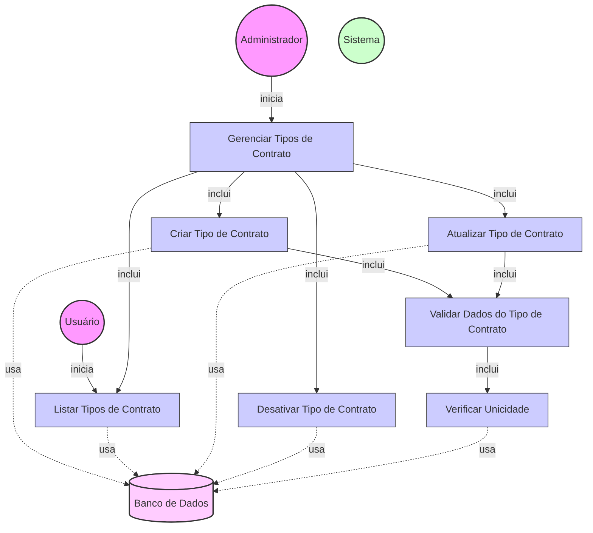

# Diagrama de Caso de Uso - Gerenciamento de Tipos de Contrato

## Descrição do Diagrama de Caso de Uso

Este diagrama representa o processo de gerenciamento de tipos de contrato no sistema tuhogar-api. Os tipos de contrato são utilizados para classificar os anúncios imobiliários de acordo com o tipo de transação (venda, aluguel, etc.) e as características específicas do contrato.

### Atores
- **Administrador**: Usuário com permissões administrativas que pode criar, atualizar e desativar tipos de contrato
- **Usuário**: Usuário comum que pode visualizar a lista de tipos de contrato disponíveis
- **Sistema**: O sistema tuhogar-api
- **Banco de Dados**: Armazenamento persistente dos tipos de contrato

### Casos de Uso
1. **Gerenciar Tipos de Contrato**: Caso de uso principal que representa o processo completo de gerenciamento de tipos de contrato
2. **Criar Tipo de Contrato**: Adição de um novo tipo de contrato ao sistema
3. **Listar Tipos de Contrato**: Visualização da lista de tipos de contrato disponíveis
4. **Atualizar Tipo de Contrato**: Modificação de um tipo de contrato existente
5. **Desativar Tipo de Contrato**: Marcação de um tipo de contrato como inativo
6. **Validar Dados do Tipo de Contrato**: Verificação da validade dos dados fornecidos
7. **Verificar Unicidade**: Verificação se já existe um tipo de contrato com o mesmo nome ou código

## Fluxo Principal - Criar Tipo de Contrato

1. O Administrador acessa a interface de gerenciamento de tipos de contrato
2. O Administrador seleciona a opção para criar um novo tipo de contrato
3. O Sistema apresenta um formulário com os campos necessários:
   - Nome do tipo de contrato
   - Código (identificador único para uso em APIs)
   - Descrição (opcional)
   - Tipo de transação (venda, aluguel, temporada, etc.)
   - Campos específicos do contrato (opcional)
4. O Administrador preenche os campos e confirma a criação
5. O Sistema executa o caso de uso "Validar Dados do Tipo de Contrato"
6. O Sistema executa o caso de uso "Verificar Unicidade"
7. O Sistema persiste o novo tipo de contrato no banco de dados
8. O Sistema confirma a criação bem-sucedida do tipo de contrato

## Fluxo Principal - Listar Tipos de Contrato

1. O Administrador ou Usuário acessa a interface de visualização de tipos de contrato
2. O Sistema recupera a lista de tipos de contrato do banco de dados
3. O Sistema exibe a lista de tipos de contrato com suas informações:
   - Nome
   - Código
   - Descrição
   - Tipo de transação
   - Status (ativo/inativo) - apenas para Administradores
4. O Administrador ou Usuário visualiza os tipos de contrato disponíveis

## Fluxo Principal - Atualizar Tipo de Contrato

1. O Administrador acessa a interface de gerenciamento de tipos de contrato
2. O Sistema exibe a lista de tipos de contrato existentes
3. O Administrador seleciona um tipo de contrato para editar
4. O Sistema apresenta um formulário preenchido com os dados atuais do tipo de contrato
5. O Administrador modifica os campos desejados e confirma a atualização
6. O Sistema executa o caso de uso "Validar Dados do Tipo de Contrato"
7. O Sistema executa o caso de uso "Verificar Unicidade" (se o nome ou código foram alterados)
8. O Sistema persiste as alterações no banco de dados
9. O Sistema confirma a atualização bem-sucedida do tipo de contrato

## Fluxo Principal - Desativar Tipo de Contrato

1. O Administrador acessa a interface de gerenciamento de tipos de contrato
2. O Sistema exibe a lista de tipos de contrato existentes
3. O Administrador seleciona um tipo de contrato para desativar
4. O Sistema solicita confirmação da desativação
5. O Administrador confirma a desativação
6. O Sistema verifica se existem anúncios ativos utilizando o tipo de contrato
7. O Sistema marca o tipo de contrato como inativo no banco de dados
8. O Sistema confirma a desativação bem-sucedida do tipo de contrato

## Fluxos Alternativos

### FA1. Validação de Dados Falha
1. Durante a validação dos dados, se algum campo não atender aos requisitos:
   - O Sistema exibe mensagens de erro específicas para cada campo inválido
   - O Administrador corrige os dados
   - O fluxo retorna ao passo de confirmação da operação

### FA2. Nome ou Código de Tipo de Contrato Já Existe
1. Durante a verificação de unicidade, se já existir um tipo de contrato com o mesmo nome ou código:
   - O Sistema exibe uma mensagem de erro informando que o nome ou código já está em uso
   - O Administrador modifica o nome ou código do tipo de contrato
   - O fluxo retorna ao passo de confirmação da operação

### FA3. Cancelamento da Operação
1. Em qualquer ponto antes da confirmação final:
   - O Administrador cancela a operação
   - O Sistema retorna à interface de gerenciamento de tipos de contrato sem realizar alterações

### FA4. Tipo de Contrato em Uso
1. Ao tentar desativar um tipo de contrato que está sendo utilizado em anúncios ativos:
   - O Sistema exibe um alerta informando que o tipo de contrato está em uso
   - O Sistema solicita confirmação adicional do Administrador
   - Se confirmado, o tipo de contrato é desativado, mas permanece visível nos anúncios existentes

## Regras de Negócio

- O nome do tipo de contrato deve ser único
- O código do tipo de contrato deve ser único
- O nome do tipo de contrato deve ter entre 2 e 50 caracteres
- O código do tipo de contrato deve ter entre 2 e 20 caracteres alfanuméricos
- Tipos de contrato desativados não aparecem para seleção em novos anúncios
- Tipos de contrato desativados continuam visíveis em anúncios existentes que já os utilizavam
- Usuários comuns só podem visualizar tipos de contrato ativos
- Administradores podem visualizar todos os tipos de contrato, incluindo os inativos

## Pré-condições

- Para criar, atualizar ou desativar: O Administrador está autenticado no sistema e possui permissões administrativas
- Para listar: O Usuário ou Administrador está autenticado no sistema

## Pós-condições

- **Criar**: Um novo tipo de contrato é adicionado ao sistema
- **Listar**: Os tipos de contrato são exibidos conforme o perfil do usuário (todos para Administradores, apenas ativos para Usuários)
- **Atualizar**: O tipo de contrato selecionado é atualizado no sistema
- **Desativar**: O tipo de contrato selecionado é marcado como inativo no sistema
