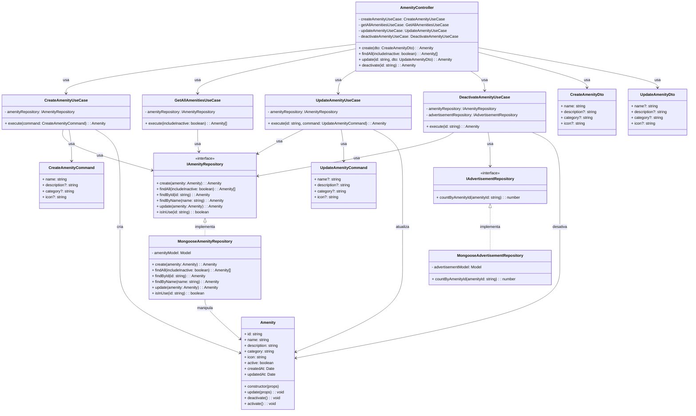

# Diagrama de Classes - Gerenciamento de Amenidades

## Descrição das Classes

### Camada de Interface

#### AmenityController
- **Descrição**: Controlador HTTP que expõe endpoints para gerenciamento de amenidades.
- **Atributos**:
  - `createAmenityUseCase`: Caso de uso para criação de amenidades
  - `getAllAmenitiesUseCase`: Caso de uso para listagem de amenidades
  - `updateAmenityUseCase`: Caso de uso para atualização de amenidades
  - `deactivateAmenityUseCase`: Caso de uso para desativação de amenidades
- **Métodos**:
  - `create(dto)`: Endpoint HTTP para criar uma nova amenidade
  - `findAll(includeInactive)`: Endpoint HTTP para listar amenidades
  - `update(id, dto)`: Endpoint HTTP para atualizar uma amenidade
  - `deactivate(id)`: Endpoint HTTP para desativar uma amenidade

#### CreateAmenityDto
- **Descrição**: Objeto de transferência de dados para criação de amenidades.
- **Atributos**:
  - `name`: Nome da amenidade
  - `description`: Descrição da amenidade (opcional)
  - `category`: Categoria da amenidade (opcional)
  - `icon`: Ícone da amenidade (opcional)

#### UpdateAmenityDto
- **Descrição**: Objeto de transferência de dados para atualização de amenidades.
- **Atributos**:
  - `name`: Nome da amenidade (opcional)
  - `description`: Descrição da amenidade (opcional)
  - `category`: Categoria da amenidade (opcional)
  - `icon`: Ícone da amenidade (opcional)

### Camada de Aplicação

#### CreateAmenityUseCase
- **Descrição**: Caso de uso responsável pela criação de novas amenidades.
- **Atributos**:
  - `amenityRepository`: Repositório de amenidades injetado via construtor
- **Métodos**:
  - `execute(command)`: Executa o caso de uso de criação de amenidade

#### GetAllAmenitiesUseCase
- **Descrição**: Caso de uso responsável pela listagem de amenidades.
- **Atributos**:
  - `amenityRepository`: Repositório de amenidades injetado via construtor
- **Métodos**:
  - `execute(includeInactive)`: Executa o caso de uso de listagem de amenidades

#### UpdateAmenityUseCase
- **Descrição**: Caso de uso responsável pela atualização de amenidades existentes.
- **Atributos**:
  - `amenityRepository`: Repositório de amenidades injetado via construtor
- **Métodos**:
  - `execute(id, command)`: Executa o caso de uso de atualização de amenidade

#### DeactivateAmenityUseCase
- **Descrição**: Caso de uso responsável pela desativação de amenidades.
- **Atributos**:
  - `amenityRepository`: Repositório de amenidades injetado via construtor
  - `advertisementRepository`: Repositório de anúncios injetado via construtor
- **Métodos**:
  - `execute(id)`: Executa o caso de uso de desativação de amenidade

#### CreateAmenityCommand
- **Descrição**: Comando para criação de amenidades.
- **Atributos**:
  - `name`: Nome da amenidade
  - `description`: Descrição da amenidade (opcional)
  - `category`: Categoria da amenidade (opcional)
  - `icon`: Ícone da amenidade (opcional)

#### UpdateAmenityCommand
- **Descrição**: Comando para atualização de amenidades.
- **Atributos**:
  - `name`: Nome da amenidade (opcional)
  - `description`: Descrição da amenidade (opcional)
  - `category`: Categoria da amenidade (opcional)
  - `icon`: Ícone da amenidade (opcional)

### Interfaces

#### IAmenityRepository
- **Descrição**: Interface que define os métodos necessários para persistência de amenidades.
- **Métodos**:
  - `create(amenity)`: Cria uma nova amenidade
  - `findAll(includeInactive)`: Recupera todas as amenidades
  - `findById(id)`: Busca uma amenidade pelo ID
  - `findByName(name)`: Busca uma amenidade pelo nome
  - `update(amenity)`: Atualiza uma amenidade existente
  - `isInUse(id)`: Verifica se uma amenidade está em uso em anúncios

#### IAdvertisementRepository
- **Descrição**: Interface que define os métodos necessários para consulta de anúncios.
- **Métodos**:
  - `countByAmenityId(amenityId)`: Conta quantos anúncios utilizam uma determinada amenidade

### Camada de Domínio

#### Amenity
- **Descrição**: Entidade de domínio que representa uma amenidade no sistema.
- **Atributos**:
  - `id`: Identificador único da amenidade
  - `name`: Nome da amenidade
  - `description`: Descrição da amenidade
  - `category`: Categoria da amenidade
  - `icon`: Ícone da amenidade
  - `active`: Indica se a amenidade está ativa ou não
  - `createdAt`: Data de criação da amenidade
  - `updatedAt`: Data de última atualização da amenidade
- **Métodos**:
  - `constructor(props)`: Inicializa uma nova instância de Amenity
  - `update(props)`: Atualiza as propriedades da amenidade
  - `deactivate()`: Marca a amenidade como inativa
  - `activate()`: Marca a amenidade como ativa

### Camada de Infraestrutura

#### MongooseAmenityRepository
- **Descrição**: Implementação concreta do repositório de amenidades usando Mongoose/MongoDB.
- **Atributos**:
  - `amenityModel`: Modelo Mongoose para a entidade Amenity
- **Métodos**:
  - `create(amenity)`: Implementa a criação de uma amenidade
  - `findAll(includeInactive)`: Implementa a busca de todas as amenidades
  - `findById(id)`: Implementa a busca de uma amenidade pelo ID
  - `findByName(name)`: Implementa a busca de uma amenidade pelo nome
  - `update(amenity)`: Implementa a atualização de uma amenidade
  - `isInUse(id)`: Implementa a verificação se uma amenidade está em uso

#### MongooseAdvertisementRepository
- **Descrição**: Implementação concreta do repositório de anúncios usando Mongoose/MongoDB.
- **Atributos**:
  - `advertisementModel`: Modelo Mongoose para a entidade Advertisement
- **Métodos**:
  - `countByAmenityId(amenityId)`: Implementa a contagem de anúncios que utilizam uma amenidade

## Fluxos Principais

### Fluxo de Criação de Amenidade
1. O cliente envia uma requisição HTTP POST para o endpoint de criação de amenidade com os dados necessários.
2. O `AmenityController` recebe a requisição e valida os dados através do `CreateAmenityDto`.
3. O `AmenityController` chama o método `execute` do `CreateAmenityUseCase`, passando os dados validados como `CreateAmenityCommand`.
4. O `CreateAmenityUseCase` verifica se já existe uma amenidade com o mesmo nome através do método `findByName` do `IAmenityRepository`.
5. Se não existir, o `CreateAmenityUseCase` cria uma nova instância da entidade `Amenity`.
6. O `CreateAmenityUseCase` chama o método `create` do `IAmenityRepository` para persistir a nova amenidade.
7. O resultado é retornado através das camadas até o cliente.

### Fluxo de Listagem de Amenidades
1. O cliente envia uma requisição HTTP GET para o endpoint de listagem de amenidades.
2. O `AmenityController` recebe a requisição e verifica o parâmetro `includeInactive`.
3. O `AmenityController` chama o método `execute` do `GetAllAmenitiesUseCase`, passando o parâmetro `includeInactive`.
4. O `GetAllAmenitiesUseCase` chama o método `findAll` do `IAmenityRepository`.
5. O resultado é retornado através das camadas até o cliente.

### Fluxo de Atualização de Amenidade
1. O cliente envia uma requisição HTTP PUT para o endpoint de atualização de amenidade com os dados a serem atualizados.
2. O `AmenityController` recebe a requisição e valida os dados através do `UpdateAmenityDto`.
3. O `AmenityController` chama o método `execute` do `UpdateAmenityUseCase`, passando o ID da amenidade e os dados validados como `UpdateAmenityCommand`.
4. O `UpdateAmenityUseCase` busca a amenidade existente pelo ID através do método `findById` do `IAmenityRepository`.
5. Se o nome for alterado, o `UpdateAmenityUseCase` verifica se já existe outra amenidade com o mesmo nome.
6. O `UpdateAmenityUseCase` atualiza as propriedades da amenidade existente.
7. O `UpdateAmenityUseCase` chama o método `update` do `IAmenityRepository` para persistir as alterações.
8. O resultado é retornado através das camadas até o cliente.

### Fluxo de Desativação de Amenidade
1. O cliente envia uma requisição HTTP PUT para o endpoint de desativação de amenidade.
2. O `AmenityController` recebe a requisição e chama o método `execute` do `DeactivateAmenityUseCase`, passando o ID da amenidade.
3. O `DeactivateAmenityUseCase` busca a amenidade existente pelo ID através do método `findById` do `IAmenityRepository`.
4. O `DeactivateAmenityUseCase` verifica se a amenidade está em uso em anúncios ativos através do método `countByAmenityId` do `IAdvertisementRepository`.
5. Se estiver em uso, o `DeactivateAmenityUseCase` pode solicitar confirmação adicional.
6. O `DeactivateAmenityUseCase` chama o método `deactivate` da entidade `Amenity`.
7. O `DeactivateAmenityUseCase` chama o método `update` do `IAmenityRepository` para persistir a desativação.
8. O resultado é retornado através das camadas até o cliente.

## Observações

- O diagrama segue os princípios de Clean Architecture, separando claramente as camadas de domínio, aplicação, infraestrutura e interface.
- A injeção de dependências é utilizada para garantir o baixo acoplamento entre os componentes.
- As interfaces são utilizadas para definir contratos entre as camadas, permitindo a substituição de implementações concretas sem afetar o restante do sistema.
- Os DTOs são utilizados para validação e transferência de dados na camada de interface, enquanto os Commands são utilizados para comunicação entre a camada de interface e a camada de aplicação.
- A entidade de domínio Amenity encapsula o comportamento relacionado às amenidades, como atualização e desativação.
