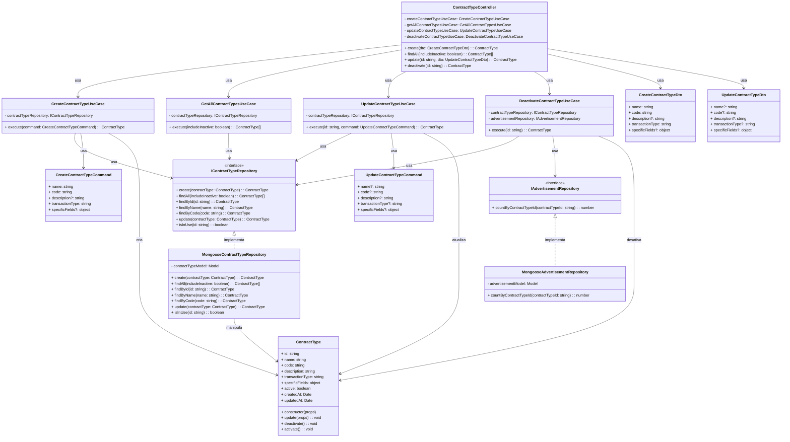

# Diagrama de Classes - Gerenciamento de Tipos de Contrato

## Descrição das Classes

### Camada de Interface

#### ContractTypeController
- **Descrição**: Controlador HTTP que expõe endpoints para gerenciamento de tipos de contrato.
- **Atributos**:
  - `createContractTypeUseCase`: Caso de uso para criação de tipos de contrato
  - `getAllContractTypesUseCase`: Caso de uso para listagem de tipos de contrato
  - `updateContractTypeUseCase`: Caso de uso para atualização de tipos de contrato
  - `deactivateContractTypeUseCase`: Caso de uso para desativação de tipos de contrato
- **Métodos**:
  - `create(dto)`: Endpoint HTTP para criar um novo tipo de contrato
  - `findAll(includeInactive)`: Endpoint HTTP para listar tipos de contrato
  - `update(id, dto)`: Endpoint HTTP para atualizar um tipo de contrato
  - `deactivate(id)`: Endpoint HTTP para desativar um tipo de contrato

#### CreateContractTypeDto
- **Descrição**: Objeto de transferência de dados para criação de tipos de contrato.
- **Atributos**:
  - `name`: Nome do tipo de contrato
  - `code`: Código único do tipo de contrato
  - `description`: Descrição do tipo de contrato (opcional)
  - `transactionType`: Tipo de transação (venda, aluguel, etc.)
  - `specificFields`: Campos específicos do tipo de contrato (opcional)

#### UpdateContractTypeDto
- **Descrição**: Objeto de transferência de dados para atualização de tipos de contrato.
- **Atributos**:
  - `name`: Nome do tipo de contrato (opcional)
  - `code`: Código único do tipo de contrato (opcional)
  - `description`: Descrição do tipo de contrato (opcional)
  - `transactionType`: Tipo de transação (opcional)
  - `specificFields`: Campos específicos do tipo de contrato (opcional)

### Camada de Aplicação

#### CreateContractTypeUseCase
- **Descrição**: Caso de uso responsável pela criação de novos tipos de contrato.
- **Atributos**:
  - `contractTypeRepository`: Repositório de tipos de contrato injetado via construtor
- **Métodos**:
  - `execute(command)`: Executa o caso de uso de criação de tipo de contrato

#### GetAllContractTypesUseCase
- **Descrição**: Caso de uso responsável pela listagem de tipos de contrato.
- **Atributos**:
  - `contractTypeRepository`: Repositório de tipos de contrato injetado via construtor
- **Métodos**:
  - `execute(includeInactive)`: Executa o caso de uso de listagem de tipos de contrato

#### UpdateContractTypeUseCase
- **Descrição**: Caso de uso responsável pela atualização de tipos de contrato existentes.
- **Atributos**:
  - `contractTypeRepository`: Repositório de tipos de contrato injetado via construtor
- **Métodos**:
  - `execute(id, command)`: Executa o caso de uso de atualização de tipo de contrato

#### DeactivateContractTypeUseCase
- **Descrição**: Caso de uso responsável pela desativação de tipos de contrato.
- **Atributos**:
  - `contractTypeRepository`: Repositório de tipos de contrato injetado via construtor
  - `advertisementRepository`: Repositório de anúncios injetado via construtor
- **Métodos**:
  - `execute(id)`: Executa o caso de uso de desativação de tipo de contrato

#### CreateContractTypeCommand
- **Descrição**: Comando para criação de tipos de contrato.
- **Atributos**:
  - `name`: Nome do tipo de contrato
  - `code`: Código único do tipo de contrato
  - `description`: Descrição do tipo de contrato (opcional)
  - `transactionType`: Tipo de transação
  - `specificFields`: Campos específicos do tipo de contrato (opcional)

#### UpdateContractTypeCommand
- **Descrição**: Comando para atualização de tipos de contrato.
- **Atributos**:
  - `name`: Nome do tipo de contrato (opcional)
  - `code`: Código único do tipo de contrato (opcional)
  - `description`: Descrição do tipo de contrato (opcional)
  - `transactionType`: Tipo de transação (opcional)
  - `specificFields`: Campos específicos do tipo de contrato (opcional)

### Interfaces

#### IContractTypeRepository
- **Descrição**: Interface que define os métodos necessários para persistência de tipos de contrato.
- **Métodos**:
  - `create(contractType)`: Cria um novo tipo de contrato
  - `findAll(includeInactive)`: Recupera todos os tipos de contrato
  - `findById(id)`: Busca um tipo de contrato pelo ID
  - `findByName(name)`: Busca um tipo de contrato pelo nome
  - `findByCode(code)`: Busca um tipo de contrato pelo código
  - `update(contractType)`: Atualiza um tipo de contrato existente
  - `isInUse(id)`: Verifica se um tipo de contrato está em uso em anúncios

#### IAdvertisementRepository
- **Descrição**: Interface que define os métodos necessários para consulta de anúncios.
- **Métodos**:
  - `countByContractTypeId(contractTypeId)`: Conta quantos anúncios utilizam um determinado tipo de contrato

### Camada de Domínio

#### ContractType
- **Descrição**: Entidade de domínio que representa um tipo de contrato no sistema.
- **Atributos**:
  - `id`: Identificador único do tipo de contrato
  - `name`: Nome do tipo de contrato
  - `code`: Código único do tipo de contrato
  - `description`: Descrição do tipo de contrato
  - `transactionType`: Tipo de transação
  - `specificFields`: Campos específicos do tipo de contrato
  - `active`: Indica se o tipo de contrato está ativo ou não
  - `createdAt`: Data de criação do tipo de contrato
  - `updatedAt`: Data de última atualização do tipo de contrato
- **Métodos**:
  - `constructor(props)`: Inicializa uma nova instância de ContractType
  - `update(props)`: Atualiza as propriedades do tipo de contrato
  - `deactivate()`: Marca o tipo de contrato como inativo
  - `activate()`: Marca o tipo de contrato como ativo

### Camada de Infraestrutura

#### MongooseContractTypeRepository
- **Descrição**: Implementação concreta do repositório de tipos de contrato usando Mongoose/MongoDB.
- **Atributos**:
  - `contractTypeModel`: Modelo Mongoose para a entidade ContractType
- **Métodos**:
  - `create(contractType)`: Implementa a criação de um tipo de contrato
  - `findAll(includeInactive)`: Implementa a busca de todos os tipos de contrato
  - `findById(id)`: Implementa a busca de um tipo de contrato pelo ID
  - `findByName(name)`: Implementa a busca de um tipo de contrato pelo nome
  - `findByCode(code)`: Implementa a busca de um tipo de contrato pelo código
  - `update(contractType)`: Implementa a atualização de um tipo de contrato
  - `isInUse(id)`: Implementa a verificação se um tipo de contrato está em uso

#### MongooseAdvertisementRepository
- **Descrição**: Implementação concreta do repositório de anúncios usando Mongoose/MongoDB.
- **Atributos**:
  - `advertisementModel`: Modelo Mongoose para a entidade Advertisement
- **Métodos**:
  - `countByContractTypeId(contractTypeId)`: Implementa a contagem de anúncios que utilizam um tipo de contrato

## Fluxos Principais

### Fluxo de Criação de Tipo de Contrato
1. O cliente envia uma requisição HTTP POST para o endpoint de criação de tipo de contrato com os dados necessários.
2. O `ContractTypeController` recebe a requisição e valida os dados através do `CreateContractTypeDto`.
3. O `ContractTypeController` chama o método `execute` do `CreateContractTypeUseCase`, passando os dados validados como `CreateContractTypeCommand`.
4. O `CreateContractTypeUseCase` verifica se já existe um tipo de contrato com o mesmo nome através do método `findByName` do `IContractTypeRepository`.
5. O `CreateContractTypeUseCase` verifica se já existe um tipo de contrato com o mesmo código através do método `findByCode` do `IContractTypeRepository`.
6. Se não existir, o `CreateContractTypeUseCase` cria uma nova instância da entidade `ContractType`.
7. O `CreateContractTypeUseCase` chama o método `create` do `IContractTypeRepository` para persistir o novo tipo de contrato.
8. O resultado é retornado através das camadas até o cliente.

### Fluxo de Listagem de Tipos de Contrato
1. O cliente envia uma requisição HTTP GET para o endpoint de listagem de tipos de contrato.
2. O `ContractTypeController` recebe a requisição e verifica o parâmetro `includeInactive`.
3. O `ContractTypeController` chama o método `execute` do `GetAllContractTypesUseCase`, passando o parâmetro `includeInactive`.
4. O `GetAllContractTypesUseCase` chama o método `findAll` do `IContractTypeRepository`.
5. O resultado é retornado através das camadas até o cliente.

### Fluxo de Atualização de Tipo de Contrato
1. O cliente envia uma requisição HTTP PUT para o endpoint de atualização de tipo de contrato com os dados a serem atualizados.
2. O `ContractTypeController` recebe a requisição e valida os dados através do `UpdateContractTypeDto`.
3. O `ContractTypeController` chama o método `execute` do `UpdateContractTypeUseCase`, passando o ID do tipo de contrato e os dados validados como `UpdateContractTypeCommand`.
4. O `UpdateContractTypeUseCase` busca o tipo de contrato existente pelo ID através do método `findById` do `IContractTypeRepository`.
5. Se o nome for alterado, o `UpdateContractTypeUseCase` verifica se já existe outro tipo de contrato com o mesmo nome.
6. Se o código for alterado, o `UpdateContractTypeUseCase` verifica se já existe outro tipo de contrato com o mesmo código.
7. O `UpdateContractTypeUseCase` atualiza as propriedades do tipo de contrato existente.
8. O `UpdateContractTypeUseCase` chama o método `update` do `IContractTypeRepository` para persistir as alterações.
9. O resultado é retornado através das camadas até o cliente.

### Fluxo de Desativação de Tipo de Contrato
1. O cliente envia uma requisição HTTP PUT para o endpoint de desativação de tipo de contrato.
2. O `ContractTypeController` recebe a requisição e chama o método `execute` do `DeactivateContractTypeUseCase`, passando o ID do tipo de contrato.
3. O `DeactivateContractTypeUseCase` busca o tipo de contrato existente pelo ID através do método `findById` do `IContractTypeRepository`.
4. O `DeactivateContractTypeUseCase` verifica se o tipo de contrato está em uso em anúncios ativos através do método `countByContractTypeId` do `IAdvertisementRepository`.
5. Se estiver em uso, o `DeactivateContractTypeUseCase` pode solicitar confirmação adicional.
6. O `DeactivateContractTypeUseCase` chama o método `deactivate` da entidade `ContractType`.
7. O `DeactivateContractTypeUseCase` chama o método `update` do `IContractTypeRepository` para persistir a desativação.
8. O resultado é retornado através das camadas até o cliente.

## Observações

- O diagrama segue os princípios de Clean Architecture, separando claramente as camadas de domínio, aplicação, infraestrutura e interface.
- A injeção de dependências é utilizada para garantir o baixo acoplamento entre os componentes.
- As interfaces são utilizadas para definir contratos entre as camadas, permitindo a substituição de implementações concretas sem afetar o restante do sistema.
- Os DTOs são utilizados para validação e transferência de dados na camada de interface, enquanto os Commands são utilizados para comunicação entre a camada de interface e a camada de aplicação.
- A entidade de domínio ContractType encapsula o comportamento relacionado aos tipos de contrato, como atualização e desativação.
- A verificação de unicidade é realizada tanto para o nome quanto para o código do tipo de contrato, garantindo que ambos sejam únicos no sistema.
