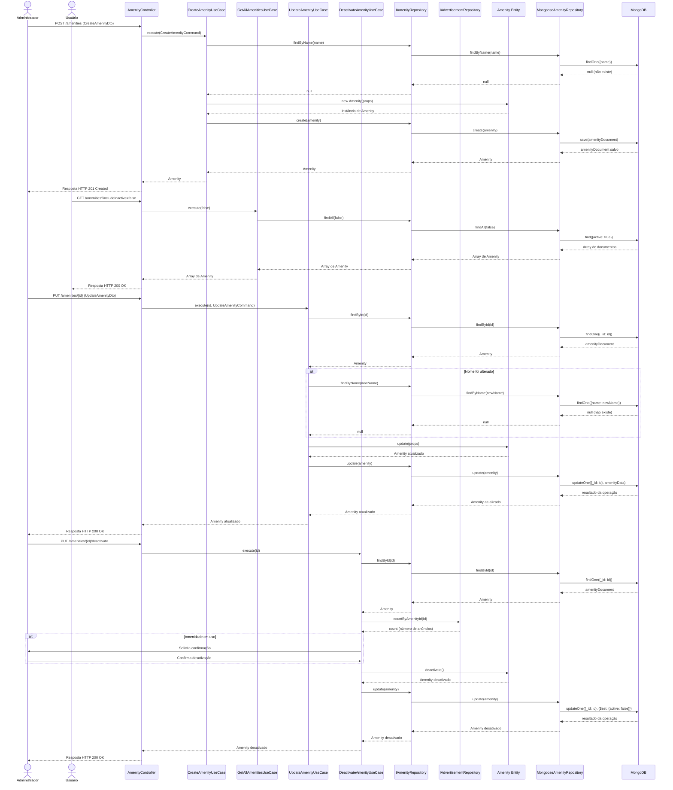

# Diagrama de Sequência - Gerenciamento de Amenidades

## Descrição
Este diagrama descreve a sequência de interações entre os componentes do sistema durante os processos de gerenciamento de amenidades, seguindo os princípios de Clean Architecture e Domain-Driven Design.

## Diagrama

## Descrição dos Fluxos

### Fluxo de Criação de Amenidade

1. **Administrador → AmenityController**:
   - O Administrador envia uma requisição HTTP POST para o endpoint `/amenities` com os dados da nova amenidade.

2. **AmenityController → CreateAmenityUseCase**:
   - O AmenityController valida os dados recebidos através do CreateAmenityDto.
   - O AmenityController chama o método `execute` do CreateAmenityUseCase, passando os dados validados como CreateAmenityCommand.

3. **CreateAmenityUseCase → IAmenityRepository → MongooseAmenityRepository → MongoDB**:
   - O CreateAmenityUseCase verifica se já existe uma amenidade com o mesmo nome, chamando o método `findByName` do IAmenityRepository.
   - A implementação MongooseAmenityRepository executa uma consulta no MongoDB.
   - O MongoDB retorna null, indicando que não existe uma amenidade com o nome fornecido.

4. **CreateAmenityUseCase → Amenity Entity**:
   - O CreateAmenityUseCase cria uma nova instância da entidade Amenity com os dados fornecidos.
   - A entidade Amenity valida os dados e retorna uma nova instância.

5. **CreateAmenityUseCase → IAmenityRepository → MongooseAmenityRepository → MongoDB**:
   - O CreateAmenityUseCase chama o método `create` do IAmenityRepository para persistir a nova amenidade.
   - A implementação MongooseAmenityRepository salva o documento no MongoDB.
   - O MongoDB retorna o documento salvo.
   - O MongooseAmenityRepository converte o documento em uma instância da entidade Amenity.
   - O resultado é retornado através das camadas até o Administrador.

### Fluxo de Listagem de Amenidades

1. **Usuário → AmenityController**:
   - O Usuário envia uma requisição HTTP GET para o endpoint `/amenities` com o parâmetro `includeInactive=false`.

2. **AmenityController → GetAllAmenitiesUseCase**:
   - O AmenityController chama o método `execute` do GetAllAmenitiesUseCase, passando o parâmetro `includeInactive`.

3. **GetAllAmenitiesUseCase → IAmenityRepository → MongooseAmenityRepository → MongoDB**:
   - O GetAllAmenitiesUseCase chama o método `findAll` do IAmenityRepository.
   - A implementação MongooseAmenityRepository executa uma consulta no MongoDB para recuperar as amenidades ativas.
   - O MongoDB retorna os documentos encontrados.
   - O MongooseAmenityRepository converte os documentos em instâncias da entidade Amenity.
   - O resultado é retornado através das camadas até o Usuário.

### Fluxo de Atualização de Amenidade

1. **Administrador → AmenityController**:
   - O Administrador envia uma requisição HTTP PUT para o endpoint `/amenities/{id}` com os dados a serem atualizados.

2. **AmenityController → UpdateAmenityUseCase**:
   - O AmenityController valida os dados recebidos através do UpdateAmenityDto.
   - O AmenityController chama o método `execute` do UpdateAmenityUseCase, passando o ID da amenidade e os dados validados como UpdateAmenityCommand.

3. **UpdateAmenityUseCase → IAmenityRepository → MongooseAmenityRepository → MongoDB**:
   - O UpdateAmenityUseCase busca a amenidade existente pelo ID através do método `findById` do IAmenityRepository.
   - A implementação MongooseAmenityRepository executa uma consulta no MongoDB.
   - O MongoDB retorna o documento encontrado.
   - O MongooseAmenityRepository converte o documento em uma instância da entidade Amenity.

4. **Verificação de Unicidade do Nome (se alterado)**:
   - Se o nome da amenidade for alterado, o UpdateAmenityUseCase verifica se já existe outra amenidade com o mesmo nome.
   - A verificação segue um fluxo similar ao passo 3, mas usando o método `findByName`.

5. **UpdateAmenityUseCase → Amenity Entity**:
   - O UpdateAmenityUseCase chama o método `update` da entidade Amenity, passando os novos dados.
   - A entidade Amenity atualiza suas propriedades e retorna a instância atualizada.

6. **UpdateAmenityUseCase → IAmenityRepository → MongooseAmenityRepository → MongoDB**:
   - O UpdateAmenityUseCase chama o método `update` do IAmenityRepository para persistir as alterações.
   - A implementação MongooseAmenityRepository atualiza o documento no MongoDB.
   - O MongoDB retorna o resultado da operação.
   - O resultado é retornado através das camadas até o Administrador.

### Fluxo de Desativação de Amenidade

1. **Administrador → AmenityController**:
   - O Administrador envia uma requisição HTTP PUT para o endpoint `/amenities/{id}/deactivate`.

2. **AmenityController → DeactivateAmenityUseCase**:
   - O AmenityController chama o método `execute` do DeactivateAmenityUseCase, passando o ID da amenidade.

3. **DeactivateAmenityUseCase → IAmenityRepository → MongooseAmenityRepository → MongoDB**:
   - O DeactivateAmenityUseCase busca a amenidade existente pelo ID através do método `findById` do IAmenityRepository.
   - A implementação MongooseAmenityRepository executa uma consulta no MongoDB.
   - O MongoDB retorna o documento encontrado.
   - O MongooseAmenityRepository converte o documento em uma instância da entidade Amenity.

4. **DeactivateAmenityUseCase → IAdvertisementRepository**:
   - O DeactivateAmenityUseCase verifica se a amenidade está em uso em anúncios ativos através do método `countByAmenityId` do IAdvertisementRepository.
   - O IAdvertisementRepository retorna o número de anúncios que utilizam a amenidade.

5. **Confirmação Adicional (se necessário)**:
   - Se a amenidade estiver em uso, o DeactivateAmenityUseCase solicita confirmação adicional do Administrador.
   - O Administrador confirma a desativação.

6. **DeactivateAmenityUseCase → Amenity Entity**:
   - O DeactivateAmenityUseCase chama o método `deactivate` da entidade Amenity.
   - A entidade Amenity atualiza seu estado para inativo e retorna a instância atualizada.

7. **DeactivateAmenityUseCase → IAmenityRepository → MongooseAmenityRepository → MongoDB**:
   - O DeactivateAmenityUseCase chama o método `update` do IAmenityRepository para persistir a desativação.
   - A implementação MongooseAmenityRepository atualiza o documento no MongoDB.
   - O MongoDB retorna o resultado da operação.
   - O resultado é retornado através das camadas até o Administrador.

## Fluxos Alternativos

### FA1. Nome de Amenidade Já Existe (Criação)

Se durante a verificação de unicidade do nome na criação de uma amenidade, for encontrada uma amenidade com o mesmo nome:
1. O MongoDB retorna o documento existente.
2. O MongooseAmenityRepository converte o documento em uma instância da entidade Amenity.
3. O CreateAmenityUseCase lança um erro informando que o nome já está em uso.
4. O AmenityController captura o erro e retorna um HTTP 409 Conflict para o Administrador.

### FA2. Nome de Amenidade Já Existe (Atualização)

Se durante a verificação de unicidade do nome na atualização de uma amenidade, for encontrada outra amenidade com o mesmo nome:
1. O MongoDB retorna o documento existente.
2. O MongooseAmenityRepository converte o documento em uma instância da entidade Amenity.
3. O UpdateAmenityUseCase lança um erro informando que o nome já está em uso.
4. O AmenityController captura o erro e retorna um HTTP 409 Conflict para o Administrador.

### FA3. Amenidade Não Encontrada

Se durante a busca de uma amenidade pelo ID, não for encontrada nenhuma amenidade:
1. O MongoDB retorna null.
2. O MongooseAmenityRepository repassa o null para o IAmenityRepository.
3. O caso de uso (UpdateAmenityUseCase ou DeactivateAmenityUseCase) lança um erro informando que a amenidade não foi encontrada.
4. O AmenityController captura o erro e retorna um HTTP 404 Not Found para o Administrador.

## Observações

- O diagrama segue os princípios de Clean Architecture, com fluxo de controle passando pelas camadas de interface, aplicação, domínio e infraestrutura.
- A injeção de dependências é utilizada para garantir o baixo acoplamento entre os componentes.
- As interfaces são utilizadas para definir contratos entre as camadas, permitindo a substituição de implementações concretas sem afetar o restante do sistema.
- A entidade de domínio Amenity encapsula o comportamento relacionado às amenidades, como atualização e desativação.
- A verificação de amenidades em uso é realizada antes da desativação para alertar sobre possíveis impactos.
