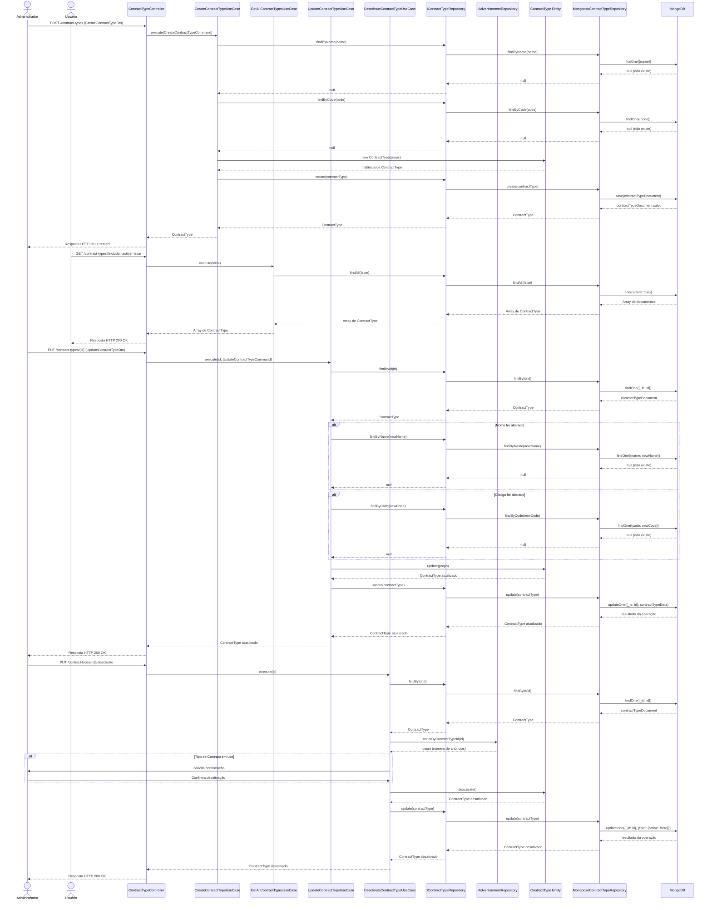

# Diagrama de Sequência - Gerenciamento de Tipos de Contrato

## Descrição
Este diagrama descreve a sequência de interações entre os componentes do sistema durante os processos de gerenciamento de tipos de contrato, seguindo os princípios de Clean Architecture e Domain-Driven Design.

## Diagrama

## Descrição dos Fluxos

### Fluxo de Criação de Tipo de Contrato

1. **Administrador → ContractTypeController**:
   - O Administrador envia uma requisição HTTP POST para o endpoint `/contract-types` com os dados do novo tipo de contrato.

2. **ContractTypeController → CreateContractTypeUseCase**:
   - O ContractTypeController valida os dados recebidos através do CreateContractTypeDto.
   - O ContractTypeController chama o método `execute` do CreateContractTypeUseCase, passando os dados validados como CreateContractTypeCommand.

3. **Verificação de Nome Único**:
   - O CreateContractTypeUseCase verifica se já existe um tipo de contrato com o mesmo nome, chamando o método `findByName` do IContractTypeRepository.
   - A implementação MongooseContractTypeRepository executa uma consulta no MongoDB.
   - O MongoDB retorna null, indicando que não existe um tipo de contrato com o nome fornecido.

4. **Verificação de Código Único**:
   - O CreateContractTypeUseCase verifica se já existe um tipo de contrato com o mesmo código, chamando o método `findByCode` do IContractTypeRepository.
   - A implementação MongooseContractTypeRepository executa uma consulta no MongoDB.
   - O MongoDB retorna null, indicando que não existe um tipo de contrato com o código fornecido.

5. **Criação da Entidade e Persistência**:
   - O CreateContractTypeUseCase cria uma nova instância da entidade ContractType com os dados fornecidos.
   - A entidade ContractType valida os dados e retorna uma nova instância.
   - O CreateContractTypeUseCase chama o método `create` do IContractTypeRepository para persistir o novo tipo de contrato.
   - A implementação MongooseContractTypeRepository salva o documento no MongoDB.
   - O resultado é retornado através das camadas até o Administrador.

### Fluxo de Listagem de Tipos de Contrato

1. **Usuário → ContractTypeController**:
   - O Usuário envia uma requisição HTTP GET para o endpoint `/contract-types` com o parâmetro `includeInactive=false`.

2. **ContractTypeController → GetAllContractTypesUseCase**:
   - O ContractTypeController chama o método `execute` do GetAllContractTypesUseCase, passando o parâmetro `includeInactive`.

3. **GetAllContractTypesUseCase → IContractTypeRepository → MongooseContractTypeRepository → MongoDB**:
   - O GetAllContractTypesUseCase chama o método `findAll` do IContractTypeRepository.
   - A implementação MongooseContractTypeRepository executa uma consulta no MongoDB para recuperar os tipos de contrato ativos.
   - O MongoDB retorna os documentos encontrados.
   - O MongooseContractTypeRepository converte os documentos em instâncias da entidade ContractType.
   - O resultado é retornado através das camadas até o Usuário.

### Fluxo de Atualização de Tipo de Contrato

1. **Administrador → ContractTypeController**:
   - O Administrador envia uma requisição HTTP PUT para o endpoint `/contract-types/{id}` com os dados a serem atualizados.

2. **ContractTypeController → UpdateContractTypeUseCase**:
   - O ContractTypeController valida os dados recebidos através do UpdateContractTypeDto.
   - O ContractTypeController chama o método `execute` do UpdateContractTypeUseCase, passando o ID do tipo de contrato e os dados validados como UpdateContractTypeCommand.

3. **Busca do Tipo de Contrato Existente**:
   - O UpdateContractTypeUseCase busca o tipo de contrato existente pelo ID através do método `findById` do IContractTypeRepository.
   - A implementação MongooseContractTypeRepository executa uma consulta no MongoDB.
   - O MongoDB retorna o documento encontrado.
   - O MongooseContractTypeRepository converte o documento em uma instância da entidade ContractType.

4. **Verificação de Nome Único (se alterado)**:
   - Se o nome do tipo de contrato for alterado, o UpdateContractTypeUseCase verifica se já existe outro tipo de contrato com o mesmo nome.
   - A verificação segue um fluxo similar ao passo 3 da criação, mas usando o método `findByName`.

5. **Verificação de Código Único (se alterado)**:
   - Se o código do tipo de contrato for alterado, o UpdateContractTypeUseCase verifica se já existe outro tipo de contrato com o mesmo código.
   - A verificação segue um fluxo similar ao passo 4 da criação, mas usando o método `findByCode`.

6. **Atualização da Entidade e Persistência**:
   - O UpdateContractTypeUseCase chama o método `update` da entidade ContractType, passando os novos dados.
   - A entidade ContractType atualiza suas propriedades e retorna a instância atualizada.
   - O UpdateContractTypeUseCase chama o método `update` do IContractTypeRepository para persistir as alterações.
   - A implementação MongooseContractTypeRepository atualiza o documento no MongoDB.
   - O resultado é retornado através das camadas até o Administrador.

### Fluxo de Desativação de Tipo de Contrato

1. **Administrador → ContractTypeController**:
   - O Administrador envia uma requisição HTTP PUT para o endpoint `/contract-types/{id}/deactivate`.

2. **ContractTypeController → DeactivateContractTypeUseCase**:
   - O ContractTypeController chama o método `execute` do DeactivateContractTypeUseCase, passando o ID do tipo de contrato.

3. **Busca do Tipo de Contrato Existente**:
   - O DeactivateContractTypeUseCase busca o tipo de contrato existente pelo ID através do método `findById` do IContractTypeRepository.
   - A implementação MongooseContractTypeRepository executa uma consulta no MongoDB.
   - O MongoDB retorna o documento encontrado.
   - O MongooseContractTypeRepository converte o documento em uma instância da entidade ContractType.

4. **Verificação de Uso em Anúncios**:
   - O DeactivateContractTypeUseCase verifica se o tipo de contrato está em uso em anúncios ativos através do método `countByContractTypeId` do IAdvertisementRepository.
   - O IAdvertisementRepository retorna o número de anúncios que utilizam o tipo de contrato.

5. **Confirmação Adicional (se necessário)**:
   - Se o tipo de contrato estiver em uso, o DeactivateContractTypeUseCase solicita confirmação adicional do Administrador.
   - O Administrador confirma a desativação.

6. **Desativação da Entidade e Persistência**:
   - O DeactivateContractTypeUseCase chama o método `deactivate` da entidade ContractType.
   - A entidade ContractType atualiza seu estado para inativo e retorna a instância atualizada.
   - O DeactivateContractTypeUseCase chama o método `update` do IContractTypeRepository para persistir a desativação.
   - A implementação MongooseContractTypeRepository atualiza o documento no MongoDB.
   - O resultado é retornado através das camadas até o Administrador.

## Fluxos Alternativos

### FA1. Nome de Tipo de Contrato Já Existe (Criação)

Se durante a verificação de unicidade do nome na criação de um tipo de contrato, for encontrado um tipo de contrato com o mesmo nome:
1. O MongoDB retorna o documento existente.
2. O MongooseContractTypeRepository converte o documento em uma instância da entidade ContractType.
3. O CreateContractTypeUseCase lança um erro informando que o nome já está em uso.
4. O ContractTypeController captura o erro e retorna um HTTP 409 Conflict para o Administrador.

### FA2. Código de Tipo de Contrato Já Existe (Criação)

Se durante a verificação de unicidade do código na criação de um tipo de contrato, for encontrado um tipo de contrato com o mesmo código:
1. O MongoDB retorna o documento existente.
2. O MongooseContractTypeRepository converte o documento em uma instância da entidade ContractType.
3. O CreateContractTypeUseCase lança um erro informando que o código já está em uso.
4. O ContractTypeController captura o erro e retorna um HTTP 409 Conflict para o Administrador.

### FA3. Nome de Tipo de Contrato Já Existe (Atualização)

Se durante a verificação de unicidade do nome na atualização de um tipo de contrato, for encontrado outro tipo de contrato com o mesmo nome:
1. O MongoDB retorna o documento existente.
2. O MongooseContractTypeRepository converte o documento em uma instância da entidade ContractType.
3. O UpdateContractTypeUseCase lança um erro informando que o nome já está em uso.
4. O ContractTypeController captura o erro e retorna um HTTP 409 Conflict para o Administrador.

### FA4. Código de Tipo de Contrato Já Existe (Atualização)

Se durante a verificação de unicidade do código na atualização de um tipo de contrato, for encontrado outro tipo de contrato com o mesmo código:
1. O MongoDB retorna o documento existente.
2. O MongooseContractTypeRepository converte o documento em uma instância da entidade ContractType.
3. O UpdateContractTypeUseCase lança um erro informando que o código já está em uso.
4. O ContractTypeController captura o erro e retorna um HTTP 409 Conflict para o Administrador.

### FA5. Tipo de Contrato Não Encontrado

Se durante a busca de um tipo de contrato pelo ID, não for encontrado nenhum tipo de contrato:
1. O MongoDB retorna null.
2. O MongooseContractTypeRepository repassa o null para o IContractTypeRepository.
3. O caso de uso (UpdateContractTypeUseCase ou DeactivateContractTypeUseCase) lança um erro informando que o tipo de contrato não foi encontrado.
4. O ContractTypeController captura o erro e retorna um HTTP 404 Not Found para o Administrador.

## Observações

- O diagrama segue os princípios de Clean Architecture, com fluxo de controle passando pelas camadas de interface, aplicação, domínio e infraestrutura.
- A injeção de dependências é utilizada para garantir o baixo acoplamento entre os componentes.
- As interfaces são utilizadas para definir contratos entre as camadas, permitindo a substituição de implementações concretas sem afetar o restante do sistema.
- A entidade de domínio ContractType encapsula o comportamento relacionado aos tipos de contrato, como atualização e desativação.
- A verificação de tipos de contrato em uso é realizada antes da desativação para alertar sobre possíveis impactos.
- A verificação de unicidade é realizada tanto para o nome quanto para o código do tipo de contrato, garantindo que ambos sejam únicos no sistema.
