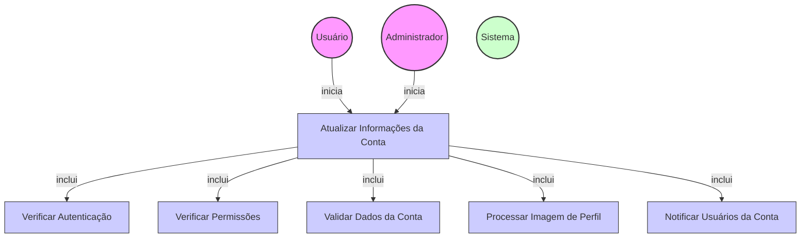

# Diagrama de Caso de Uso - Atualização de Informações da Conta

## Descrição do Diagrama de Caso de Uso

Este diagrama representa o processo de atualização de informações de uma conta no sistema tuhogar-api.

### Atores
- **Usuário**: Pessoa vinculada à conta que deseja atualizar suas informações
- **Administrador**: Usuário com privilégios elevados que pode atualizar qualquer conta
- **Sistema**: O sistema tuhogar-api

### Casos de Uso
1. **Atualizar Informações da Conta**: Processo principal de atualização dos dados de uma conta
2. **Verificar Autenticação**: Validação se o usuário está autenticado no sistema
3. **Verificar Permissões**: Validação se o usuário tem permissão para atualizar a conta
4. **Validar Dados da Conta**: Verificação da validade dos novos dados fornecidos
5. **Processar Imagem de Perfil**: Tratamento e armazenamento da nova imagem de perfil (se fornecida)
6. **Notificar Usuários da Conta**: Envio de notificação aos usuários vinculados à conta sobre as alterações

### Relacionamentos
- O Usuário ou o Administrador iniciam o processo de atualização de informações da conta
- O processo de atualização inclui verificação de autenticação, verificação de permissões, validação de dados, processamento de imagem e notificação de usuários

### Regras de Negócio
- O usuário deve estar autenticado para atualizar informações de uma conta
- Um usuário comum só pode atualizar a conta à qual está vinculado
- Um administrador pode atualizar qualquer conta
- Os novos dados da conta devem ser validados
- Se uma nova imagem de perfil for fornecida, ela deve ser processada e armazenada
- Os usuários vinculados à conta devem ser notificados sobre as alterações
- Alguns campos podem ter restrições específicas de atualização dependendo do tipo de conta ou status
