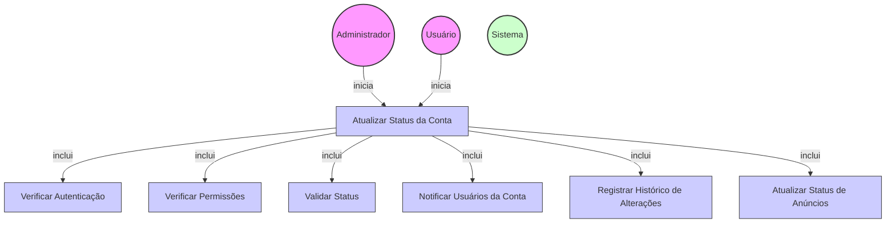

# Diagrama de Caso de Uso - Atualização de Status da Conta

## Descrição do Diagrama de Caso de Uso

Este diagrama representa o processo de atualização do status de uma conta no sistema tuhogar-api.

### Atores
- **Administrador**: Usuário com privilégios elevados que pode atualizar o status de qualquer conta
- **Usuário**: Pessoa vinculada à conta que pode atualizar o status da própria conta (com restrições)
- **Sistema**: O sistema tuhogar-api

### Casos de Uso
1. **Atualizar Status da Conta**: Processo principal de atualização do status de uma conta
2. **Verificar Autenticação**: Validação se o usuário está autenticado no sistema
3. **Verificar Permissões**: Validação se o usuário tem permissão para atualizar o status da conta
4. **Validar Status**: Verificação se o novo status é válido e se a transição é permitida
5. **Notificar Usuários da Conta**: Envio de notificações aos usuários vinculados à conta sobre a mudança de status
6. **Registrar Histórico de Alterações**: Registro da alteração de status no histórico da conta
7. **Atualizar Status de Anúncios**: Atualização do status dos anúncios vinculados à conta, se necessário

### Relacionamentos
- O Administrador ou o Usuário iniciam o processo de atualização de status
- O processo de atualização inclui verificação de autenticação, verificação de permissões, validação do status, notificação de usuários, registro no histórico e atualização de anúncios

### Regras de Negócio
- O usuário deve estar autenticado para atualizar o status da conta
- Um usuário comum só pode realizar certas transições de status (ex: ativar ou desativar sua própria conta)
- Um administrador pode realizar qualquer transição de status para qualquer conta
- O novo status deve ser um valor válido (ACTIVE, INACTIVE, PENDING, SUSPENDED)
- Certas transições de status podem ser restritas (ex: uma conta SUSPENDED só pode ser reativada por um administrador)
- Quando uma conta é suspensa ou inativada, os anúncios vinculados a ela podem ser automaticamente desativados
- Todas as alterações de status são registradas em um histórico para auditoria
- Os usuários vinculados à conta são notificados sobre a mudança de status
