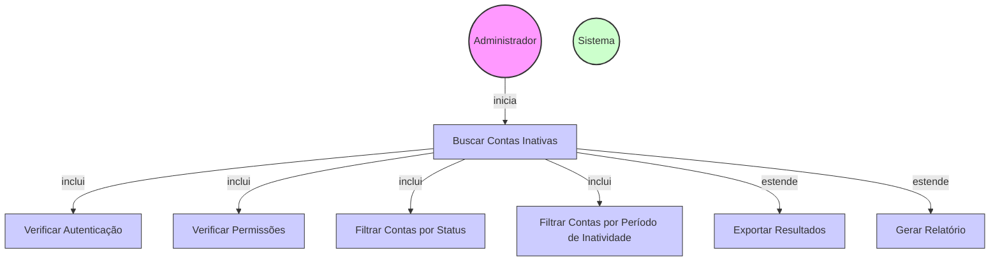

# Diagrama de Caso de Uso - Busca de Contas Inativas

## Descrição do Diagrama de Caso de Uso

Este diagrama representa o processo de busca de contas inativas no sistema tuhogar-api.

### Atores
- **Administrador**: Usuário com privilégios elevados que pode buscar contas inativas
- **Sistema**: O sistema tuhogar-api

### Casos de Uso
1. **Buscar Contas Inativas**: Processo principal de busca de contas inativas
2. **Verificar Autenticação**: Validação se o usuário está autenticado no sistema
3. **Verificar Permissões**: Validação se o usuário tem permissão para buscar contas inativas
4. **Filtrar Contas por Status**: Filtragem de contas com base no status (INACTIVE, SUSPENDED)
5. **Filtrar Contas por Período de Inatividade**: Filtragem de contas com base no período de inatividade
6. **Exportar Resultados**: Exportação dos resultados da busca em diferentes formatos (CSV, Excel, etc.)
7. **Gerar Relatório**: Geração de um relatório detalhado sobre as contas inativas

### Relacionamentos
- O Administrador inicia o processo de busca de contas inativas
- O processo de busca inclui verificação de autenticação, verificação de permissões, filtragem por status e filtragem por período de inatividade
- O processo de busca pode ser estendido para exportar os resultados ou gerar um relatório

### Regras de Negócio
- O usuário deve estar autenticado para buscar contas inativas
- Apenas administradores têm permissão para buscar contas inativas
- As contas podem ser filtradas por status (INACTIVE, SUSPENDED)
- As contas podem ser filtradas por período de inatividade (ex: inativas há mais de 30 dias)
- Os resultados podem ser exportados em diferentes formatos (CSV, Excel, etc.)
- Um relatório detalhado pode ser gerado com informações sobre as contas inativas
- O relatório pode incluir estatísticas como número de contas inativas, distribuição por tipo de conta, etc.
