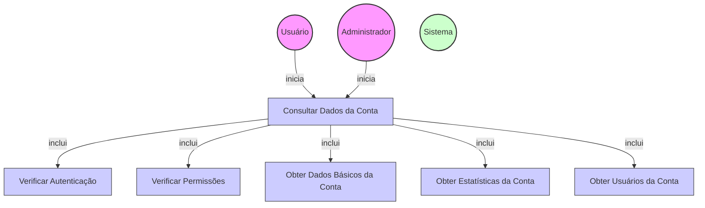

# Diagrama de Caso de Uso - Consulta de Dados da Conta

## Descrição do Diagrama de Caso de Uso

Este diagrama representa o processo de consulta de dados de uma conta no sistema tuhogar-api.

### Atores
- **Usuário**: Pessoa vinculada à conta que deseja consultar suas informações
- **Administrador**: Usuário com privilégios elevados que pode consultar qualquer conta
- **Sistema**: O sistema tuhogar-api

### Casos de Uso
1. **Consultar Dados da Conta**: Processo principal de obtenção dos dados de uma conta
2. **Verificar Autenticação**: Validação se o usuário está autenticado no sistema
3. **Verificar Permissões**: Validação se o usuário tem permissão para consultar a conta
4. **Obter Dados Básicos da Conta**: Recuperação das informações básicas da conta
5. **Obter Estatísticas da Conta**: Recuperação de métricas e estatísticas relacionadas à conta
6. **Obter Usuários da Conta**: Recuperação da lista de usuários vinculados à conta

### Relacionamentos
- O Usuário ou o Administrador iniciam o processo de consulta de dados da conta
- O processo de consulta inclui verificação de autenticação, verificação de permissões, obtenção de dados básicos, estatísticas e usuários vinculados

### Regras de Negócio
- O usuário deve estar autenticado para consultar dados de uma conta
- Um usuário comum só pode consultar a conta à qual está vinculado
- Um administrador pode consultar qualquer conta
- Os dados básicos incluem informações como nome, tipo, contato, etc.
- As estatísticas incluem métricas como número de anúncios, visualizações, etc.
- A lista de usuários vinculados inclui todos os usuários associados à conta
- Dependendo do nível de acesso do usuário, alguns dados podem ser omitidos ou limitados
