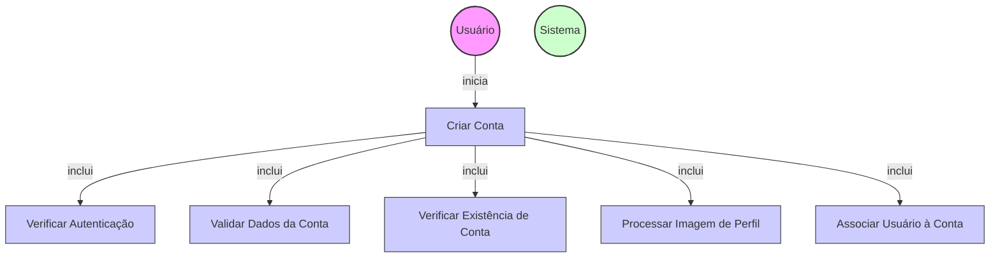

# Diagrama de Caso de Uso - Criação de Contas

## Descrição do Diagrama de Caso de Uso

Este diagrama representa o processo de criação de contas no sistema tuhogar-api.

### Atores
- **Usuário**: Pessoa que utiliza o sistema e deseja criar uma nova conta
- **Sistema**: O sistema tuhogar-api

### Casos de Uso
1. **Criar Conta**: Processo principal de criação de uma nova conta no sistema
2. **Verificar Autenticação**: Validação se o usuário está autenticado no sistema
3. **Validar Dados da Conta**: Verificação da validade dos dados fornecidos para a conta
4. **Verificar Existência de Conta**: Verificação se já existe uma conta com os mesmos dados
5. **Processar Imagem de Perfil**: Tratamento e armazenamento da imagem de perfil da conta
6. **Associar Usuário à Conta**: Vinculação do usuário autenticado à nova conta criada

### Relacionamentos
- O Usuário inicia o processo de criação de conta
- O processo de criação de conta inclui verificação de autenticação, validação de dados, verificação de existência, processamento de imagem e associação de usuário

### Regras de Negócio
- O usuário deve estar autenticado para criar uma conta
- Os dados da conta devem ser validados (nome, tipo, contato, etc.)
- Não deve existir outra conta com os mesmos dados identificadores
- A imagem de perfil da conta deve ser processada e armazenada
- O usuário criador deve ser automaticamente associado à conta com privilégios de administrador
- Uma conta pode representar uma imobiliária, um proprietário individual ou outro tipo de entidade imobiliária
