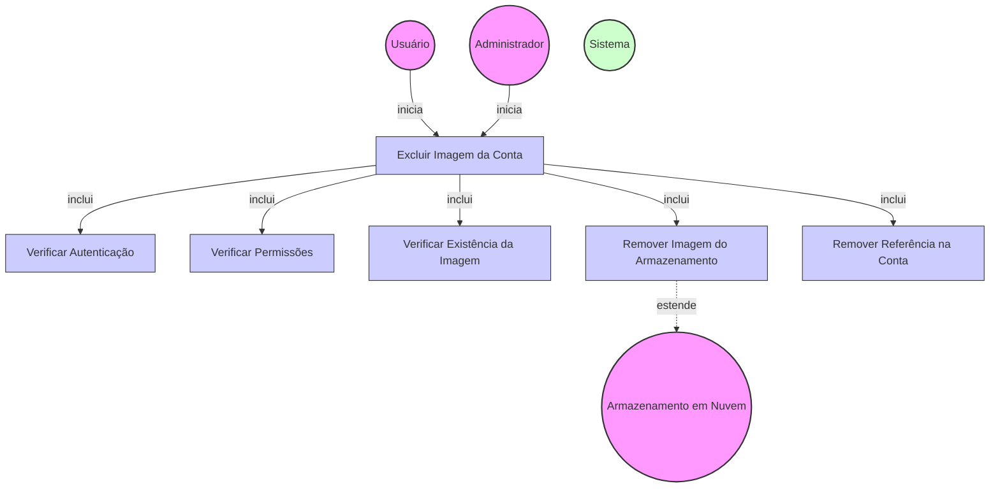

# Diagrama de Caso de Uso - Exclusão de Imagens da Conta

## Descrição do Diagrama de Caso de Uso

Este diagrama representa o processo de exclusão de imagens de uma conta no sistema tuhogar-api.

### Atores
- **Usuário**: Pessoa vinculada à conta que deseja excluir uma imagem
- **Administrador**: Usuário com privilégios elevados que pode excluir imagens de qualquer conta
- **Sistema**: O sistema tuhogar-api
- **Armazenamento em Nuvem**: Serviço externo para armazenamento de arquivos

### Casos de Uso
1. **Excluir Imagem da Conta**: Processo principal de exclusão de uma imagem da conta
2. **Verificar Autenticação**: Validação se o usuário está autenticado no sistema
3. **Verificar Permissões**: Validação se o usuário tem permissão para excluir imagens da conta
4. **Verificar Existência da Imagem**: Verificação se a imagem existe e está associada à conta
5. **Remover Imagem do Armazenamento**: Exclusão da imagem do serviço de armazenamento em nuvem
6. **Remover Referência na Conta**: Remoção da referência da imagem nos dados da conta

### Relacionamentos
- O Usuário ou o Administrador iniciam o processo de exclusão de imagem
- O processo de exclusão inclui verificação de autenticação, verificação de permissões, verificação de existência da imagem, remoção da imagem do armazenamento e remoção da referência na conta
- A remoção da imagem do armazenamento estende para o serviço de Armazenamento em Nuvem

### Regras de Negócio
- O usuário deve estar autenticado para excluir imagens
- Um usuário comum só pode excluir imagens da conta à qual está vinculado
- Um administrador pode excluir imagens de qualquer conta
- A imagem deve existir e estar associada à conta para ser excluída
- A imagem é removida do serviço de armazenamento em nuvem
- A referência da imagem (URL) é removida dos dados da conta
- Algumas imagens podem ser obrigatórias dependendo do tipo de conta, e não podem ser excluídas
