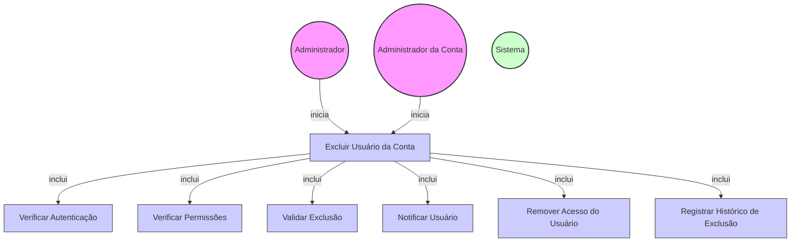

# Diagrama de Caso de Uso - Exclusão de Usuário da Conta

## Descrição do Diagrama de Caso de Uso

Este diagrama representa o processo de exclusão de um usuário de uma conta no sistema tuhogar-api.

### Atores
- **Administrador**: Usuário com privilégios elevados que pode excluir qualquer usuário de qualquer conta
- **Administrador da Conta**: Usuário com privilégios de administração em uma conta específica
- **Sistema**: O sistema tuhogar-api

### Casos de Uso
1. **Excluir Usuário da Conta**: Processo principal de exclusão de um usuário de uma conta
2. **Verificar Autenticação**: Validação se o solicitante está autenticado no sistema
3. **Verificar Permissões**: Validação se o solicitante tem permissão para excluir o usuário da conta
4. **Validar Exclusão**: Verificação se a exclusão é permitida (ex: não é o último administrador da conta)
5. **Notificar Usuário**: Envio de notificação ao usuário que está sendo excluído da conta
6. **Remover Acesso do Usuário**: Remoção dos acessos e permissões do usuário na conta
7. **Registrar Histórico de Exclusão**: Registro da exclusão do usuário para fins de auditoria

### Relacionamentos
- O Administrador ou o Administrador da Conta iniciam o processo de exclusão de usuário
- O processo de exclusão inclui verificação de autenticação, verificação de permissões, validação da exclusão, notificação do usuário, remoção de acesso e registro no histórico

### Regras de Negócio
- O solicitante deve estar autenticado para excluir um usuário de uma conta
- Um Administrador pode excluir qualquer usuário de qualquer conta
- Um Administrador da Conta só pode excluir usuários da conta que administra
- Não é permitido excluir o último administrador de uma conta
- Um usuário não pode excluir a si mesmo de uma conta (deve usar a funcionalidade de "Sair da conta")
- O usuário excluído deve ser notificado sobre a exclusão
- Todos os acessos e permissões do usuário na conta devem ser removidos
- A exclusão deve ser registrada em um histórico para fins de auditoria
- Os anúncios e outros recursos criados pelo usuário permanecem associados à conta
