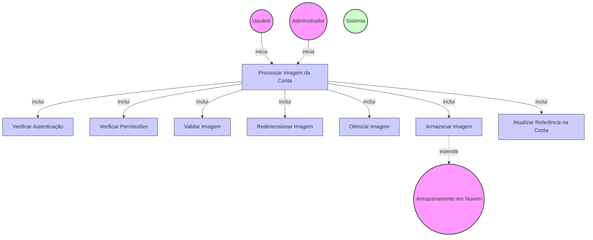

# Diagrama de Caso de Uso - Processamento de Imagens da Conta

## Descrição do Diagrama de Caso de Uso

Este diagrama representa o processo de processamento de imagens de uma conta no sistema tuhogar-api.

### Atores
- **Usuário**: Pessoa vinculada à conta que deseja processar uma imagem
- **Administrador**: Usuário com privilégios elevados que pode processar imagens para qualquer conta
- **Sistema**: O sistema tuhogar-api
- **Armazenamento em Nuvem**: Serviço externo para armazenamento de arquivos

### Casos de Uso
1. **Processar Imagem da Conta**: Processo principal de processamento de uma imagem para a conta
2. **Verificar Autenticação**: Validação se o usuário está autenticado no sistema
3. **Verificar Permissões**: Validação se o usuário tem permissão para processar imagens da conta
4. **Validar Imagem**: Verificação se a imagem atende aos requisitos (formato, tamanho, etc.)
5. **Redimensionar Imagem**: Ajuste das dimensões da imagem para os padrões do sistema
6. **Otimizar Imagem**: Compressão e otimização da imagem para melhor desempenho
7. **Armazenar Imagem**: Envio da imagem processada para o serviço de armazenamento
8. **Atualizar Referência na Conta**: Atualização da referência da imagem nos dados da conta

### Relacionamentos
- O Usuário ou o Administrador iniciam o processo de processamento de imagem
- O processo de processamento inclui verificação de autenticação, verificação de permissões, validação da imagem, redimensionamento, otimização, armazenamento e atualização da referência
- O armazenamento da imagem estende para o serviço de Armazenamento em Nuvem

### Regras de Negócio
- O usuário deve estar autenticado para processar imagens
- Um usuário comum só pode processar imagens para a conta à qual está vinculado
- Um administrador pode processar imagens para qualquer conta
- A imagem deve atender aos requisitos de formato (JPEG, PNG, etc.) e tamanho (máximo de X MB)
- A imagem é redimensionada para dimensões padronizadas (ex: logo 200x200px)
- A imagem é otimizada para reduzir o tamanho do arquivo mantendo a qualidade
- A imagem processada é armazenada em um serviço de armazenamento em nuvem
- A referência da imagem (URL) é atualizada nos dados da conta
