# Diagrama de Classes - Atualização de Informações da Conta

```mermaid
classDiagram
    %% Entidades de Domínio
    class Account {
        +string id
        +string name
        +AccountType type
        +string description
        +string phone
        +string email
        +string website
        +string logoUrl
        +string address
        +AccountStatus status
        +Date createdAt
        +Date updatedAt
        +constructor(props: Account)
    }
    
    class AccountType {
        <<enumeration>>
        REAL_ESTATE
        INDIVIDUAL_OWNER
        DEVELOPER
        OTHER
    }
    
    class AccountStatus {
        <<enumeration>>
        ACTIVE
        INACTIVE
        PENDING
        SUSPENDED
    }
    
    class User {
        +string id
        +string email
        +string name
        +string lastName
        +string phone
        +UserRole role
        +UserStatus status
        +string accountId
        +string firebaseId
        +Date createdAt
        +Date updatedAt
    }
    
    class AuthenticatedUser {
        +string id
        +string email
        +string name
        +UserRole role
        +string accountId
    }
    
    class UpdateAccountDto {
        +string name
        +string description
        +string phone
        +string email
        +string website
        +string address
        +constructor(props: UpdateAccountDto)
    }
    
    %% Interfaces
    class IAccountRepository {
        <<interface>>
        +findOneById(id: string) Promise~Account~
        +update(id: string, accountData: Partial~Account~) Promise~Account~
        +findOneByEmail(email: string) Promise~Account~
        +findOneByName(name: string) Promise~Account~
    }
    
    class IUserRepository {
        <<interface>>
        +findAllByAccountId(accountId: string) Promise~User[]~
    }
    
    class IImageProcessingService {
        <<interface>>
        +processAndUploadImage(imageFile: File, path: string) Promise~string~
    }
    
    class INotificationService {
        <<interface>>
        +notifyAccountUpdate(users: User[], account: Account) Promise~void~
    }
    
    %% Casos de Uso
    class UpdateAccountUseCase {
        -IAccountRepository accountRepository
        -IUserRepository userRepository
        -IImageProcessingService imageProcessingService
        -INotificationService notificationService
        +constructor(dependencies: ...)
        +execute(authenticatedUser: AuthenticatedUser, accountId: string, updateAccountDto: UpdateAccountDto, logoFile?: File) Promise~Account~
    }
    
    %% Implementações
    class MongooseAccountRepository {
        -AccountModel accountModel
        +constructor(accountModel: Model)
        +findOneById(id: string) Promise~Account~
        +update(id: string, accountData: Partial~Account~) Promise~Account~
        +findOneByEmail(email: string) Promise~Account~
        +findOneByName(name: string) Promise~Account~
    }
    
    class MongooseUserRepository {
        -UserModel userModel
        +constructor(userModel: Model)
        +findAllByAccountId(accountId: string) Promise~User[]~
    }
    
    class CloudImageProcessingService {
        -CloudStorageClient storageClient
        +constructor(storageClient: CloudStorageClient)
        +processAndUploadImage(imageFile: File, path: string) Promise~string~
    }
    
    class EmailNotificationService {
        -EmailService emailService
        +constructor(emailService: EmailService)
        +notifyAccountUpdate(users: User[], account: Account) Promise~void~
    }
    
    class AccountController {
        -UpdateAccountUseCase updateAccountUseCase
        +constructor(updateAccountUseCase: UpdateAccountUseCase)
        +update(authenticatedUser: AuthenticatedUser, accountId: string, updateAccountDto: UpdateAccountDto, logoFile?: File) Promise~Account~
    }
    
    %% Relações
    Account "1" -- "1" AccountType : tem >
    Account "1" -- "1" AccountStatus : tem >
    User "*" -- "1" Account : pertence a >
    
    IAccountRepository <|.. MongooseAccountRepository : implementa
    IUserRepository <|.. MongooseUserRepository : implementa
    IImageProcessingService <|.. CloudImageProcessingService : implementa
    INotificationService <|.. EmailNotificationService : implementa
    
    UpdateAccountUseCase --> IAccountRepository : usa >
    UpdateAccountUseCase --> IUserRepository : usa >
    UpdateAccountUseCase --> IImageProcessingService : usa >
    UpdateAccountUseCase --> INotificationService : usa >
    
    AccountController --> UpdateAccountUseCase : usa >
    
    UpdateAccountUseCase ..> AuthenticatedUser : usa >
    UpdateAccountUseCase ..> UpdateAccountDto : usa >
    UpdateAccountUseCase ..> Account : atualiza >
```

## Descrição do Diagrama de Classes

Este diagrama representa a estrutura de classes envolvidas no processo de atualização de informações de uma conta no sistema tuhogar-api.

### Entidades de Domínio
- **Account**: Representa uma conta no sistema com seus atributos
- **AccountType**: Enumeração que define os possíveis tipos de conta (REAL_ESTATE, INDIVIDUAL_OWNER, DEVELOPER, OTHER)
- **AccountStatus**: Enumeração que define os possíveis estados de uma conta (ACTIVE, INACTIVE, PENDING, SUSPENDED)
- **User**: Representa um usuário no sistema
- **AuthenticatedUser**: Representa um usuário autenticado com informações reduzidas
- **UpdateAccountDto**: Objeto de transferência de dados que contém as informações para atualização de uma conta

### Interfaces
- **IAccountRepository**: Interface para acesso e manipulação dos dados de contas
- **IUserRepository**: Interface para acesso aos dados de usuários
- **IImageProcessingService**: Interface para processamento e upload de imagens
- **INotificationService**: Interface para envio de notificações

### Casos de Uso
- **UpdateAccountUseCase**: Orquestra o processo de atualização de informações de uma conta

### Implementações
- **MongooseAccountRepository**: Implementação do repositório de contas usando MongoDB/Mongoose
- **MongooseUserRepository**: Implementação do repositório de usuários usando MongoDB/Mongoose
- **CloudImageProcessingService**: Implementação do serviço de processamento de imagens usando um serviço de armazenamento em nuvem
- **EmailNotificationService**: Implementação do serviço de notificação por email
- **AccountController**: Controlador HTTP para endpoints relacionados a contas

### Relações
- Uma Account tem um AccountType e um AccountStatus
- Vários Users podem pertencer a uma Account
- MongooseAccountRepository implementa IAccountRepository
- MongooseUserRepository implementa IUserRepository
- CloudImageProcessingService implementa IImageProcessingService
- EmailNotificationService implementa INotificationService
- UpdateAccountUseCase depende de IAccountRepository, IUserRepository, IImageProcessingService e INotificationService
- AccountController depende de UpdateAccountUseCase
- UpdateAccountUseCase usa AuthenticatedUser e UpdateAccountDto, e atualiza Account

### Responsabilidades
- O UpdateAccountUseCase coordena todo o processo de atualização de informações da conta, incluindo:
  - Verificação de autenticação e permissões
  - Validação dos novos dados da conta
  - Verificação de conflitos (email ou nome já existentes)
  - Processamento da nova imagem de perfil (se fornecida)
  - Atualização da conta no banco de dados
  - Notificação dos usuários vinculados à conta

Este diagrama segue os princípios de Clean Architecture, com separação clara entre entidades de domínio, casos de uso, interfaces e implementações.
