# Diagrama de Classes - Atualização de Status da Conta

```mermaid
classDiagram
    %% Entidades de Domínio
    class Account {
        +string id
        +string name
        +AccountType type
        +string description
        +string phone
        +string email
        +string website
        +string logoUrl
        +string address
        +AccountStatus status
        +Date createdAt
        +Date updatedAt
        +constructor(props: Account)
        +canTransitionTo(newStatus: AccountStatus): boolean
    }
    
    class AccountType {
        <<enumeration>>
        REAL_ESTATE
        INDIVIDUAL_OWNER
        DEVELOPER
        OTHER
    }
    
    class AccountStatus {
        <<enumeration>>
        ACTIVE
        INACTIVE
        PENDING
        SUSPENDED
    }
    
    class AccountStatusHistory {
        +string id
        +string accountId
        +AccountStatus oldStatus
        +AccountStatus newStatus
        +string userId
        +string reason
        +Date createdAt
        +constructor(props: AccountStatusHistory)
    }
    
    class User {
        +string id
        +string email
        +string name
        +string lastName
        +string phone
        +UserRole role
        +UserStatus status
        +string accountId
        +string firebaseId
        +Date createdAt
        +Date updatedAt
    }
    
    class AuthenticatedUser {
        +string id
        +string email
        +string name
        +UserRole role
        +string accountId
        +isAdmin(): boolean
        +belongsToAccount(accountId: string): boolean
    }
    
    class UserRole {
        <<enumeration>>
        ADMIN
        ACCOUNT_ADMIN
        ACCOUNT_USER
    }
    
    class UpdateAccountStatusDto {
        +AccountStatus status
        +string reason
    }
    
    %% Interfaces
    class IAccountRepository {
        <<interface>>
        +findOneById(id: string) Promise~Account~
        +update(id: string, accountData: Partial~Account~) Promise~Account~
    }
    
    class IAccountStatusHistoryRepository {
        <<interface>>
        +create(historyData: AccountStatusHistory) Promise~AccountStatusHistory~
    }
    
    class IAdvertisementRepository {
        <<interface>>
        +updateStatusByAccountId(accountId: string, status: string) Promise~number~
    }
    
    class INotificationService {
        <<interface>>
        +notifyAccountStatusChange(account: Account, oldStatus: AccountStatus, newStatus: AccountStatus, reason: string) Promise~void~
    }
    
    %% Casos de Uso
    class UpdateAccountStatusUseCase {
        -IAccountRepository accountRepository
        -IAccountStatusHistoryRepository accountStatusHistoryRepository
        -IAdvertisementRepository advertisementRepository
        -INotificationService notificationService
        +constructor(dependencies: ...)
        +execute(authenticatedUser: AuthenticatedUser, accountId: string, updateStatusDto: UpdateAccountStatusDto) Promise~Account~
    }
    
    %% Implementações
    class MongooseAccountRepository {
        -AccountModel accountModel
        +constructor(accountModel: Model)
        +findOneById(id: string) Promise~Account~
        +update(id: string, accountData: Partial~Account~) Promise~Account~
    }
    
    class MongooseAccountStatusHistoryRepository {
        -AccountStatusHistoryModel historyModel
        +constructor(historyModel: Model)
        +create(historyData: AccountStatusHistory) Promise~AccountStatusHistory~
    }
    
    class MongooseAdvertisementRepository {
        -AdvertisementModel advertisementModel
        +constructor(advertisementModel: Model)
        +updateStatusByAccountId(accountId: string, status: string) Promise~number~
    }
    
    class EmailNotificationService {
        -EmailClient emailClient
        +constructor(emailClient: EmailClient)
        +notifyAccountStatusChange(account: Account, oldStatus: AccountStatus, newStatus: AccountStatus, reason: string) Promise~void~
    }
    
    class AccountController {
        -UpdateAccountStatusUseCase updateAccountStatusUseCase
        +constructor(updateAccountStatusUseCase: UpdateAccountStatusUseCase)
        +updateStatus(authenticatedUser: AuthenticatedUser, accountId: string, updateStatusDto: UpdateAccountStatusDto) Promise~Account~
    }
    
    %% Relações
    Account "1" -- "1" AccountType : tem >
    Account "1" -- "1" AccountStatus : tem >
    Account "1" -- "*" AccountStatusHistory : tem >
    User "*" -- "1" Account : pertence a >
    User "1" -- "1" UserRole : tem >
    
    IAccountRepository <|.. MongooseAccountRepository : implementa
    IAccountStatusHistoryRepository <|.. MongooseAccountStatusHistoryRepository : implementa
    IAdvertisementRepository <|.. MongooseAdvertisementRepository : implementa
    INotificationService <|.. EmailNotificationService : implementa
    
    UpdateAccountStatusUseCase --> IAccountRepository : usa >
    UpdateAccountStatusUseCase --> IAccountStatusHistoryRepository : usa >
    UpdateAccountStatusUseCase --> IAdvertisementRepository : usa >
    UpdateAccountStatusUseCase --> INotificationService : usa >
    
    AccountController --> UpdateAccountStatusUseCase : usa >
    
    UpdateAccountStatusUseCase ..> AuthenticatedUser : usa >
    UpdateAccountStatusUseCase ..> UpdateAccountStatusDto : usa >
    UpdateAccountStatusUseCase ..> Account : atualiza >
    UpdateAccountStatusUseCase ..> AccountStatusHistory : cria >
```

## Descrição do Diagrama de Classes

Este diagrama representa a estrutura de classes envolvidas no processo de atualização de status de uma conta no sistema tuhogar-api, seguindo os princípios de Clean Architecture.

### Entidades de Domínio
- **Account**: Representa uma conta no sistema com seus atributos e métodos para validar transições de status
- **AccountType**: Enumeração que define os possíveis tipos de conta
- **AccountStatus**: Enumeração que define os possíveis estados de uma conta (ACTIVE, INACTIVE, PENDING, SUSPENDED)
- **AccountStatusHistory**: Entidade que registra o histórico de alterações de status de uma conta
- **User**: Representa um usuário no sistema
- **AuthenticatedUser**: Representa um usuário autenticado com informações reduzidas e métodos para verificar permissões
- **UserRole**: Enumeração que define os papéis de usuário (ADMIN, ACCOUNT_ADMIN, ACCOUNT_USER)
- **UpdateAccountStatusDto**: Objeto de transferência de dados para atualização de status de conta

### Interfaces
- **IAccountRepository**: Interface para acesso e manipulação dos dados de contas
- **IAccountStatusHistoryRepository**: Interface para registro do histórico de alterações de status
- **IAdvertisementRepository**: Interface para manipulação de anúncios relacionados à conta
- **INotificationService**: Interface para envio de notificações sobre alterações de status

### Casos de Uso
- **UpdateAccountStatusUseCase**: Orquestra o processo de atualização de status de uma conta

### Implementações
- **MongooseAccountRepository**: Implementação do repositório de contas usando MongoDB/Mongoose
- **MongooseAccountStatusHistoryRepository**: Implementação do repositório de histórico usando MongoDB/Mongoose
- **MongooseAdvertisementRepository**: Implementação do repositório de anúncios usando MongoDB/Mongoose
- **EmailNotificationService**: Implementação do serviço de notificação usando e-mail
- **AccountController**: Controlador HTTP para endpoints relacionados a contas

### Relações
- Uma Account tem um AccountType e um AccountStatus
- Uma Account tem vários AccountStatusHistory
- Vários Users podem pertencer a uma Account
- Um User tem um UserRole
- As implementações de repositório implementam suas respectivas interfaces
- UpdateAccountStatusUseCase depende de IAccountRepository, IAccountStatusHistoryRepository, IAdvertisementRepository e INotificationService
- AccountController depende de UpdateAccountStatusUseCase
- UpdateAccountStatusUseCase usa AuthenticatedUser e UpdateAccountStatusDto, atualiza Account e cria AccountStatusHistory

### Responsabilidades
- O UpdateAccountStatusUseCase coordena todo o processo de atualização de status, incluindo:
  - Verificação de autenticação e permissões
  - Validação da transição de status
  - Atualização do status da conta
  - Registro da alteração no histórico
  - Atualização do status dos anúncios vinculados à conta (se necessário)
  - Notificação dos usuários sobre a alteração

Este diagrama segue os princípios de Clean Architecture, com separação clara entre entidades de domínio, casos de uso, interfaces e implementações, conforme a estrutura do projeto tuhogar-api.
