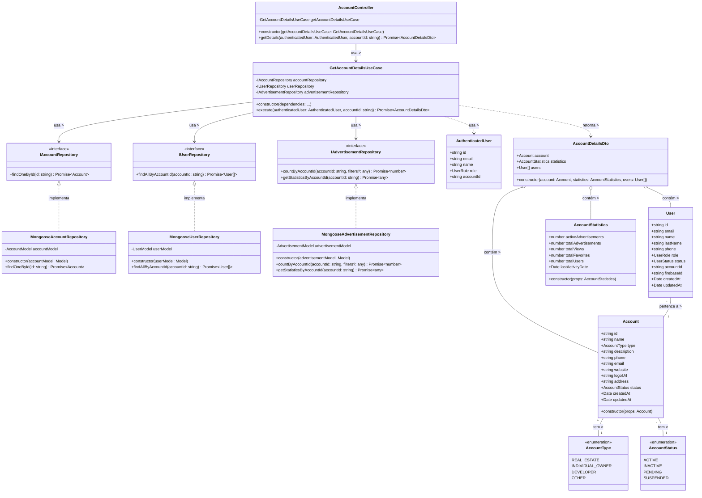

# Diagrama de Classes - Consulta de Dados da Conta

## Descrição do Diagrama de Classes

Este diagrama representa a estrutura de classes envolvidas no processo de consulta de dados de uma conta no sistema tuhogar-api.

### Entidades de Domínio
- **Account**: Representa uma conta no sistema com seus atributos
- **AccountType**: Enumeração que define os possíveis tipos de conta (REAL_ESTATE, INDIVIDUAL_OWNER, DEVELOPER, OTHER)
- **AccountStatus**: Enumeração que define os possíveis estados de uma conta (ACTIVE, INACTIVE, PENDING, SUSPENDED)
- **User**: Representa um usuário no sistema
- **AuthenticatedUser**: Representa um usuário autenticado com informações reduzidas
- **AccountStatistics**: Contém métricas e estatísticas relacionadas à conta
- **AccountDetailsDto**: Objeto de transferência de dados que agrupa informações da conta, estatísticas e usuários

### Interfaces
- **IAccountRepository**: Interface para acesso aos dados de contas
- **IUserRepository**: Interface para acesso aos dados de usuários
- **IAdvertisementRepository**: Interface para acesso aos dados de anúncios e estatísticas

### Casos de Uso
- **GetAccountDetailsUseCase**: Orquestra o processo de consulta de dados detalhados de uma conta

### Implementações
- **MongooseAccountRepository**: Implementação do repositório de contas usando MongoDB/Mongoose
- **MongooseUserRepository**: Implementação do repositório de usuários usando MongoDB/Mongoose
- **MongooseAdvertisementRepository**: Implementação do repositório de anúncios usando MongoDB/Mongoose
- **AccountController**: Controlador HTTP para endpoints relacionados a contas

### Relações
- Uma Account tem um AccountType e um AccountStatus
- Vários Users podem pertencer a uma Account
- MongooseAccountRepository implementa IAccountRepository
- MongooseUserRepository implementa IUserRepository
- MongooseAdvertisementRepository implementa IAdvertisementRepository
- GetAccountDetailsUseCase depende de IAccountRepository, IUserRepository e IAdvertisementRepository
- AccountController depende de GetAccountDetailsUseCase
- GetAccountDetailsUseCase usa AuthenticatedUser e retorna AccountDetailsDto
- AccountDetailsDto contém Account, AccountStatistics e uma lista de User

### Responsabilidades
- O GetAccountDetailsUseCase coordena todo o processo de consulta de dados da conta, incluindo:
  - Verificação de autenticação e permissões
  - Obtenção dos dados básicos da conta
  - Obtenção das estatísticas relacionadas à conta
  - Obtenção da lista de usuários vinculados à conta
  - Montagem do objeto de resposta com todos os dados

Este diagrama segue os princípios de Clean Architecture, com separação clara entre entidades de domínio, casos de uso, interfaces e implementações.
