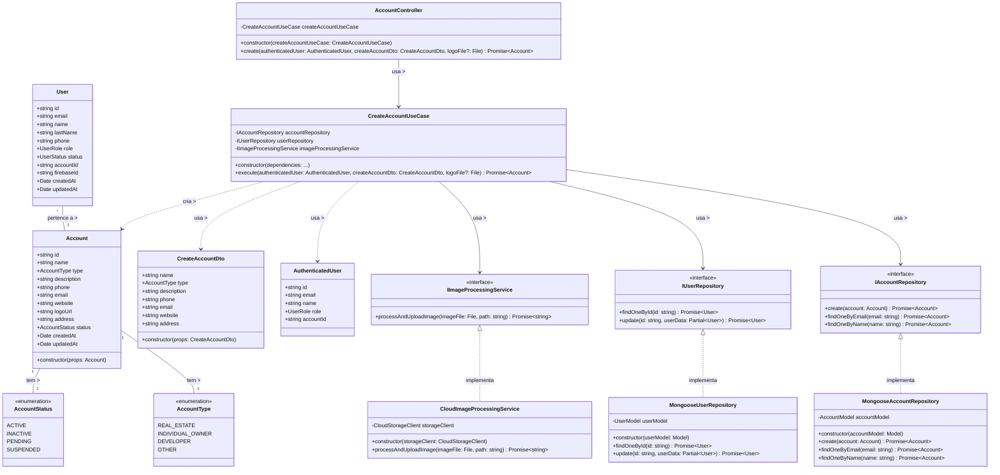

# Diagrama de Classes - Criação de Contas

## Descrição do Diagrama de Classes

Este diagrama representa a estrutura de classes envolvidas no processo de criação de contas no sistema tuhogar-api.

### Entidades de Domínio
- **Account**: Representa uma conta no sistema com seus atributos
- **AccountType**: Enumeração que define os possíveis tipos de conta (REAL_ESTATE, INDIVIDUAL_OWNER, DEVELOPER, OTHER)
- **AccountStatus**: Enumeração que define os possíveis estados de uma conta (ACTIVE, INACTIVE, PENDING, SUSPENDED)
- **User**: Representa um usuário no sistema
- **AuthenticatedUser**: Representa um usuário autenticado com informações reduzidas
- **CreateAccountDto**: Objeto de transferência de dados que contém as informações para criação de uma conta

### Interfaces
- **IAccountRepository**: Interface para acesso e manipulação dos dados de contas
- **IUserRepository**: Interface para acesso e manipulação dos dados de usuários
- **IImageProcessingService**: Interface para processamento e upload de imagens

### Casos de Uso
- **CreateAccountUseCase**: Orquestra o processo de criação de uma nova conta

### Implementações
- **MongooseAccountRepository**: Implementação do repositório de contas usando MongoDB/Mongoose
- **MongooseUserRepository**: Implementação do repositório de usuários usando MongoDB/Mongoose
- **CloudImageProcessingService**: Implementação do serviço de processamento de imagens usando um serviço de armazenamento em nuvem
- **AccountController**: Controlador HTTP para endpoints relacionados a contas

### Relações
- Uma Account tem um AccountType e um AccountStatus
- Vários Users podem pertencer a uma Account
- MongooseAccountRepository implementa IAccountRepository
- MongooseUserRepository implementa IUserRepository
- CloudImageProcessingService implementa IImageProcessingService
- CreateAccountUseCase depende de IAccountRepository, IUserRepository e IImageProcessingService
- AccountController depende de CreateAccountUseCase
- CreateAccountUseCase usa AuthenticatedUser e CreateAccountDto, e cria Account

### Responsabilidades
- O CreateAccountUseCase coordena todo o processo de criação de conta, incluindo:
  - Validação dos dados da conta
  - Verificação de existência de conta com os mesmos dados
  - Processamento da imagem de perfil (se fornecida)
  - Criação da conta no banco de dados
  - Associação do usuário autenticado à nova conta

Este diagrama segue os princípios de Clean Architecture, com separação clara entre entidades de domínio, casos de uso, interfaces e implementações.
