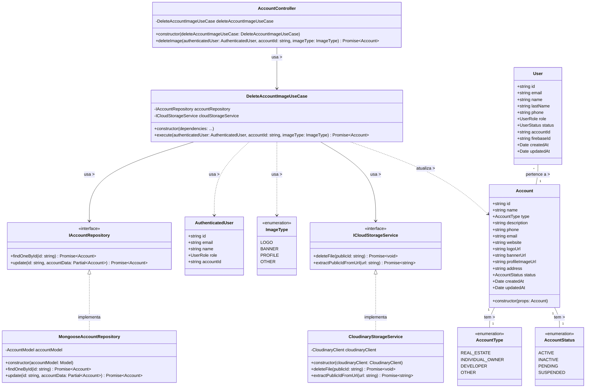

# Diagrama de Classes - Exclusão de Imagens da Conta

## Descrição do Diagrama de Classes

Este diagrama representa a estrutura de classes envolvidas no processo de exclusão de imagens de uma conta no sistema tuhogar-api, seguindo os princípios de Clean Architecture.

### Entidades de Domínio
- **Account**: Representa uma conta no sistema com seus atributos, incluindo URLs para diferentes tipos de imagens
- **AccountType**: Enumeração que define os possíveis tipos de conta
- **AccountStatus**: Enumeração que define os possíveis estados de uma conta
- **User**: Representa um usuário no sistema
- **AuthenticatedUser**: Representa um usuário autenticado com informações reduzidas
- **ImageType**: Enumeração que define os tipos de imagem (LOGO, BANNER, PROFILE, OTHER)

### Interfaces
- **IAccountRepository**: Interface para acesso e manipulação dos dados de contas
- **ICloudStorageService**: Interface para interação com o serviço de armazenamento em nuvem

### Casos de Uso
- **DeleteAccountImageUseCase**: Orquestra o processo de exclusão de imagens de uma conta

### Implementações
- **MongooseAccountRepository**: Implementação do repositório de contas usando MongoDB/Mongoose
- **CloudinaryStorageService**: Implementação do serviço de armazenamento em nuvem usando Cloudinary
- **AccountController**: Controlador HTTP para endpoints relacionados a contas

### Relações
- Uma Account tem um AccountType e um AccountStatus
- Vários Users podem pertencer a uma Account
- MongooseAccountRepository implementa IAccountRepository
- CloudinaryStorageService implementa ICloudStorageService
- DeleteAccountImageUseCase depende de IAccountRepository e ICloudStorageService
- AccountController depende de DeleteAccountImageUseCase
- DeleteAccountImageUseCase usa AuthenticatedUser e ImageType, e atualiza Account

### Responsabilidades
- O DeleteAccountImageUseCase coordena todo o processo de exclusão de imagens, incluindo:
  - Verificação de autenticação e permissões
  - Verificação da existência da imagem na conta
  - Extração do identificador público da imagem a partir da URL
  - Exclusão da imagem do serviço de armazenamento em nuvem
  - Remoção da referência da imagem na conta

Este diagrama segue os princípios de Clean Architecture, com separação clara entre entidades de domínio, casos de uso, interfaces e implementações, conforme a estrutura do projeto tuhogar-api.
