# Diagrama de Classes - Exclusão de Usuário da Conta

```mermaid
classDiagram
    %% Entidades de Domínio
    class Account {
        +string id
        +string name
        +AccountType type
        +string description
        +string phone
        +string email
        +string website
        +string logoUrl
        +AccountStatus status
        +Date createdAt
        +Date updatedAt
        +constructor(props: Account)
    }
    
    class User {
        +string id
        +string email
        +string name
        +string lastName
        +string phone
        +UserRole role
        +UserStatus status
        +string accountId
        +string firebaseId
        +Date createdAt
        +Date updatedAt
        +constructor(props: User)
    }
    
    class UserRole {
        <<enumeration>>
        ADMIN
        ACCOUNT_ADMIN
        ACCOUNT_USER
    }
    
    class UserStatus {
        <<enumeration>>
        ACTIVE
        INACTIVE
        PENDING
        SUSPENDED
    }
    
    class AuthenticatedUser {
        +string id
        +string email
        +string name
        +UserRole role
        +string accountId
        +isAdmin(): boolean
        +isAccountAdmin(): boolean
        +belongsToAccount(accountId: string): boolean
    }
    
    class UserAccountRemovalHistory {
        +string id
        +string userId
        +string accountId
        +string removedByUserId
        +string reason
        +Date createdAt
        +constructor(props: UserAccountRemovalHistory)
    }
    
    %% Interfaces
    class IUserRepository {
        <<interface>>
        +findOneById(id: string) Promise~User~
        +findAllByAccountId(accountId: string) Promise~User[]~
        +update(id: string, userData: Partial~User~) Promise~User~
        +removeFromAccount(userId: string) Promise~User~
    }
    
    class IAccountRepository {
        <<interface>>
        +findOneById(id: string) Promise~Account~
    }
    
    class IUserAccountRemovalHistoryRepository {
        <<interface>>
        +create(historyData: UserAccountRemovalHistory) Promise~UserAccountRemovalHistory~
    }
    
    class INotificationService {
        <<interface>>
        +notifyUserRemovedFromAccount(user: User, account: Account, removedBy: AuthenticatedUser, reason: string) Promise~void~
    }
    
    class IAuthService {
        <<interface>>
        +revokeAccountAccess(userId: string, accountId: string) Promise~void~
    }
    
    %% Casos de Uso
    class RemoveUserFromAccountUseCase {
        -IUserRepository userRepository
        -IAccountRepository accountRepository
        -IUserAccountRemovalHistoryRepository historyRepository
        -INotificationService notificationService
        -IAuthService authService
        +constructor(dependencies: ...)
        +execute(authenticatedUser: AuthenticatedUser, accountId: string, userId: string, reason: string) Promise~void~
    }
    
    %% Implementações
    class MongooseUserRepository {
        -UserModel userModel
        +constructor(userModel: Model)
        +findOneById(id: string) Promise~User~
        +findAllByAccountId(accountId: string) Promise~User[]~
        +update(id: string, userData: Partial~User~) Promise~User~
        +removeFromAccount(userId: string) Promise~User~
    }
    
    class MongooseAccountRepository {
        -AccountModel accountModel
        +constructor(accountModel: Model)
        +findOneById(id: string) Promise~Account~
    }
    
    class MongooseUserAccountRemovalHistoryRepository {
        -UserAccountRemovalHistoryModel historyModel
        +constructor(historyModel: Model)
        +create(historyData: UserAccountRemovalHistory) Promise~UserAccountRemovalHistory~
    }
    
    class EmailNotificationService {
        -EmailClient emailClient
        +constructor(emailClient: EmailClient)
        +notifyUserRemovedFromAccount(user: User, account: Account, removedBy: AuthenticatedUser, reason: string) Promise~void~
    }
    
    class FirebaseAuthService {
        -FirebaseClient firebaseClient
        +constructor(firebaseClient: FirebaseClient)
        +revokeAccountAccess(userId: string, accountId: string) Promise~void~
    }
    
    class UserController {
        -RemoveUserFromAccountUseCase removeUserFromAccountUseCase
        +constructor(removeUserFromAccountUseCase: RemoveUserFromAccountUseCase)
        +removeFromAccount(authenticatedUser: AuthenticatedUser, accountId: string, userId: string, reason: string) Promise~void~
    }
    
    %% Relações
    User "*" -- "1" Account : pertence a >
    User "1" -- "1" UserRole : tem >
    User "1" -- "1" UserStatus : tem >
    User "1" -- "*" UserAccountRemovalHistory : tem >
    
    IUserRepository <|.. MongooseUserRepository : implementa
    IAccountRepository <|.. MongooseAccountRepository : implementa
    IUserAccountRemovalHistoryRepository <|.. MongooseUserAccountRemovalHistoryRepository : implementa
    INotificationService <|.. EmailNotificationService : implementa
    IAuthService <|.. FirebaseAuthService : implementa
    
    RemoveUserFromAccountUseCase --> IUserRepository : usa >
    RemoveUserFromAccountUseCase --> IAccountRepository : usa >
    RemoveUserFromAccountUseCase --> IUserAccountRemovalHistoryRepository : usa >
    RemoveUserFromAccountUseCase --> INotificationService : usa >
    RemoveUserFromAccountUseCase --> IAuthService : usa >
    
    UserController --> RemoveUserFromAccountUseCase : usa >
    
    RemoveUserFromAccountUseCase ..> AuthenticatedUser : usa >
    RemoveUserFromAccountUseCase ..> User : manipula >
    RemoveUserFromAccountUseCase ..> Account : consulta >
    RemoveUserFromAccountUseCase ..> UserAccountRemovalHistory : cria >
```

## Descrição do Diagrama de Classes

Este diagrama representa a estrutura de classes envolvidas no processo de exclusão de um usuário de uma conta no sistema tuhogar-api, seguindo os princípios de Clean Architecture.

### Entidades de Domínio
- **Account**: Representa uma conta no sistema com seus atributos
- **User**: Representa um usuário no sistema com seus atributos
- **UserRole**: Enumeração que define os papéis de usuário (ADMIN, ACCOUNT_ADMIN, ACCOUNT_USER)
- **UserStatus**: Enumeração que define os estados de um usuário (ACTIVE, INACTIVE, PENDING, SUSPENDED)
- **AuthenticatedUser**: Representa um usuário autenticado com informações reduzidas e métodos para verificar permissões
- **UserAccountRemovalHistory**: Entidade que registra o histórico de exclusões de usuários de contas

### Interfaces
- **IUserRepository**: Interface para acesso e manipulação dos dados de usuários
- **IAccountRepository**: Interface para acesso aos dados de contas
- **IUserAccountRemovalHistoryRepository**: Interface para registro do histórico de exclusões
- **INotificationService**: Interface para envio de notificações
- **IAuthService**: Interface para gerenciamento de autenticação e autorização

### Casos de Uso
- **RemoveUserFromAccountUseCase**: Orquestra o processo de exclusão de um usuário de uma conta

### Implementações
- **MongooseUserRepository**: Implementação do repositório de usuários usando MongoDB/Mongoose
- **MongooseAccountRepository**: Implementação do repositório de contas usando MongoDB/Mongoose
- **MongooseUserAccountRemovalHistoryRepository**: Implementação do repositório de histórico usando MongoDB/Mongoose
- **EmailNotificationService**: Implementação do serviço de notificação usando e-mail
- **FirebaseAuthService**: Implementação do serviço de autenticação usando Firebase
- **UserController**: Controlador HTTP para endpoints relacionados a usuários

### Relações
- Vários Users podem pertencer a uma Account
- Um User tem um UserRole e um UserStatus
- Um User tem vários UserAccountRemovalHistory
- As implementações de repositório e serviço implementam suas respectivas interfaces
- RemoveUserFromAccountUseCase depende de IUserRepository, IAccountRepository, IUserAccountRemovalHistoryRepository, INotificationService e IAuthService
- UserController depende de RemoveUserFromAccountUseCase
- RemoveUserFromAccountUseCase usa AuthenticatedUser, manipula User, consulta Account e cria UserAccountRemovalHistory

### Responsabilidades
- O RemoveUserFromAccountUseCase coordena todo o processo de exclusão de um usuário de uma conta, incluindo:
  - Verificação de autenticação e permissões
  - Validação da exclusão (ex: não é o último administrador da conta)
  - Remoção do usuário da conta
  - Revogação dos acessos do usuário à conta
  - Registro da exclusão no histórico
  - Notificação do usuário sobre a exclusão

Este diagrama segue os princípios de Clean Architecture, com separação clara entre entidades de domínio, casos de uso, interfaces e implementações, conforme a estrutura do projeto tuhogar-api.
