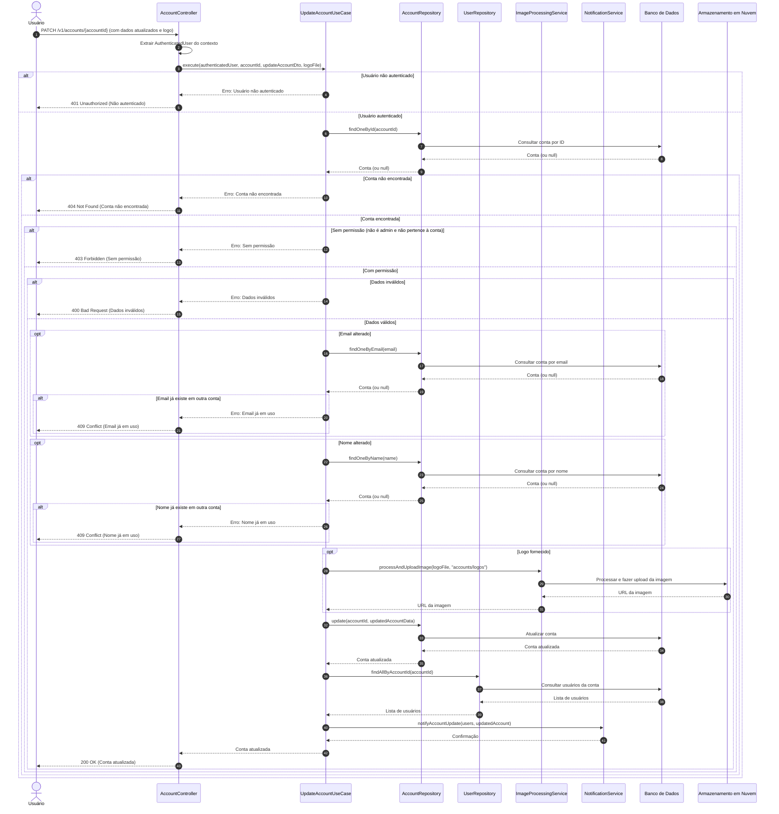

# Diagrama de Sequência - Atualização de Informações da Conta

## Descrição do Diagrama de Sequência

Este diagrama ilustra o fluxo de interações durante o processo de atualização de informações de uma conta no sistema tuhogar-api.

### Participantes
- **Usuário**: Pessoa que está utilizando o sistema
- **AccountController**: Componente que recebe e processa requisições HTTP
- **UpdateAccountUseCase**: Componente que orquestra a lógica de negócio para atualização de contas
- **AccountRepository**: Componente responsável pelo acesso aos dados de contas
- **UserRepository**: Componente responsável pelo acesso aos dados de usuários
- **ImageProcessingService**: Componente responsável pelo processamento e upload de imagens
- **NotificationService**: Componente responsável pelo envio de notificações
- **Banco de Dados**: Sistema de armazenamento persistente
- **Armazenamento em Nuvem**: Serviço para armazenamento de arquivos

### Fluxo Principal
1. O usuário envia uma requisição PATCH para `/v1/accounts/{accountId}` com os dados atualizados e opcionalmente uma nova imagem de logo
2. O controlador extrai o usuário autenticado do contexto da requisição
3. O controlador chama o caso de uso de atualização de conta
4. O caso de uso verifica se o usuário está autenticado
5. Se o usuário estiver autenticado:
   - Busca a conta pelo ID fornecido
   - Se a conta for encontrada:
     - Verifica se o usuário tem permissão para atualizar a conta
     - Se tiver permissão:
       - Valida os novos dados da conta
       - Verifica conflitos (email ou nome já existentes em outras contas)
       - Processa a nova imagem de logo (se fornecida)
       - Atualiza a conta no banco de dados
       - Notifica os usuários vinculados à conta sobre as alterações
       - Retorna a conta atualizada
6. O controlador responde à requisição com a conta atualizada ou uma mensagem de erro

### Cenários Alternativos
- **Usuário não autenticado**: O sistema retorna um erro 401 Unauthorized
- **Conta não encontrada**: O sistema retorna um erro 404 Not Found
- **Sem permissão**: O sistema retorna um erro 403 Forbidden
- **Dados inválidos**: O sistema retorna um erro 400 Bad Request
- **Conflito de email ou nome**: O sistema retorna um erro 409 Conflict

### Regras de Permissão
- Um usuário comum só pode atualizar a conta à qual está vinculado
- Um administrador pode atualizar qualquer conta

### Validações
- Os novos dados da conta devem ser válidos
- O email e o nome da conta devem ser únicos no sistema

### Processamento de Imagem
- Se uma nova imagem de logo for fornecida, ela é processada e armazenada em um serviço de armazenamento em nuvem
- A URL da imagem processada é armazenada no campo logoUrl da conta

### Notificações
- Todos os usuários vinculados à conta são notificados sobre as alterações realizadas
