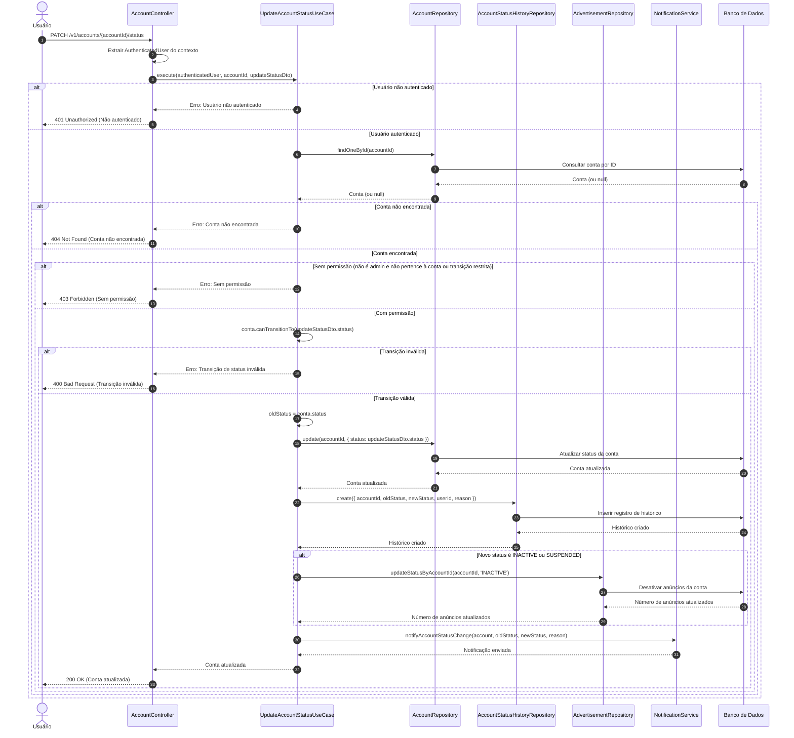

# Diagrama de Sequência - Atualização de Status da Conta

## Descrição do Diagrama de Sequência

Este diagrama ilustra o fluxo de interações durante o processo de atualização de status de uma conta no sistema tuhogar-api, seguindo os princípios de Clean Architecture.

### Participantes
- **Usuário**: Pessoa que está utilizando o sistema
- **AccountController**: Componente que recebe e processa requisições HTTP
- **UpdateAccountStatusUseCase**: Componente que orquestra a lógica de negócio para atualização de status
- **AccountRepository**: Componente responsável pelo acesso aos dados de contas
- **AccountStatusHistoryRepository**: Componente responsável pelo registro do histórico de alterações de status
- **AdvertisementRepository**: Componente responsável pelo acesso aos dados de anúncios
- **NotificationService**: Componente responsável pelo envio de notificações
- **Banco de Dados**: Sistema de armazenamento persistente

### Fluxo Principal
1. O usuário envia uma requisição PATCH para `/v1/accounts/{accountId}/status` com o novo status e motivo da alteração
2. O controlador extrai o usuário autenticado do contexto da requisição
3. O controlador chama o caso de uso de atualização de status
4. O caso de uso verifica se o usuário está autenticado
5. Se o usuário estiver autenticado:
   - Busca a conta pelo ID fornecido
   - Se a conta for encontrada:
     - Verifica se o usuário tem permissão para atualizar o status da conta
     - Se tiver permissão:
       - Verifica se a transição de status é válida
       - Se a transição for válida:
         - Armazena o status antigo para registro no histórico
         - Atualiza o status da conta
         - Registra a alteração no histórico
         - Se o novo status for INACTIVE ou SUSPENDED, desativa os anúncios vinculados à conta
         - Notifica os usuários da conta sobre a alteração de status
         - Retorna a conta atualizada
6. O controlador responde à requisição com a conta atualizada ou uma mensagem de erro

### Cenários Alternativos
- **Usuário não autenticado**: O sistema retorna um erro 401 Unauthorized
- **Conta não encontrada**: O sistema retorna um erro 404 Not Found
- **Sem permissão**: O sistema retorna um erro 403 Forbidden
- **Transição inválida**: O sistema retorna um erro 400 Bad Request

### Regras de Permissão
- Um usuário comum só pode realizar certas transições de status para a conta à qual está vinculado
- Um administrador pode realizar qualquer transição de status para qualquer conta

### Transições de Status
- Nem todas as transições de status são permitidas (ex: uma conta SUSPENDED só pode ser reativada por um administrador)
- A validação de transições é feita pelo método `canTransitionTo` da entidade Account

### Efeitos Colaterais
- A alteração de status é registrada no histórico para fins de auditoria
- Se o novo status for INACTIVE ou SUSPENDED, os anúncios vinculados à conta são desativados
- Os usuários da conta são notificados sobre a alteração de status

### Considerações Técnicas
- O motivo da alteração de status é registrado no histórico
- As notificações são enviadas por um serviço dedicado, que pode usar diferentes canais (email, SMS, etc.)
- A atualização de anúncios é feita em massa para todos os anúncios vinculados à conta
