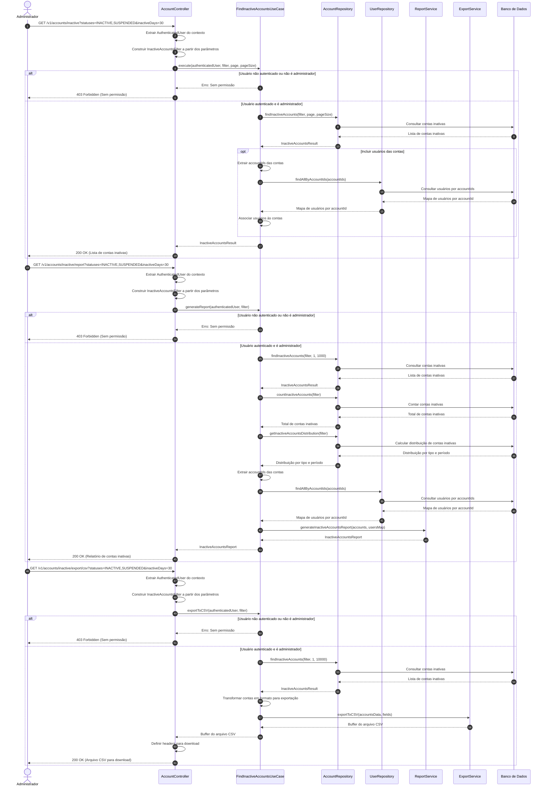

# Diagrama de Sequência - Busca de Contas Inativas

## Descrição do Diagrama de Sequência

Este diagrama ilustra o fluxo de interações durante o processo de busca de contas inativas no sistema tuhogar-api, seguindo os princípios de Clean Architecture.

### Participantes
- **Administrador**: Pessoa que está iniciando a busca de contas inativas
- **AccountController**: Componente que recebe e processa requisições HTTP
- **FindInactiveAccountsUseCase**: Componente que orquestra a lógica de negócio para busca de contas inativas
- **AccountRepository**: Componente responsável pelo acesso aos dados de contas
- **UserRepository**: Componente responsável pelo acesso aos dados de usuários
- **ReportService**: Componente responsável pela geração de relatórios
- **ExportService**: Componente responsável pela exportação de dados
- **Banco de Dados**: Sistema de armazenamento persistente

### Fluxos Principais

#### 1. Busca de Contas Inativas
1. O administrador envia uma requisição GET para `/v1/accounts/inactive` com parâmetros de filtro
2. O controlador extrai o usuário autenticado do contexto da requisição
3. O controlador constrói um objeto de filtro a partir dos parâmetros da requisição
4. O controlador chama o caso de uso de busca de contas inativas
5. O caso de uso verifica se o usuário está autenticado e é administrador
6. Se o usuário tiver permissão:
   - Busca as contas inativas de acordo com os filtros
   - Opcionalmente, busca os usuários vinculados às contas
   - Retorna os resultados paginados
7. O controlador responde à requisição com a lista de contas inativas ou uma mensagem de erro

#### 2. Geração de Relatório
1. O administrador envia uma requisição GET para `/v1/accounts/inactive/report` com parâmetros de filtro
2. O controlador extrai o usuário autenticado do contexto da requisição
3. O controlador constrói um objeto de filtro a partir dos parâmetros da requisição
4. O controlador chama o método de geração de relatório do caso de uso
5. O caso de uso verifica se o usuário está autenticado e é administrador
6. Se o usuário tiver permissão:
   - Busca as contas inativas de acordo com os filtros
   - Obtém estatísticas adicionais (contagem total, distribuição por tipo e período)
   - Busca os usuários vinculados às contas
   - Gera um relatório detalhado usando o serviço de relatórios
   - Retorna o relatório
7. O controlador responde à requisição com o relatório ou uma mensagem de erro

#### 3. Exportação para CSV
1. O administrador envia uma requisição GET para `/v1/accounts/inactive/export/csv` com parâmetros de filtro
2. O controlador extrai o usuário autenticado do contexto da requisição
3. O controlador constrói um objeto de filtro a partir dos parâmetros da requisição
4. O controlador chama o método de exportação para CSV do caso de uso
5. O caso de uso verifica se o usuário está autenticado e é administrador
6. Se o usuário tiver permissão:
   - Busca as contas inativas de acordo com os filtros
   - Transforma os dados das contas em um formato adequado para exportação
   - Exporta os dados para CSV usando o serviço de exportação
   - Retorna o buffer do arquivo CSV
7. O controlador define os headers apropriados para download do arquivo
8. O controlador responde à requisição com o arquivo CSV para download ou uma mensagem de erro

### Cenários Alternativos
- **Usuário não autenticado ou sem permissão**: O sistema retorna um erro 403 Forbidden

### Regras de Permissão
- Apenas administradores têm permissão para buscar contas inativas, gerar relatórios e exportar dados

### Considerações Técnicas
- Os filtros de busca permitem especificar status, período de inatividade e outros critérios
- A busca de contas inativas é paginada para lidar com grandes volumes de dados
- A geração de relatório inclui estatísticas e análises adicionais
- A exportação para CSV permite que os dados sejam processados em ferramentas externas
- Os resultados podem incluir informações sobre os usuários vinculados às contas
