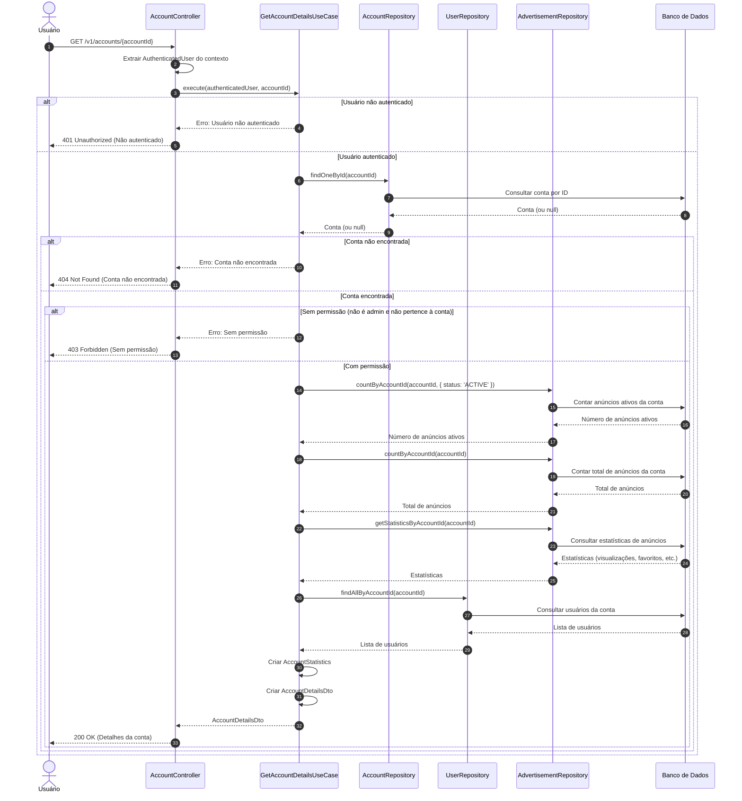

# Diagrama de Sequência - Consulta de Dados da Conta

## Descrição do Diagrama de Sequência

Este diagrama ilustra o fluxo de interações durante o processo de consulta de dados de uma conta no sistema tuhogar-api.

### Participantes
- **Usuário**: Pessoa que está utilizando o sistema
- **AccountController**: Componente que recebe e processa requisições HTTP
- **GetAccountDetailsUseCase**: Componente que orquestra a lógica de negócio para consulta de dados da conta
- **AccountRepository**: Componente responsável pelo acesso aos dados de contas
- **UserRepository**: Componente responsável pelo acesso aos dados de usuários
- **AdvertisementRepository**: Componente responsável pelo acesso aos dados de anúncios e estatísticas
- **Banco de Dados**: Sistema de armazenamento persistente

### Fluxo Principal
1. O usuário envia uma requisição GET para `/v1/accounts/{accountId}`
2. O controlador extrai o usuário autenticado do contexto da requisição
3. O controlador chama o caso de uso de consulta de dados da conta
4. O caso de uso verifica se o usuário está autenticado
5. Se o usuário estiver autenticado:
   - Busca a conta pelo ID fornecido
   - Se a conta for encontrada:
     - Verifica se o usuário tem permissão para consultar a conta
     - Se tiver permissão:
       - Obtém estatísticas da conta (anúncios ativos, total de anúncios, visualizações, favoritos, etc.)
       - Obtém a lista de usuários vinculados à conta
       - Monta o objeto de resposta com todos os dados
       - Retorna os detalhes da conta
6. O controlador responde à requisição com os detalhes da conta ou uma mensagem de erro

### Cenários Alternativos
- **Usuário não autenticado**: O sistema retorna um erro 401 Unauthorized
- **Conta não encontrada**: O sistema retorna um erro 404 Not Found
- **Sem permissão**: O sistema retorna um erro 403 Forbidden

### Regras de Permissão
- Um usuário comum só pode consultar a conta à qual está vinculado
- Um administrador pode consultar qualquer conta

### Dados Retornados
- **Dados básicos da conta**: Nome, tipo, descrição, contatos, endereço, status, etc.
- **Estatísticas**: Número de anúncios ativos, total de anúncios, visualizações, favoritos, etc.
- **Usuários vinculados**: Lista de usuários associados à conta

### Considerações
- Dependendo do nível de acesso do usuário, alguns dados podem ser omitidos ou limitados
- As estatísticas são calculadas em tempo real com base nos dados armazenados
- A resposta é estruturada como um objeto AccountDetailsDto que agrupa todas as informações relevantes
