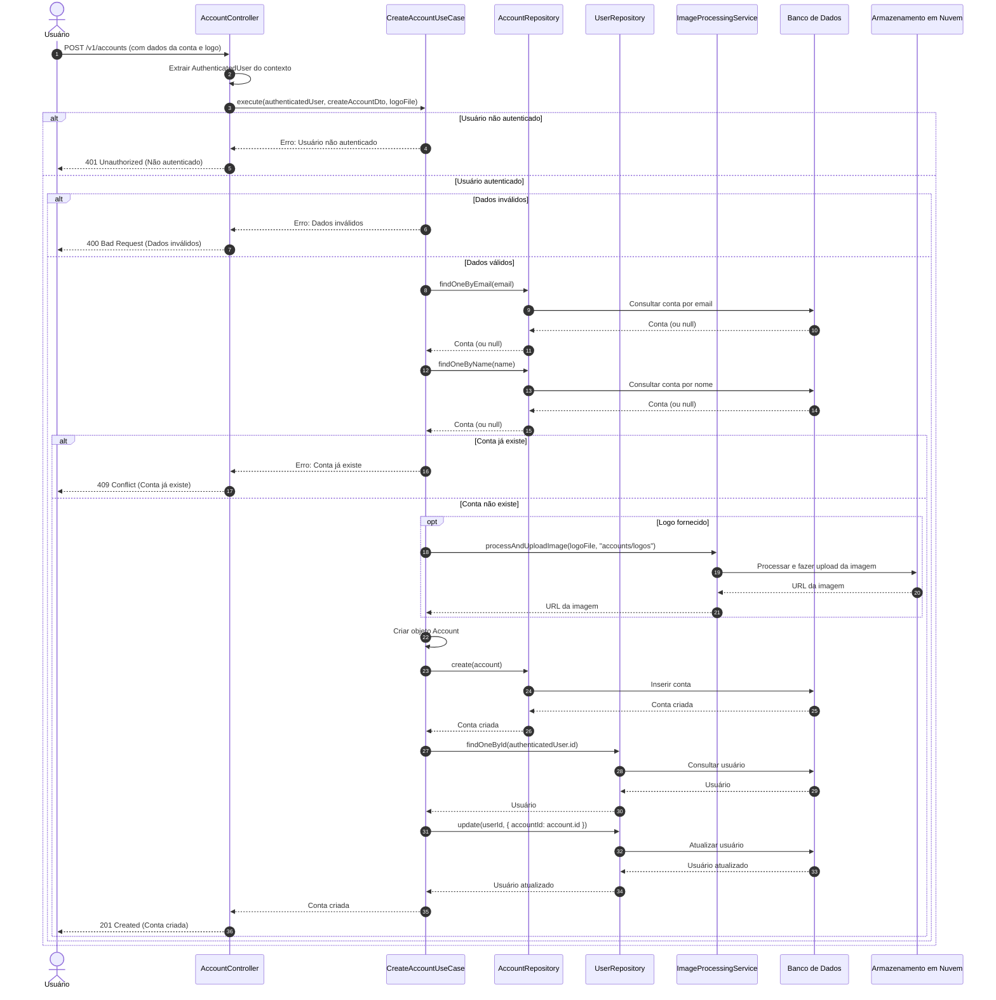

# Diagrama de Sequência - Criação de Contas

## Descrição do Diagrama de Sequência

Este diagrama ilustra o fluxo de interações durante o processo de criação de uma conta no sistema tuhogar-api.

### Participantes
- **Usuário**: Pessoa que está utilizando o sistema
- **AccountController**: Componente que recebe e processa requisições HTTP
- **CreateAccountUseCase**: Componente que orquestra a lógica de negócio para criação de contas
- **AccountRepository**: Componente responsável pelo acesso aos dados de contas
- **UserRepository**: Componente responsável pelo acesso aos dados de usuários
- **ImageProcessingService**: Componente responsável pelo processamento e upload de imagens
- **Banco de Dados**: Sistema de armazenamento persistente
- **Armazenamento em Nuvem**: Serviço para armazenamento de arquivos

### Fluxo Principal
1. O usuário envia uma requisição POST para `/v1/accounts` com os dados da conta e opcionalmente uma imagem de logo
2. O controlador extrai o usuário autenticado do contexto da requisição
3. O controlador chama o caso de uso de criação de conta
4. O caso de uso verifica se o usuário está autenticado
5. Se o usuário estiver autenticado:
   - Valida os dados da conta
   - Se os dados forem válidos:
     - Verifica se já existe uma conta com o mesmo email ou nome
     - Se não existir:
       - Processa a imagem de logo (se fornecida)
       - Cria a conta no banco de dados
       - Associa o usuário autenticado à nova conta
       - Retorna a conta criada
6. O controlador responde à requisição com a conta criada ou uma mensagem de erro

### Cenários Alternativos
- **Usuário não autenticado**: O sistema retorna um erro 401 Unauthorized
- **Dados inválidos**: O sistema retorna um erro 400 Bad Request
- **Conta já existe**: O sistema retorna um erro 409 Conflict

### Validações
- O usuário deve estar autenticado
- Os dados da conta devem ser válidos
- Não deve existir outra conta com o mesmo email ou nome

### Processamento de Imagem
- Se uma imagem de logo for fornecida, ela é processada e armazenada em um serviço de armazenamento em nuvem
- A URL da imagem processada é armazenada no campo logoUrl da conta

### Associação de Usuário
- O usuário que cria a conta é automaticamente associado a ela
- A associação é feita atualizando o campo accountId do usuário
