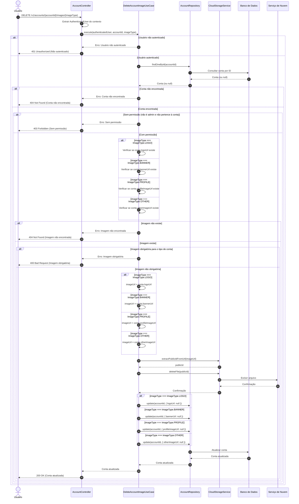

# Diagrama de Sequência - Exclusão de Imagens da Conta

## Descrição do Diagrama de Sequência

Este diagrama ilustra o fluxo de interações durante o processo de exclusão de imagens de uma conta no sistema tuhogar-api, seguindo os princípios de Clean Architecture.

### Participantes
- **Usuário**: Pessoa que está utilizando o sistema
- **AccountController**: Componente que recebe e processa requisições HTTP
- **DeleteAccountImageUseCase**: Componente que orquestra a lógica de negócio para exclusão de imagens
- **AccountRepository**: Componente responsável pelo acesso aos dados de contas
- **CloudStorageService**: Componente responsável pelo armazenamento de arquivos em nuvem
- **Banco de Dados**: Sistema de armazenamento persistente
- **Serviço de Nuvem**: Serviço externo para armazenamento de arquivos

### Fluxo Principal
1. O usuário envia uma requisição DELETE para `/v1/accounts/{accountId}/images/{imageType}`
2. O controlador extrai o usuário autenticado do contexto da requisição
3. O controlador chama o caso de uso de exclusão de imagem
4. O caso de uso verifica se o usuário está autenticado
5. Se o usuário estiver autenticado:
   - Busca a conta pelo ID fornecido
   - Se a conta for encontrada:
     - Verifica se o usuário tem permissão para excluir imagens da conta
     - Se tiver permissão:
       - Verifica se a imagem do tipo especificado existe na conta
       - Se a imagem existir:
         - Verifica se a imagem é obrigatória para o tipo de conta
         - Se a imagem não for obrigatória:
           - Obtém a URL da imagem com base no tipo
           - Extrai o identificador público da imagem a partir da URL
           - Exclui a imagem do serviço de armazenamento em nuvem
           - Remove a referência da imagem na conta
           - Retorna a conta atualizada
6. O controlador responde à requisição com a conta atualizada ou uma mensagem de erro

### Cenários Alternativos
- **Usuário não autenticado**: O sistema retorna um erro 401 Unauthorized
- **Conta não encontrada**: O sistema retorna um erro 404 Not Found
- **Sem permissão**: O sistema retorna um erro 403 Forbidden
- **Imagem não encontrada**: O sistema retorna um erro 404 Not Found
- **Imagem obrigatória**: O sistema retorna um erro 400 Bad Request

### Regras de Permissão
- Um usuário comum só pode excluir imagens da conta à qual está vinculado
- Um administrador pode excluir imagens de qualquer conta

### Verificações de Imagem
- O sistema verifica se a imagem do tipo especificado existe na conta
- O sistema verifica se a imagem é obrigatória para o tipo de conta (por exemplo, uma imobiliária pode ser obrigada a ter um logo)

### Tipos de Imagem
- **LOGO**: Imagem de logotipo da conta
- **BANNER**: Imagem de banner para a conta
- **PROFILE**: Imagem de perfil da conta
- **OTHER**: Outros tipos de imagem relacionados à conta

### Considerações Técnicas
- O identificador público da imagem é extraído da URL armazenada na conta
- A exclusão da imagem no serviço de nuvem é realizada antes da atualização da referência na conta
- A referência da imagem na conta é definida como null após a exclusão
