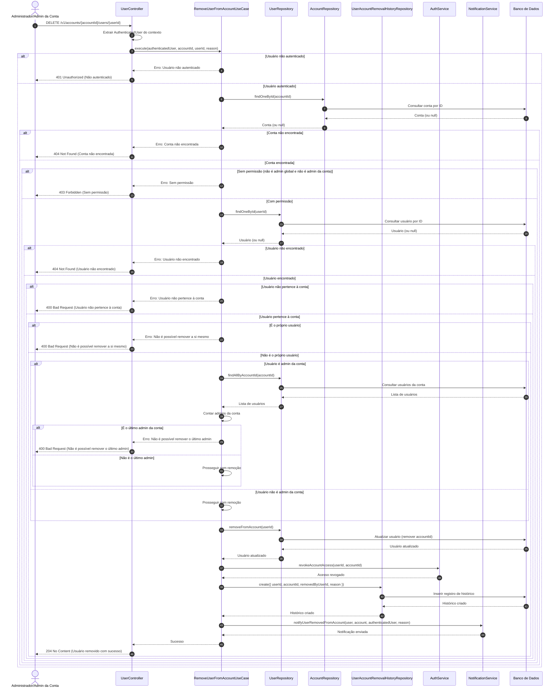

# Diagrama de Sequência - Exclusão de Usuário da Conta

## Descrição do Diagrama de Sequência

Este diagrama ilustra o fluxo de interações durante o processo de exclusão de um usuário de uma conta no sistema tuhogar-api, seguindo os princípios de Clean Architecture.

### Participantes
- **Administrador/Admin da Conta**: Pessoa que está iniciando a exclusão do usuário
- **UserController**: Componente que recebe e processa requisições HTTP
- **RemoveUserFromAccountUseCase**: Componente que orquestra a lógica de negócio para exclusão de usuário
- **UserRepository**: Componente responsável pelo acesso aos dados de usuários
- **AccountRepository**: Componente responsável pelo acesso aos dados de contas
- **UserAccountRemovalHistoryRepository**: Componente responsável pelo registro do histórico de exclusões
- **AuthService**: Componente responsável pelo gerenciamento de autenticação e autorização
- **NotificationService**: Componente responsável pelo envio de notificações
- **Banco de Dados**: Sistema de armazenamento persistente

### Fluxo Principal
1. O administrador ou administrador da conta envia uma requisição DELETE para `/v1/accounts/{accountId}/users/{userId}` com o motivo da exclusão
2. O controlador extrai o usuário autenticado do contexto da requisição
3. O controlador chama o caso de uso de exclusão de usuário
4. O caso de uso verifica se o solicitante está autenticado
5. Se o solicitante estiver autenticado:
   - Busca a conta pelo ID fornecido
   - Se a conta for encontrada:
     - Verifica se o solicitante tem permissão para excluir usuários da conta
     - Se tiver permissão:
       - Busca o usuário a ser removido pelo ID fornecido
       - Se o usuário for encontrado:
         - Verifica se o usuário pertence à conta
         - Se o usuário pertencer à conta:
           - Verifica se o solicitante está tentando remover a si mesmo
           - Se não estiver:
             - Se o usuário a ser removido for um administrador da conta, verifica se é o último administrador
             - Se não for o último administrador ou não for um administrador:
               - Remove o usuário da conta
               - Revoga os acessos do usuário à conta
               - Registra a exclusão no histórico
               - Notifica o usuário sobre a exclusão
               - Retorna sucesso
6. O controlador responde à requisição com uma confirmação de sucesso ou uma mensagem de erro

### Cenários Alternativos
- **Solicitante não autenticado**: O sistema retorna um erro 401 Unauthorized
- **Conta não encontrada**: O sistema retorna um erro 404 Not Found
- **Sem permissão**: O sistema retorna um erro 403 Forbidden
- **Usuário não encontrado**: O sistema retorna um erro 404 Not Found
- **Usuário não pertence à conta**: O sistema retorna um erro 400 Bad Request
- **Tentativa de remover a si mesmo**: O sistema retorna um erro 400 Bad Request
- **Tentativa de remover o último administrador**: O sistema retorna um erro 400 Bad Request

### Regras de Permissão
- Um administrador global pode excluir qualquer usuário de qualquer conta
- Um administrador de conta só pode excluir usuários da conta que administra
- Um usuário comum não pode excluir outros usuários

### Validações
- O sistema verifica se o usuário a ser removido pertence à conta
- O sistema não permite que um usuário remova a si mesmo
- O sistema não permite a remoção do último administrador de uma conta

### Efeitos Colaterais
- O usuário é desvinculado da conta (accountId é removido)
- Os acessos do usuário à conta são revogados
- A exclusão é registrada no histórico para fins de auditoria
- O usuário é notificado sobre a exclusão

### Considerações Técnicas
- A remoção do usuário da conta não exclui o usuário do sistema, apenas desvincula da conta
- O motivo da exclusão é registrado no histórico e incluído na notificação ao usuário
