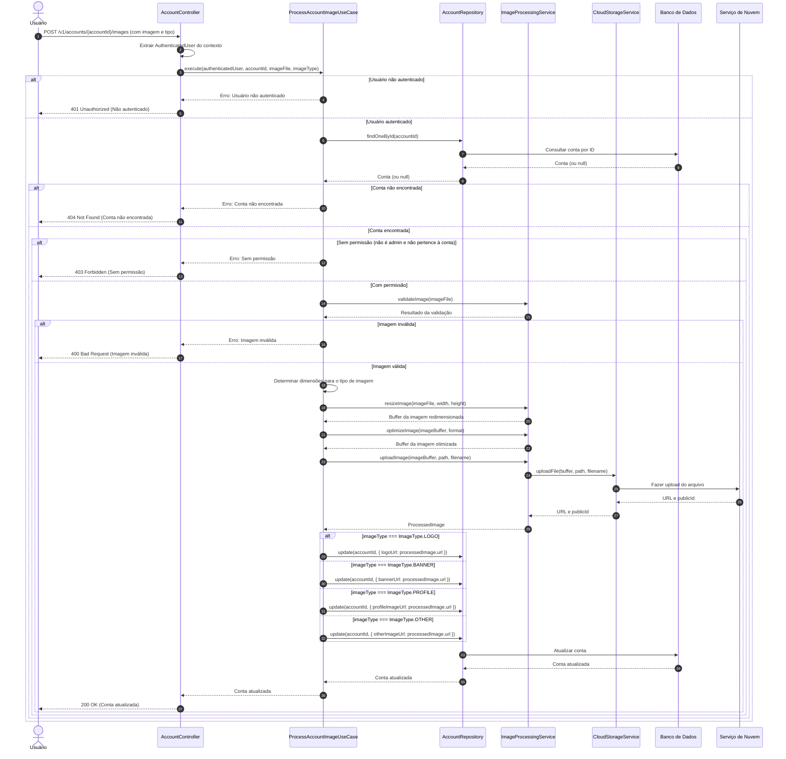

# Diagrama de Sequência - Processamento de Imagens da Conta

## Descrição do Diagrama de Sequência

Este diagrama ilustra o fluxo de interações durante o processo de processamento de imagens de uma conta no sistema tuhogar-api, seguindo os princípios de Clean Architecture.

### Participantes
- **Usuário**: Pessoa que está utilizando o sistema
- **AccountController**: Componente que recebe e processa requisições HTTP
- **ProcessAccountImageUseCase**: Componente que orquestra a lógica de negócio para processamento de imagens
- **AccountRepository**: Componente responsável pelo acesso aos dados de contas
- **ImageProcessingService**: Componente responsável pelo processamento de imagens
- **CloudStorageService**: Componente responsável pelo armazenamento de arquivos em nuvem
- **Banco de Dados**: Sistema de armazenamento persistente
- **Serviço de Nuvem**: Serviço externo para armazenamento de arquivos

### Fluxo Principal
1. O usuário envia uma requisição POST para `/v1/accounts/{accountId}/images` com a imagem e o tipo de imagem
2. O controlador extrai o usuário autenticado do contexto da requisição
3. O controlador chama o caso de uso de processamento de imagem
4. O caso de uso verifica se o usuário está autenticado
5. Se o usuário estiver autenticado:
   - Busca a conta pelo ID fornecido
   - Se a conta for encontrada:
     - Verifica se o usuário tem permissão para processar imagens da conta
     - Se tiver permissão:
       - Valida a imagem (formato, tamanho, etc.)
       - Se a imagem for válida:
         - Determina as dimensões adequadas com base no tipo de imagem
         - Redimensiona a imagem para as dimensões determinadas
         - Otimiza a imagem para melhor desempenho
         - Faz upload da imagem para o serviço de armazenamento em nuvem
         - Atualiza a referência da imagem na conta com base no tipo de imagem
         - Retorna a conta atualizada
6. O controlador responde à requisição com a conta atualizada ou uma mensagem de erro

### Cenários Alternativos
- **Usuário não autenticado**: O sistema retorna um erro 401 Unauthorized
- **Conta não encontrada**: O sistema retorna um erro 404 Not Found
- **Sem permissão**: O sistema retorna um erro 403 Forbidden
- **Imagem inválida**: O sistema retorna um erro 400 Bad Request

### Regras de Permissão
- Um usuário comum só pode processar imagens para a conta à qual está vinculado
- Um administrador pode processar imagens para qualquer conta

### Processamento de Imagem
- A imagem é validada quanto ao formato, tamanho e outras restrições
- A imagem é redimensionada para dimensões adequadas com base no tipo (logo, banner, etc.)
- A imagem é otimizada para reduzir o tamanho do arquivo mantendo a qualidade
- A imagem processada é armazenada em um serviço de nuvem (como Cloudinary)
- A URL da imagem é armazenada no campo apropriado da conta com base no tipo de imagem

### Tipos de Imagem
- **LOGO**: Imagem de logotipo da conta (geralmente quadrada, ex: 200x200px)
- **BANNER**: Imagem de banner para a conta (geralmente retangular, ex: 1200x300px)
- **PROFILE**: Imagem de perfil da conta (geralmente quadrada, ex: 400x400px)
- **OTHER**: Outros tipos de imagem relacionados à conta
