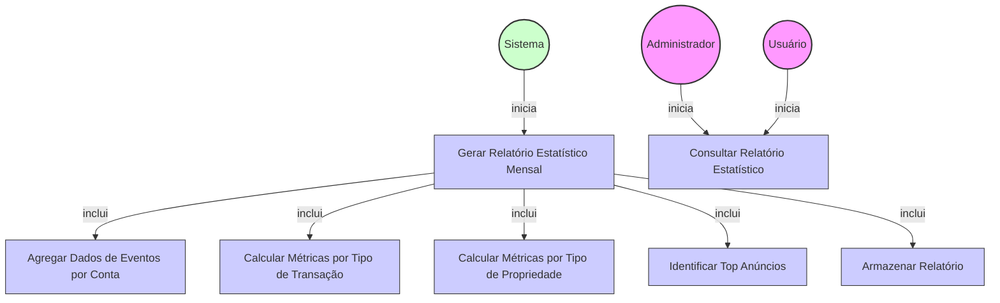

# Diagrama de Caso de Uso - Geração de Relatórios Estatísticos Mensais

## Descrição do Diagrama de Caso de Uso

Este diagrama representa o processo de geração e consulta de relatórios estatísticos mensais para eventos de anúncios imobiliários no sistema tuhogar-api.

### Atores
- **Sistema**: Responsável por iniciar automaticamente o processo de geração de relatórios
- **Administrador**: Usuário com privilégios administrativos que pode consultar relatórios
- **Usuário**: Usuário regular da conta que pode consultar relatórios da sua própria conta

### Casos de Uso
1. **Gerar Relatório Estatístico Mensal**: Processo principal de geração automática do relatório estatístico
2. **Agregar Dados de Eventos por Conta**: Coleta e agregação de todos os eventos registrados para cada conta
3. **Calcular Métricas por Tipo de Transação**: Cálculo de métricas segmentadas por tipo de transação (venda/aluguel)
4. **Calcular Métricas por Tipo de Propriedade**: Cálculo de métricas segmentadas por tipo de propriedade (casa/apartamento/terreno)
5. **Identificar Top Anúncios**: Identificação dos anúncios mais visualizados e com maior interação
6. **Armazenar Relatório**: Persistência do relatório gerado na collection account-advertisements-statistics
7. **Consultar Relatório Estatístico**: Acesso ao relatório estatístico por usuários autorizados

### Relacionamentos
- O Sistema inicia automaticamente o processo de geração de relatório estatístico mensal
- A geração do relatório inclui a agregação de dados, cálculos de métricas por tipo de transação e propriedade, identificação de top anúncios e armazenamento do relatório
- Administradores e Usuários podem consultar os relatórios estatísticos

### Regras de Negócio
- O processo de geração de relatórios é executado automaticamente no primeiro dia de cada mês
- Os relatórios são gerados com base nos dados do mês anterior completo
- Cada relatório é associado a uma conta específica (accountId)
- Os relatórios incluem métricas como total de anúncios, visualizações, cliques em telefone, visualizações de catálogo e cliques em informações de contato
- As métricas são segmentadas por tipo de transação (venda/aluguel) e tipo de propriedade (casa/apartamento/terreno)
- Os relatórios identificam os 5 anúncios mais visualizados e os 5 com maior interação
- Os relatórios são armazenados na collection account-advertisements-statistics
- Apenas usuários do tipo USER ou ADMIN da conta podem acessar os relatórios da conta

### Fluxo Principal
1. No primeiro dia de cada mês, o sistema inicia automaticamente o processo de geração de relatórios
2. O sistema agrega os dados de eventos de todas as contas para o mês anterior
3. Para cada conta, o sistema calcula as métricas segmentadas por tipo de transação e propriedade
4. O sistema identifica os top 5 anúncios mais visualizados e com maior interação
5. O sistema armazena o relatório gerado na collection account-advertisements-statistics
6. Os usuários autorizados podem consultar os relatórios gerados

### Cenários Alternativos
- **Sem eventos registrados**: Se não houver eventos registrados para uma conta no mês anterior, o sistema gera um relatório com valores zerados
- **Falha na geração**: Se ocorrer uma falha durante a geração, o sistema registra o erro e tenta novamente mais tarde
