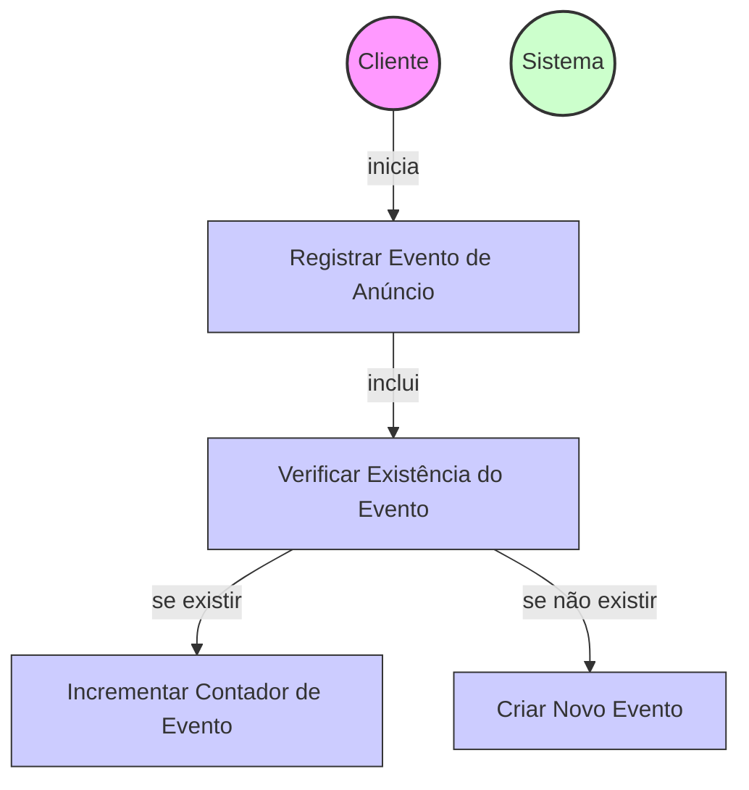

# Diagrama de Caso de Uso - Registro de Eventos de Anúncios

## Descrição do Diagrama de Caso de Uso

Este diagrama representa o processo de registro de eventos relacionados a anúncios imobiliários no sistema tuhogar-api.

### Atores
- **Cliente**: Qualquer cliente do sistema (aplicação frontend, sistema externo, etc.) que registra eventos de anúncios
- **Sistema**: O sistema tuhogar-api

### Casos de Uso
1. **Registrar Evento de Anúncio**: Processo principal de registro de um evento relacionado a um anúncio
2. **Verificar Existência do Evento**: Verificação se já existe um registro para o tipo de evento específico associado ao anúncio
3. **Incrementar Contador de Evento**: Atualização do contador de um evento existente
4. **Criar Novo Evento**: Criação de um novo registro de evento quando não existe previamente

### Relacionamentos
- O Cliente inicia o processo de registro de evento de anúncio
- O registro de evento inclui a verificação da existência prévia do evento
- Se o evento já existir para o anúncio, o contador é incrementado
- Se o evento não existir para o anúncio, um novo registro de evento é criado

### Regras de Negócio
- Cada evento é associado a um anúncio específico através do ID do anúncio
- Os eventos são categorizados por tipo (ex: visualização, clique, contato, etc.)
- Se já existir um registro para o tipo de evento específico associado ao anúncio, o contador é incrementado
- Se não existir um registro para o tipo de evento específico associado ao anúncio, um novo registro é criado com contador inicial 1
- O sistema mantém um contador para cada tipo de evento por anúncio
- Não há autenticação necessária para registrar eventos (endpoint público)

### Fluxo Principal
1. O cliente envia uma requisição para registrar um evento, informando o ID do anúncio e o tipo de evento
2. O sistema verifica se já existe um registro para esse tipo de evento associado ao anúncio
3. Se existir, o sistema incrementa o contador do evento
4. Se não existir, o sistema cria um novo registro de evento com contador inicial 1
5. O sistema retorna o registro de evento atualizado ou criado

### Cenários Alternativos
- **Anúncio inexistente**: O sistema registra o evento mesmo que o anúncio não exista no sistema (não há validação de existência do anúncio)
- **Tipo de evento inválido**: Não há validação de tipos de evento, qualquer string é aceita como tipo
