# Diagrama de Classes - Geração de Relatórios Estatísticos Mensais

```mermaid
classDiagram
    %% Entidades de Domínio
    class AccountAdvertisementStatistics {
        +string id
        +string accountId
        +string month
        +Date createdAt
        +TotalAdvertisements totalAdvertisements
        +TotalVisits totalVisits
        +PhoneClicks phoneClicks
        +number digitalCatalogViews
        +ContactInfoClicks contactInfoClicks
        +TopAdvertisements topViewedAdvertisements
        +TopAdvertisements topInteractedAdvertisements
        +constructor(props: AccountAdvertisementStatistics)
    }
    
    class TotalAdvertisements {
        +number total
        +TransactionTypeMetrics byTransactionType
        +PropertyTypeAndTransactionMetrics byPropertyTypeAndTransaction
    }
    
    class TotalVisits {
        +number total
        +TransactionTypeMetrics byTransactionType
        +PropertyTypeAndTransactionMetrics byPropertyTypeAndTransaction
    }
    
    class PhoneClicks {
        +number total
        +TransactionTypeMetrics byTransactionType
        +PropertyTypeAndTransactionMetrics byPropertyTypeAndTransaction
    }
    
    class ContactInfoClicks {
        +number total
        +TransactionTypeMetrics byTransactionType
        +PropertyTypeAndTransactionMetrics byPropertyTypeAndTransaction
    }
    
    class TransactionTypeMetrics {
        +number sale
        +number rent
    }
    
    class PropertyTypeAndTransactionMetrics {
        +TransactionTypeMetrics house
        +TransactionTypeMetrics apartment
        +TransactionTypeMetrics lot
    }
    
    class TopAdvertisements {
        +AdvertisementMetric[] sale
        +AdvertisementMetric[] rent
    }
    
    class AdvertisementMetric {
        +string advertisementId
        +number views
        +number interactions
    }
    
    class AdvertisementEvent {
        +string id
        +string advertisementId
        +string type
        +number count
        +constructor(props: AdvertisementEvent)
    }
    
    class Advertisement {
        +string id
        +string title
        +string description
        +string accountId
        +string transactionType
        +string propertyType
        +Date createdAt
        +Date updatedAt
    }
    
    class Account {
        +string id
        +string name
        +AccountType type
        +AccountStatus status
        +Date createdAt
        +Date updatedAt
    }
    
    %% Interfaces
    class IAccountAdvertisementStatisticsRepository {
        <<interface>>
        +create(statistics: AccountAdvertisementStatistics) Promise~AccountAdvertisementStatistics~
        +findByAccountIdAndMonth(accountId: string, month: string) Promise~AccountAdvertisementStatistics~
        +findAllByAccountId(accountId: string) Promise~AccountAdvertisementStatistics[]~
    }
    
    class IAdvertisementEventRepository {
        <<interface>>
        +findAllByPeriod(startDate: Date, endDate: Date) Promise~AdvertisementEvent[]~
        +findAllByAdvertisementIdAndType(advertisementId: string, type: string, startDate: Date, endDate: Date) Promise~AdvertisementEvent[]~
        +countByType(type: string, startDate: Date, endDate: Date) Promise~number~
    }
    
    class IAdvertisementRepository {
        <<interface>>
        +findAllByAccountId(accountId: string) Promise~Advertisement[]~
        +countByAccountId(accountId: string) Promise~number~
        +countByAccountIdAndTransactionType(accountId: string, transactionType: string) Promise~number~
        +countByAccountIdAndPropertyTypeAndTransactionType(accountId: string, propertyType: string, transactionType: string) Promise~number~
    }
    
    class IAccountRepository {
        <<interface>>
        +findAll() Promise~Account[]~
    }
    
    %% Casos de Uso
    class GenerateMonthlyStatisticsUseCase {
        -IAccountRepository accountRepository
        -IAdvertisementRepository advertisementRepository
        -IAdvertisementEventRepository advertisementEventRepository
        -IAccountAdvertisementStatisticsRepository accountAdvertisementStatisticsRepository
        +constructor(dependencies: ...)
        +execute() Promise~void~
        -generateStatisticsForAccount(account: Account, month: string, startDate: Date, endDate: Date) Promise~AccountAdvertisementStatistics~
        -calculateTotalAdvertisements(accountId: string) Promise~TotalAdvertisements~
        -calculateTotalVisits(accountId: string, startDate: Date, endDate: Date) Promise~TotalVisits~
        -calculatePhoneClicks(accountId: string, startDate: Date, endDate: Date) Promise~PhoneClicks~
        -calculateDigitalCatalogViews(accountId: string, startDate: Date, endDate: Date) Promise~number~
        -calculateContactInfoClicks(accountId: string, startDate: Date, endDate: Date) Promise~ContactInfoClicks~
        -findTopViewedAdvertisements(accountId: string, startDate: Date, endDate: Date) Promise~TopAdvertisements~
        -findTopInteractedAdvertisements(accountId: string, startDate: Date, endDate: Date) Promise~TopAdvertisements~
    }
    
    class GetAccountStatisticsUseCase {
        -IAccountAdvertisementStatisticsRepository accountAdvertisementStatisticsRepository
        +constructor(accountAdvertisementStatisticsRepository: IAccountAdvertisementStatisticsRepository)
        +execute(authenticatedUser: AuthenticatedUser, accountId: string, month: string) Promise~AccountAdvertisementStatistics~
    }
    
    %% Implementações
    class MongooseAccountAdvertisementStatisticsRepository {
        -AccountAdvertisementStatisticsModel statisticsModel
        +constructor(statisticsModel: Model)
        +create(statistics: AccountAdvertisementStatistics) Promise~AccountAdvertisementStatistics~
        +findByAccountIdAndMonth(accountId: string, month: string) Promise~AccountAdvertisementStatistics~
        +findAllByAccountId(accountId: string) Promise~AccountAdvertisementStatistics[]~
    }
    
    class MongooseAdvertisementEventRepository {
        -AdvertisementEventModel advertisementEventModel
        +constructor(advertisementEventModel: Model)
        +findAllByPeriod(startDate: Date, endDate: Date) Promise~AdvertisementEvent[]~
        +findAllByAdvertisementIdAndType(advertisementId: string, type: string, startDate: Date, endDate: Date) Promise~AdvertisementEvent[]~
        +countByType(type: string, startDate: Date, endDate: Date) Promise~number~
    }
    
    class MongooseAdvertisementRepository {
        -AdvertisementModel advertisementModel
        +constructor(advertisementModel: Model)
        +findAllByAccountId(accountId: string) Promise~Advertisement[]~
        +countByAccountId(accountId: string) Promise~number~
        +countByAccountIdAndTransactionType(accountId: string, transactionType: string) Promise~number~
        +countByAccountIdAndPropertyTypeAndTransactionType(accountId: string, propertyType: string, transactionType: string) Promise~number~
    }
    
    class MongooseAccountRepository {
        -AccountModel accountModel
        +constructor(accountModel: Model)
        +findAll() Promise~Account[]~
    }
    
    class StatisticsScheduler {
        -GenerateMonthlyStatisticsUseCase generateMonthlyStatisticsUseCase
        +constructor(generateMonthlyStatisticsUseCase: GenerateMonthlyStatisticsUseCase)
        +scheduleMonthlyStatisticsGeneration() void
    }
    
    class AccountStatisticsController {
        -GetAccountStatisticsUseCase getAccountStatisticsUseCase
        +constructor(getAccountStatisticsUseCase: GetAccountStatisticsUseCase)
        +getStatistics(authenticatedUser: AuthenticatedUser, accountId: string, month: string) Promise~AccountAdvertisementStatistics~
    }
    
    %% Relações
    AccountAdvertisementStatistics "1" -- "1" TotalAdvertisements : tem >
    AccountAdvertisementStatistics "1" -- "1" TotalVisits : tem >
    AccountAdvertisementStatistics "1" -- "1" PhoneClicks : tem >
    AccountAdvertisementStatistics "1" -- "1" ContactInfoClicks : tem >
    AccountAdvertisementStatistics "1" -- "1" TopAdvertisements : tem topViewedAdvertisements >
    AccountAdvertisementStatistics "1" -- "1" TopAdvertisements : tem topInteractedAdvertisements >
    
    TotalAdvertisements "1" -- "1" TransactionTypeMetrics : tem byTransactionType >
    TotalAdvertisements "1" -- "1" PropertyTypeAndTransactionMetrics : tem byPropertyTypeAndTransaction >
    
    TotalVisits "1" -- "1" TransactionTypeMetrics : tem byTransactionType >
    TotalVisits "1" -- "1" PropertyTypeAndTransactionMetrics : tem byPropertyTypeAndTransaction >
    
    PhoneClicks "1" -- "1" TransactionTypeMetrics : tem byTransactionType >
    PhoneClicks "1" -- "1" PropertyTypeAndTransactionMetrics : tem byPropertyTypeAndTransaction >
    
    ContactInfoClicks "1" -- "1" TransactionTypeMetrics : tem byTransactionType >
    ContactInfoClicks "1" -- "1" PropertyTypeAndTransactionMetrics : tem byPropertyTypeAndTransaction >
    
    TopAdvertisements "1" -- "*" AdvertisementMetric : contém sale >
    TopAdvertisements "1" -- "*" AdvertisementMetric : contém rent >
    
    PropertyTypeAndTransactionMetrics "1" -- "1" TransactionTypeMetrics : tem house >
    PropertyTypeAndTransactionMetrics "1" -- "1" TransactionTypeMetrics : tem apartment >
    PropertyTypeAndTransactionMetrics "1" -- "1" TransactionTypeMetrics : tem lot >
    
    IAccountAdvertisementStatisticsRepository <|.. MongooseAccountAdvertisementStatisticsRepository : implementa
    IAdvertisementEventRepository <|.. MongooseAdvertisementEventRepository : implementa
    IAdvertisementRepository <|.. MongooseAdvertisementRepository : implementa
    IAccountRepository <|.. MongooseAccountRepository : implementa
    
    GenerateMonthlyStatisticsUseCase --> IAccountRepository : usa >
    GenerateMonthlyStatisticsUseCase --> IAdvertisementRepository : usa >
    GenerateMonthlyStatisticsUseCase --> IAdvertisementEventRepository : usa >
    GenerateMonthlyStatisticsUseCase --> IAccountAdvertisementStatisticsRepository : usa >
    
    GetAccountStatisticsUseCase --> IAccountAdvertisementStatisticsRepository : usa >
    
    StatisticsScheduler --> GenerateMonthlyStatisticsUseCase : usa >
    
    AccountStatisticsController --> GetAccountStatisticsUseCase : usa >
    
    GenerateMonthlyStatisticsUseCase ..> AccountAdvertisementStatistics : cria >
    GenerateMonthlyStatisticsUseCase ..> TotalAdvertisements : cria >
    GenerateMonthlyStatisticsUseCase ..> TotalVisits : cria >
    GenerateMonthlyStatisticsUseCase ..> PhoneClicks : cria >
    GenerateMonthlyStatisticsUseCase ..> ContactInfoClicks : cria >
    GenerateMonthlyStatisticsUseCase ..> TopAdvertisements : cria >
```

## Descrição do Diagrama de Classes

Este diagrama representa a estrutura de classes envolvidas no processo de geração de relatórios estatísticos mensais para eventos de anúncios imobiliários no sistema tuhogar-api, seguindo os princípios de Clean Architecture.

### Entidades de Domínio
- **AccountAdvertisementStatistics**: Representa o relatório estatístico mensal para uma conta
- **TotalAdvertisements**: Representa as estatísticas de total de anúncios
- **TotalVisits**: Representa as estatísticas de visualizações (evento AD_VIEW)
- **PhoneClicks**: Representa as estatísticas de cliques em telefone (evento AD_PHONE_CLICK)
- **ContactInfoClicks**: Representa as estatísticas de cliques em informações de contato (evento AD_CONTACT_CLICK)
- **TransactionTypeMetrics**: Representa métricas segmentadas por tipo de transação (venda/aluguel)
- **PropertyTypeAndTransactionMetrics**: Representa métricas segmentadas por tipo de propriedade e transação
- **TopAdvertisements**: Representa os rankings de anúncios mais relevantes
- **AdvertisementMetric**: Representa uma métrica para um anúncio específico
- **AdvertisementEvent**: Representa um evento de anúncio registrado no sistema
- **Advertisement**: Representa um anúncio imobiliário
- **Account**: Representa uma conta no sistema

### Interfaces
- **IAccountAdvertisementStatisticsRepository**: Interface para acesso e manipulação dos dados de estatísticas
- **IAdvertisementEventRepository**: Interface para acesso aos dados de eventos de anúncios
- **IAdvertisementRepository**: Interface para acesso aos dados de anúncios
- **IAccountRepository**: Interface para acesso aos dados de contas

### Casos de Uso
- **GenerateMonthlyStatisticsUseCase**: Orquestra o processo de geração de estatísticas mensais para todas as contas
- **GetAccountStatisticsUseCase**: Orquestra o processo de consulta de estatísticas para uma conta específica

### Implementações
- **MongooseAccountAdvertisementStatisticsRepository**: Implementação do repositório de estatísticas usando MongoDB/Mongoose
- **MongooseAdvertisementEventRepository**: Implementação do repositório de eventos de anúncios usando MongoDB/Mongoose
- **MongooseAdvertisementRepository**: Implementação do repositório de anúncios usando MongoDB/Mongoose
- **MongooseAccountRepository**: Implementação do repositório de contas usando MongoDB/Mongoose
- **StatisticsScheduler**: Responsável por agendar a execução da geração de estatísticas mensais
- **AccountStatisticsController**: Controlador HTTP para endpoints relacionados a estatísticas de contas

### Relações
- AccountAdvertisementStatistics tem TotalAdvertisements, TotalVisits, PhoneClicks, ContactInfoClicks e TopAdvertisements
- TotalAdvertisements, TotalVisits, PhoneClicks e ContactInfoClicks têm TransactionTypeMetrics e PropertyTypeAndTransactionMetrics
- TopAdvertisements contém arrays de AdvertisementMetric para venda e aluguel
- PropertyTypeAndTransactionMetrics tem TransactionTypeMetrics para casa, apartamento e terreno
- As implementações de repositório implementam suas respectivas interfaces
- Os casos de uso dependem de repositórios
- O StatisticsScheduler depende do GenerateMonthlyStatisticsUseCase
- O AccountStatisticsController depende do GetAccountStatisticsUseCase
- O GenerateMonthlyStatisticsUseCase cria objetos de estatísticas

### Responsabilidades
- **AccountAdvertisementStatistics**: Representa a estrutura completa do relatório estatístico
- **GenerateMonthlyStatisticsUseCase**: Coordena todo o processo de geração de estatísticas mensais, incluindo:
  - Obtenção de todas as contas
  - Cálculo de métricas para cada conta
  - Armazenamento dos relatórios gerados
- **GetAccountStatisticsUseCase**: Coordena o processo de consulta de estatísticas
- **StatisticsScheduler**: Agenda a execução da geração de estatísticas no primeiro dia de cada mês
- **AccountStatisticsController**: Expõe endpoints para consulta de estatísticas

### Estrutura do Relatório
- **TotalAdvertisements**: Total de anúncios, segmentado por tipo de transação e propriedade
- **TotalVisits**: Total de visualizações (evento AD_VIEW), segmentado por tipo de transação e propriedade
- **PhoneClicks**: Total de cliques em telefone (evento AD_PHONE_CLICK), segmentado por tipo de transação e propriedade
- **digitalCatalogViews**: Total de visualizações de catálogo digital (evento AD_PROFILE_CLICK)
- **ContactInfoClicks**: Total de cliques em informações de contato (evento AD_CONTACT_CLICK), segmentado por tipo de transação e propriedade
- **topViewedAdvertisements**: Top 5 anúncios mais visualizados (evento AD_VIEW), separados por tipo de transação
- **topInteractedAdvertisements**: Top 5 anúncios com maior interação (eventos AD_CONTACT_CLICK e AD_PHONE_CLICK), separados por tipo de transação

Este diagrama segue os princípios de Clean Architecture, com separação clara entre entidades de domínio, casos de uso, interfaces e implementações, conforme a estrutura do projeto tuhogar-api.
