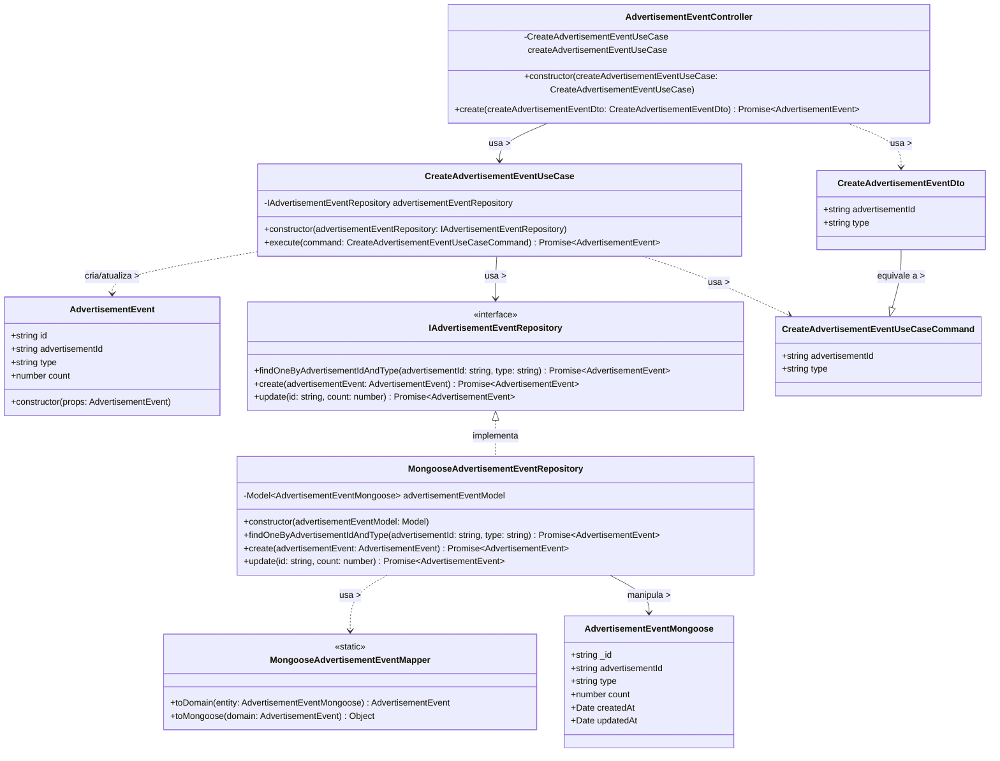

# Diagrama de Classes - Registro de Eventos de Anúncios

## Descrição do Diagrama de Classes

Este diagrama representa a estrutura de classes envolvidas no processo de registro de eventos de anúncios no sistema tuhogar-api, seguindo os princípios de Clean Architecture.

### Entidades de Domínio
- **AdvertisementEvent**: Representa um evento de anúncio no sistema com seus atributos (id, advertisementId, type, count)

### DTOs (Data Transfer Objects)
- **CreateAdvertisementEventDto**: Objeto de transferência de dados para criação de evento de anúncio, contendo advertisementId e type

### Interfaces
- **IAdvertisementEventRepository**: Interface para acesso e manipulação dos dados de eventos de anúncios, definindo métodos para buscar, criar e atualizar eventos

### Casos de Uso
- **CreateAdvertisementEventUseCase**: Orquestra o processo de criação/atualização de um evento de anúncio
- **CreateAdvertisementEventUseCaseCommand**: Comando que encapsula os dados necessários para executar o caso de uso

### Implementações
- **MongooseAdvertisementEventRepository**: Implementação do repositório de eventos de anúncios usando MongoDB/Mongoose
- **AdvertisementEventMongoose**: Esquema Mongoose para a entidade AdvertisementEvent
- **MongooseAdvertisementEventMapper**: Responsável por mapear entre a entidade de domínio e o modelo Mongoose
- **AdvertisementEventController**: Controlador HTTP para endpoints relacionados a eventos de anúncios

### Relações
- O MongooseAdvertisementEventRepository implementa a interface IAdvertisementEventRepository
- O CreateAdvertisementEventUseCase depende da interface IAdvertisementEventRepository
- O AdvertisementEventController depende do CreateAdvertisementEventUseCase
- O MongooseAdvertisementEventRepository usa o MongooseAdvertisementEventMapper para conversões
- O MongooseAdvertisementEventRepository manipula objetos AdvertisementEventMongoose
- O CreateAdvertisementEventUseCase cria/atualiza objetos AdvertisementEvent
- O CreateAdvertisementEventUseCase usa o CreateAdvertisementEventUseCaseCommand
- O AdvertisementEventController usa o CreateAdvertisementEventDto
- O CreateAdvertisementEventDto é equivalente ao CreateAdvertisementEventUseCaseCommand

### Responsabilidades
- **AdvertisementEvent**: Representa o conceito de evento de anúncio no domínio
- **IAdvertisementEventRepository**: Define o contrato para operações de persistência de eventos de anúncios
- **CreateAdvertisementEventUseCase**: Coordena o processo de criação/atualização de eventos de anúncios, incluindo:
  - Verificação da existência prévia do evento
  - Incremento do contador se o evento já existir
  - Criação de um novo evento se não existir
- **MongooseAdvertisementEventRepository**: Implementa as operações de persistência usando MongoDB
- **MongooseAdvertisementEventMapper**: Converte entre formatos de domínio e persistência
- **AdvertisementEventController**: Expõe um endpoint HTTP para registrar eventos de anúncios

### Fluxo de Dados
1. O AdvertisementEventController recebe um CreateAdvertisementEventDto via HTTP
2. O controlador passa os dados para o CreateAdvertisementEventUseCase
3. O caso de uso verifica se o evento já existe através do IAdvertisementEventRepository
4. Se existir, o caso de uso atualiza o contador do evento
5. Se não existir, o caso de uso cria um novo evento
6. O MongooseAdvertisementEventRepository persiste as alterações no MongoDB
7. O resultado é retornado ao controlador e então ao cliente

Este diagrama segue os princípios de Clean Architecture, com separação clara entre entidades de domínio, casos de uso, interfaces e implementações, conforme a estrutura do projeto tuhogar-api.
