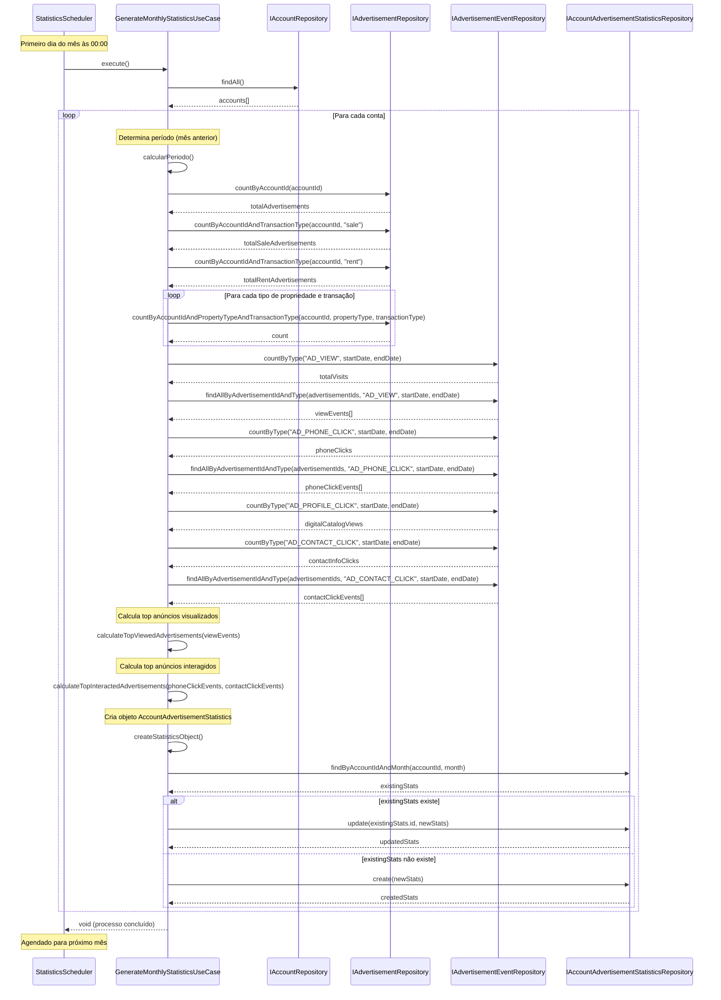

# Diagrama de Sequência - Geração de Relatórios Estatísticos Mensais

## Descrição do Diagrama de Sequência

Este diagrama representa o fluxo de interações entre os componentes durante o processo de geração de relatórios estatísticos mensais para eventos de anúncios imobiliários no sistema tuhogar-api.

### Atores e Componentes
- **StatisticsScheduler**: Componente responsável por agendar e iniciar o processo de geração de estatísticas
- **GenerateMonthlyStatisticsUseCase**: Caso de uso que orquestra todo o processo de geração de estatísticas
- **IAccountRepository**: Interface para acesso aos dados de contas
- **IAdvertisementRepository**: Interface para acesso aos dados de anúncios
- **IAdvertisementEventRepository**: Interface para acesso aos dados de eventos de anúncios
- **IAccountAdvertisementStatisticsRepository**: Interface para acesso e manipulação dos dados de estatísticas

### Fluxo Principal
1. **Início do Processo**:
   - No primeiro dia do mês às 00:00, o StatisticsScheduler inicia o processo chamando o método execute() do GenerateMonthlyStatisticsUseCase

2. **Obtenção de Contas**:
   - O UseCase solicita todas as contas ao AccountRepository
   - O AccountRepository retorna a lista de contas

3. **Processamento para Cada Conta**:
   - Para cada conta, o UseCase determina o período de análise (mês anterior)
   - O UseCase solicita ao AdvertisementRepository:
     - Total de anúncios da conta
     - Total de anúncios por tipo de transação (venda/aluguel)
     - Total de anúncios por tipo de propriedade e transação

4. **Obtenção de Métricas de Eventos**:
   - O UseCase solicita ao AdvertisementEventRepository:
     - Total de visualizações (evento AD_VIEW)
     - Eventos de visualização por anúncio
     - Total de cliques em telefone (evento AD_PHONE_CLICK)
     - Eventos de clique em telefone por anúncio
     - Total de visualizações de catálogo digital (evento AD_PROFILE_CLICK)
     - Total de cliques em informações de contato (evento AD_CONTACT_CLICK)
     - Eventos de clique em informações de contato por anúncio

5. **Cálculo de Top Anúncios**:
   - O UseCase calcula internamente:
     - Top 5 anúncios mais visualizados (baseado nos eventos AD_VIEW)
     - Top 5 anúncios com maior interação (baseado na soma de eventos AD_CONTACT_CLICK e AD_PHONE_CLICK)

6. **Criação e Armazenamento do Relatório**:
   - O UseCase cria o objeto AccountAdvertisementStatistics com todas as métricas calculadas
   - O UseCase verifica se já existe um relatório para a conta e mês específicos
   - Se existir, atualiza o relatório existente
   - Se não existir, cria um novo relatório
   - O StatsRepository armazena o relatório na collection account-advertisements-statistics

7. **Finalização**:
   - O processo é concluído para todas as contas
   - O StatisticsScheduler agenda a próxima execução para o primeiro dia do próximo mês

### Detalhes Importantes
- O processo é executado automaticamente no primeiro dia de cada mês
- As métricas são calculadas com base nos dados do mês anterior completo
- Para cada métrica (exceto digitalCatalogViews), são calculados:
  - Valor total
  - Valores segmentados por tipo de transação (venda/aluguel)
  - Valores segmentados por tipo de propriedade (casa/apartamento/terreno) e tipo de transação
- Os rankings de anúncios (topViewedAdvertisements e topInteractedAdvertisements) são separados por tipo de transação
- O relatório é armazenado na collection account-advertisements-statistics com um formato estruturado que permite análises detalhadas

### Cenários Alternativos
- **Sem contas**: Se não houver contas no sistema, o processo é concluído sem gerar relatórios
- **Sem anúncios**: Se uma conta não tiver anúncios, o relatório é gerado com valores zerados para as métricas
- **Sem eventos**: Se não houver eventos registrados para os anúncios de uma conta, o relatório é gerado com valores zerados para as métricas de eventos
- **Falha na geração**: Se ocorrer uma falha durante a geração para uma conta específica, o processo continua para as próximas contas e registra o erro

Este diagrama de sequência ilustra o fluxo completo de interações necessárias para gerar relatórios estatísticos mensais, seguindo os princípios de Clean Architecture e Domain-Driven Design do projeto tuhogar-api.
