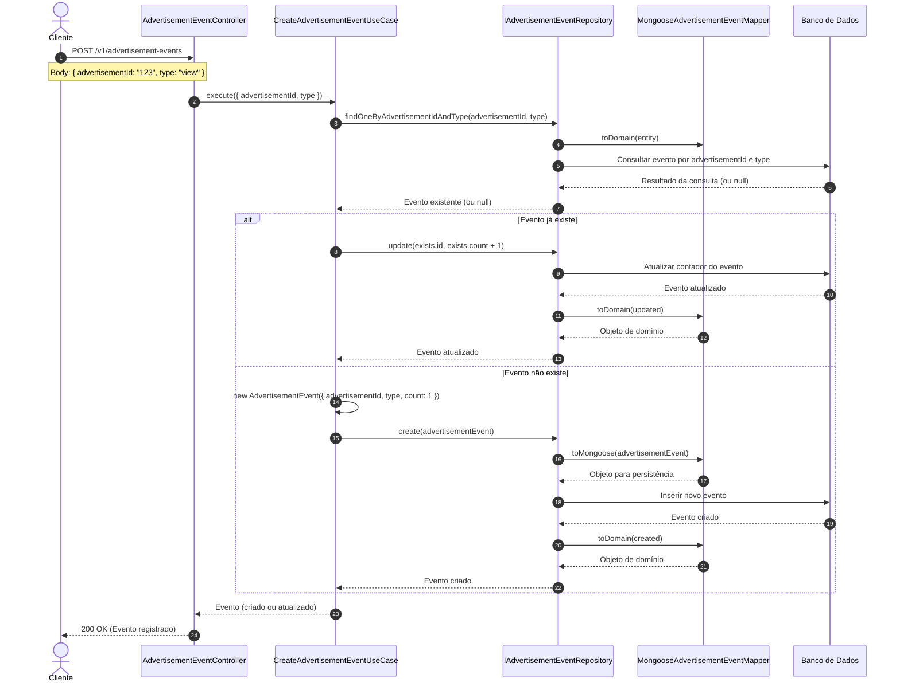

# Diagrama de Sequência - Registro de Eventos de Anúncios

## Descrição do Diagrama de Sequência

Este diagrama ilustra o fluxo de interações durante o processo de registro de eventos de anúncios no sistema tuhogar-api, seguindo os princípios de Clean Architecture.

### Participantes
- **Cliente**: Aplicação cliente que faz a requisição para registrar um evento
- **AdvertisementEventController**: Componente que recebe e processa requisições HTTP
- **CreateAdvertisementEventUseCase**: Componente que orquestra a lógica de negócio para criar/atualizar eventos
- **IAdvertisementEventRepository**: Componente responsável pelo acesso aos dados de eventos
- **MongooseAdvertisementEventMapper**: Componente responsável por mapear entre objetos de domínio e persistência
- **Banco de Dados**: Sistema de armazenamento persistente (MongoDB)

### Fluxo Principal
1. O cliente envia uma requisição POST para `/v1/advertisement-events` com os dados do evento (advertisementId e type)
2. O controlador recebe a requisição e chama o caso de uso de criação de evento
3. O caso de uso verifica se já existe um evento para o anúncio e tipo específicos
4. O repositório consulta o banco de dados e retorna o evento se existir
5. Se o evento já existir:
   - O caso de uso solicita ao repositório que atualize o contador do evento (incrementando-o)
   - O repositório atualiza o evento no banco de dados
   - O repositório mapeia o resultado para um objeto de domínio e retorna ao caso de uso
6. Se o evento não existir:
   - O caso de uso cria um novo objeto de evento com contador inicial 1
   - O caso de uso solicita ao repositório que crie o novo evento
   - O repositório mapeia o objeto de domínio para um formato persistível
   - O repositório insere o novo evento no banco de dados
   - O repositório mapeia o resultado para um objeto de domínio e retorna ao caso de uso
7. O caso de uso retorna o evento (criado ou atualizado) ao controlador
8. O controlador responde à requisição com o evento registrado

### Cenários Alternativos
Não há cenários alternativos significativos neste fluxo, pois o processo é bastante direto e não inclui validações complexas ou verificações de permissão.

### Regras de Negócio Aplicadas
- Se já existir um evento para o anúncio e tipo específicos, o contador é incrementado
- Se não existir um evento para o anúncio e tipo específicos, um novo evento é criado com contador inicial 1
- Não há validação da existência do anúncio referenciado
- Não há validação do tipo de evento fornecido

### Operações de Banco de Dados
- **Consulta**: Buscar evento por advertisementId e type
- **Atualização**: Incrementar contador de um evento existente
- **Inserção**: Criar um novo registro de evento

### Mapeamento de Dados
- O MongooseAdvertisementEventMapper é responsável por converter entre:
  - Objetos de domínio (AdvertisementEvent) usados na lógica de negócio
  - Objetos de persistência (AdvertisementEventMongoose) usados no banco de dados

Este diagrama demonstra como o sistema segue os princípios de Clean Architecture, com separação clara de responsabilidades entre controladores, casos de uso e repositórios, e como os dados fluem entre essas camadas durante o processo de registro de eventos de anúncios.
