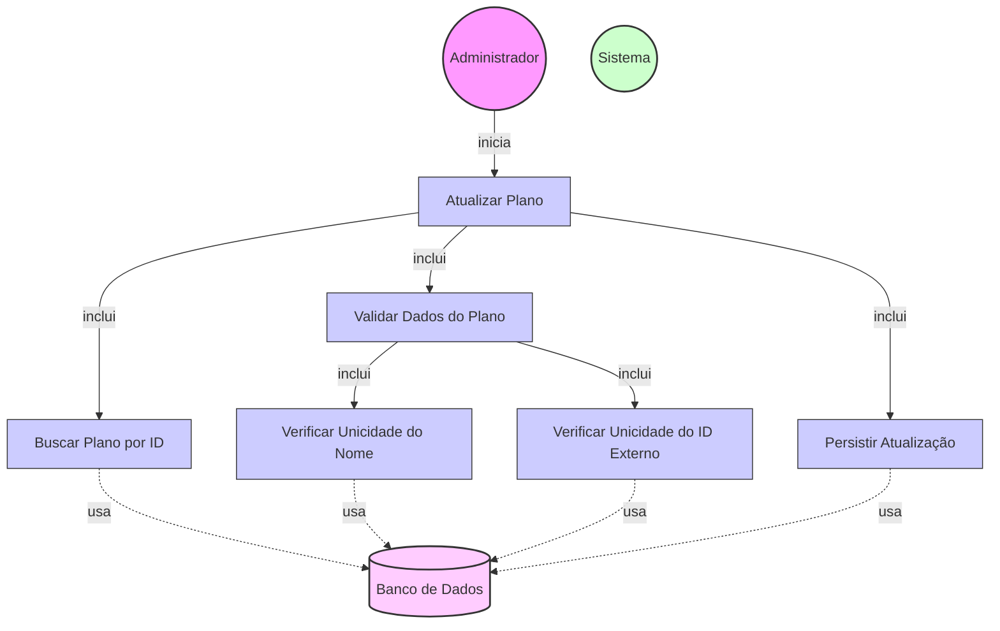

# Diagrama de Caso de Uso - Atualização de Planos

## Descrição do Diagrama de Caso de Uso

Este diagrama representa o processo de atualização de planos existentes no sistema tuhogar-api.

### Atores
- **Administrador**: Usuário com permissões administrativas que pode atualizar planos existentes
- **Sistema**: O sistema tuhogar-api
- **Banco de Dados**: Armazenamento persistente dos planos

### Casos de Uso
1. **Atualizar Plano**: Caso de uso principal que representa o processo completo de atualização de plano
2. **Buscar Plano por ID**: Recuperação do plano existente pelo seu identificador
3. **Validar Dados do Plano**: Verificação dos dados fornecidos pelo administrador
4. **Verificar Unicidade do Nome**: Verificação se já existe outro plano com o mesmo nome
5. **Verificar Unicidade do ID Externo**: Verificação se já existe outro plano com o mesmo ID externo
6. **Persistir Atualização**: Armazenamento das alterações no banco de dados

## Fluxo Principal

1. O Administrador acessa a interface de gerenciamento de planos
2. O Sistema exibe a lista de planos existentes
3. O Administrador seleciona um plano para atualizar
4. O Sistema executa o caso de uso "Buscar Plano por ID"
5. O Sistema exibe um formulário com os dados atuais do plano:
   - Nome do plano
   - Duração (em dias)
   - Itens incluídos no plano (lista)
   - Preço
   - ID externo (para integração com gateway de pagamento)
   - Limite de anúncios (opcional)
   - Limite de fotos por anúncio (opcional)
6. O Administrador modifica os campos desejados
7. O Administrador confirma a atualização do plano
8. O Sistema executa o caso de uso "Validar Dados do Plano"
9. O Sistema executa os casos de uso "Verificar Unicidade do Nome" e "Verificar Unicidade do ID Externo"
10. O Sistema executa o caso de uso "Persistir Atualização"
11. O Sistema confirma a atualização bem-sucedida do plano

## Fluxos Alternativos

### FA1. Plano Não Encontrado
1. No passo 4 do fluxo principal, se o plano não for encontrado:
   - O Sistema exibe uma mensagem de erro informando que o plano não existe
   - O fluxo retorna ao passo 2 do fluxo principal

### FA2. Validação de Dados Falha
1. No passo 8 do fluxo principal, se a validação falhar:
   - O Sistema exibe mensagens de erro específicas para cada campo inválido
   - O Administrador corrige os dados
   - O fluxo retorna ao passo 7 do fluxo principal

### FA3. Nome de Plano Já Existe
1. No passo 9 do fluxo principal, se já existir outro plano com o mesmo nome:
   - O Sistema exibe uma mensagem de erro informando que o nome já está em uso
   - O Administrador modifica o nome do plano
   - O fluxo retorna ao passo 7 do fluxo principal

### FA4. ID Externo Já Existe
1. No passo 9 do fluxo principal, se já existir outro plano com o mesmo ID externo:
   - O Sistema exibe uma mensagem de erro informando que o ID externo já está em uso
   - O Administrador modifica o ID externo do plano
   - O fluxo retorna ao passo 7 do fluxo principal

### FA5. Cancelamento da Atualização
1. Em qualquer ponto antes do passo 7 do fluxo principal:
   - O Administrador cancela a operação
   - O Sistema retorna à interface de gerenciamento de planos sem atualizar o plano

## Regras de Negócio

- O nome do plano deve ser único (caso seja alterado)
- A duração do plano deve ser um número inteiro positivo
- O preço deve ser um valor numérico positivo
- O ID externo deve ser único para integração com o gateway de pagamento (caso seja alterado)
- Os limites de anúncios e fotos, quando especificados, devem ser números inteiros não negativos
- A atualização de um plano não afeta assinaturas existentes, apenas novas assinaturas

## Pré-condições

- O Administrador está autenticado no sistema
- O Administrador possui permissões para gerenciar planos
- Existe pelo menos um plano cadastrado no sistema

## Pós-condições

- O plano selecionado é atualizado no sistema
- As alterações no plano são refletidas para novas assinaturas
- RF-P06: O sistema deve validar os dados de atualização de planos conforme as regras de negócio.
