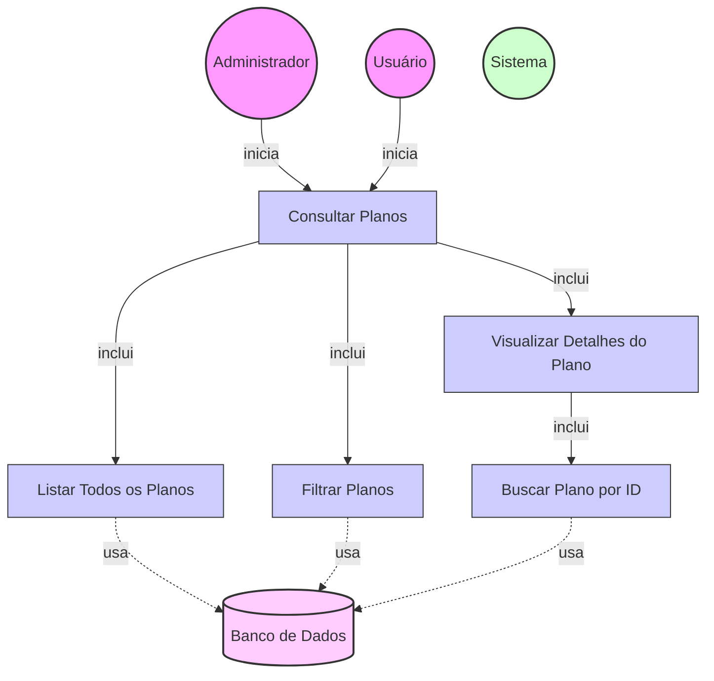

# Diagrama de Caso de Uso - Consulta de Planos

## Descrição do Diagrama de Caso de Uso

Este diagrama representa o processo de consulta de planos disponíveis no sistema tuhogar-api.

### Atores
- **Administrador**: Usuário com permissões administrativas que pode visualizar todos os planos
- **Usuário**: Usuário comum que pode visualizar planos disponíveis para assinatura
- **Sistema**: O sistema tuhogar-api
- **Banco de Dados**: Armazenamento persistente dos planos

### Casos de Uso
1. **Consultar Planos**: Caso de uso principal que representa o processo de consulta de planos
2. **Listar Todos os Planos**: Recuperação da lista de planos disponíveis
3. **Filtrar Planos**: Aplicação de filtros para refinar a lista de planos
4. **Visualizar Detalhes do Plano**: Exibição detalhada de um plano específico
5. **Buscar Plano por ID**: Recuperação de um plano específico pelo seu identificador

## Fluxo Principal

1. O Administrador ou Usuário inicia o caso de uso "Consultar Planos"
2. O Sistema executa o caso de uso "Listar Todos os Planos", que recupera os planos do Banco de Dados
3. O Sistema exibe os planos com suas características principais:
   - Nome do plano
   - Duração
   - Itens/benefícios incluídos
   - Preço
   - Limite de anúncios (se aplicável)
   - Limite de fotos por anúncio (se aplicável)
4. O Administrador ou Usuário pode optar por visualizar detalhes de um plano específico

## Fluxos Alternativos

### FA1. Filtrar Planos
1. Após o passo 2 do fluxo principal, o Administrador ou Usuário pode aplicar filtros
2. O Sistema executa o caso de uso "Filtrar Planos", que refina a busca no Banco de Dados
3. O Sistema exibe apenas os planos que correspondem aos critérios de filtro

### FA2. Visualizar Detalhes do Plano
1. O Administrador ou Usuário seleciona um plano específico
2. O Sistema executa o caso de uso "Buscar Plano por ID", que recupera os dados completos do plano
3. O Sistema exibe todos os detalhes do plano, incluindo:
   - Nome do plano
   - Duração
   - Itens/benefícios incluídos
   - Preço
   - ID externo (apenas para Administradores)
   - Limite de anúncios
   - Limite de fotos por anúncio

### FA3. Nenhum Plano Encontrado
1. Se nenhum plano for encontrado após a busca:
   - O Sistema exibe uma mensagem informando que não há planos disponíveis
   - Se o ator for um Administrador, o Sistema oferece a opção de criar um novo plano

## Regras de Negócio

- Usuários comuns só podem visualizar planos ativos
- Administradores podem visualizar todos os planos, incluindo detalhes técnicos como ID externo
- Os limites de anúncios e fotos são exibidos como parte das características do plano

## Pré-condições

- O Administrador ou Usuário está autenticado no sistema
- O Administrador ou Usuário possui permissões para visualizar planos

## Pós-condições

- O Administrador ou Usuário visualiza os planos disponíveis ou um plano específico
