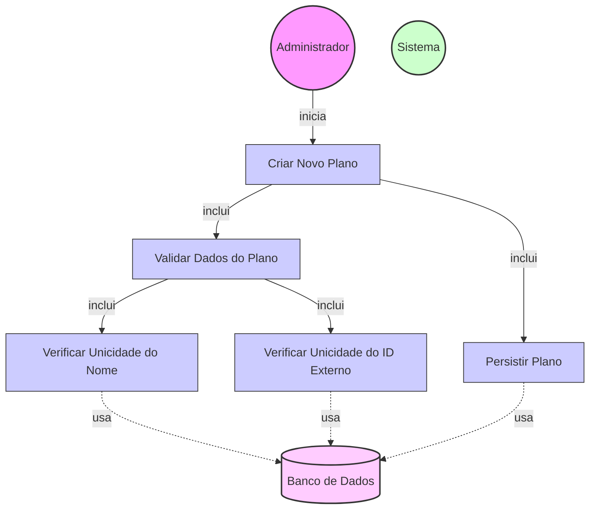

# Diagrama de Caso de Uso - Criação de Planos

## Descrição do Diagrama de Caso de Uso

Este diagrama representa o processo de criação de novos planos no sistema tuhogar-api.

### Atores
- **Administrador**: Usuário com permissões administrativas que pode criar novos planos
- **Sistema**: O sistema tuhogar-api
- **Banco de Dados**: Armazenamento persistente dos planos

### Casos de Uso
1. **Criar Novo Plano**: Caso de uso principal que representa o processo completo de criação de plano
2. **Validar Dados do Plano**: Verificação dos dados fornecidos pelo administrador
3. **Verificar Unicidade do Nome**: Verificação se já existe um plano com o mesmo nome
4. **Verificar Unicidade do ID Externo**: Verificação se já existe um plano com o mesmo ID externo
5. **Persistir Plano**: Armazenamento do novo plano no banco de dados

## Fluxo Principal

1. O Administrador acessa a interface de gerenciamento de planos
2. O Administrador seleciona a opção para criar um novo plano
3. O Sistema apresenta um formulário com os campos necessários:
   - Nome do plano
   - Duração (em dias)
   - Itens incluídos no plano (lista)
   - Preço
   - ID externo (para integração com gateway de pagamento)
   - Limite de anúncios (opcional)
   - Limite de fotos por anúncio (opcional)
4. O Administrador preenche os campos obrigatórios e opcionais
5. O Administrador confirma a criação do plano
6. O Sistema executa o caso de uso "Validar Dados do Plano"
7. O Sistema executa os casos de uso "Verificar Unicidade do Nome" e "Verificar Unicidade do ID Externo"
8. O Sistema executa o caso de uso "Persistir Plano"
9. O Sistema confirma a criação bem-sucedida do plano

## Fluxos Alternativos

### FA1. Validação de Dados Falha
1. No passo 6 do fluxo principal, se a validação falhar:
   - O Sistema exibe mensagens de erro específicas para cada campo inválido
   - O Administrador corrige os dados
   - O fluxo retorna ao passo 5 do fluxo principal

### FA2. Nome de Plano Já Existe
1. No passo 7 do fluxo principal, se já existir um plano com o mesmo nome:
   - O Sistema exibe uma mensagem de erro informando que o nome já está em uso
   - O Administrador modifica o nome do plano
   - O fluxo retorna ao passo 5 do fluxo principal

### FA3. ID Externo Já Existe
1. No passo 7 do fluxo principal, se já existir um plano com o mesmo ID externo:
   - O Sistema exibe uma mensagem de erro informando que o ID externo já está em uso
   - O Administrador modifica o ID externo do plano
   - O fluxo retorna ao passo 5 do fluxo principal

### FA4. Cancelamento da Criação
1. Em qualquer ponto antes do passo 5 do fluxo principal:
   - O Administrador cancela a operação
   - O Sistema retorna à interface de gerenciamento de planos sem criar um novo plano

## Regras de Negócio

- O nome do plano deve ser único
- A duração do plano deve ser um número inteiro positivo
- O preço deve ser um valor numérico positivo
- O ID externo deve ser único para integração com o gateway de pagamento
- Os limites de anúncios e fotos, quando especificados, devem ser números inteiros não negativos

## Pré-condições

- O Administrador está autenticado no sistema
- O Administrador possui permissões para gerenciar planos

## Pós-condições

- Um novo plano é criado no sistema
- O novo plano está disponível para assinaturas
