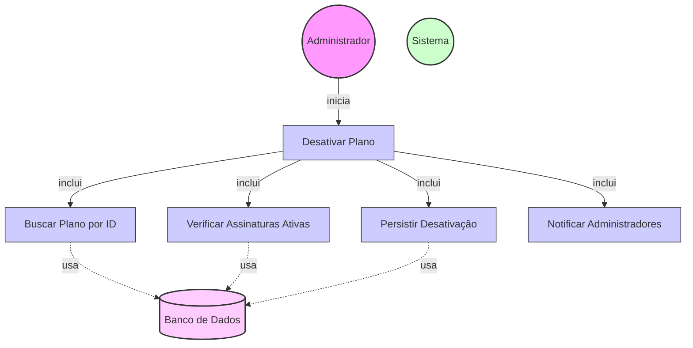

# Diagrama de Caso de Uso - Desativação de Planos

## Descrição do Diagrama de Caso de Uso

Este diagrama representa o processo de desativação de planos existentes no sistema tuhogar-api.

### Atores
- **Administrador**: Usuário com permissões administrativas que pode desativar planos existentes
- **Sistema**: O sistema tuhogar-api
- **Banco de Dados**: Armazenamento persistente dos planos e assinaturas

### Casos de Uso
1. **Desativar Plano**: Caso de uso principal que representa o processo completo de desativação de plano
2. **Buscar Plano por ID**: Recuperação do plano existente pelo seu identificador
3. **Verificar Assinaturas Ativas**: Verificação se existem assinaturas ativas vinculadas ao plano
4. **Persistir Desativação**: Armazenamento da desativação no banco de dados
5. **Notificar Administradores**: Envio de notificação sobre a desativação do plano

## Fluxo Principal

1. O Administrador acessa a interface de gerenciamento de planos
2. O Sistema exibe a lista de planos existentes
3. O Administrador seleciona um plano para desativar
4. O Sistema executa o caso de uso "Buscar Plano por ID"
5. O Sistema executa o caso de uso "Verificar Assinaturas Ativas"
6. O Sistema solicita confirmação do Administrador para desativar o plano
7. O Administrador confirma a desativação do plano
8. O Sistema executa o caso de uso "Persistir Desativação"
9. O Sistema executa o caso de uso "Notificar Administradores"
10. O Sistema confirma a desativação bem-sucedida do plano

## Fluxos Alternativos

### FA1. Plano Não Encontrado
1. No passo 4 do fluxo principal, se o plano não for encontrado:
   - O Sistema exibe uma mensagem de erro informando que o plano não existe
   - O fluxo retorna ao passo 2 do fluxo principal

### FA2. Existem Assinaturas Ativas
1. No passo 5 do fluxo principal, se forem encontradas assinaturas ativas vinculadas ao plano:
   - O Sistema exibe uma mensagem de alerta informando sobre as assinaturas ativas
   - O Sistema solicita confirmação adicional do Administrador
   - Se o Administrador confirmar mesmo assim, o fluxo continua no passo 8
   - Se o Administrador cancelar, o fluxo é interrompido e retorna ao passo 2

### FA3. Cancelamento da Desativação
1. No passo 7 do fluxo principal:
   - O Administrador cancela a operação
   - O Sistema retorna à interface de gerenciamento de planos sem desativar o plano

## Regras de Negócio

- Um plano desativado não pode ser selecionado para novas assinaturas
- Assinaturas existentes vinculadas ao plano desativado continuam válidas até seu vencimento
- Ao renovar uma assinatura vinculada a um plano desativado, o usuário deverá escolher um novo plano
- A desativação de um plano é reversível (o plano pode ser reativado posteriormente)
- Administradores devem ser notificados quando um plano é desativado

## Pré-condições

- O Administrador está autenticado no sistema
- O Administrador possui permissões para gerenciar planos
- Existe pelo menos um plano ativo cadastrado no sistema

## Pós-condições

- O plano selecionado é marcado como desativado no sistema
- O plano desativado não aparece mais como opção para novas assinaturas
- Administradores são notificados sobre a desativação do plano
