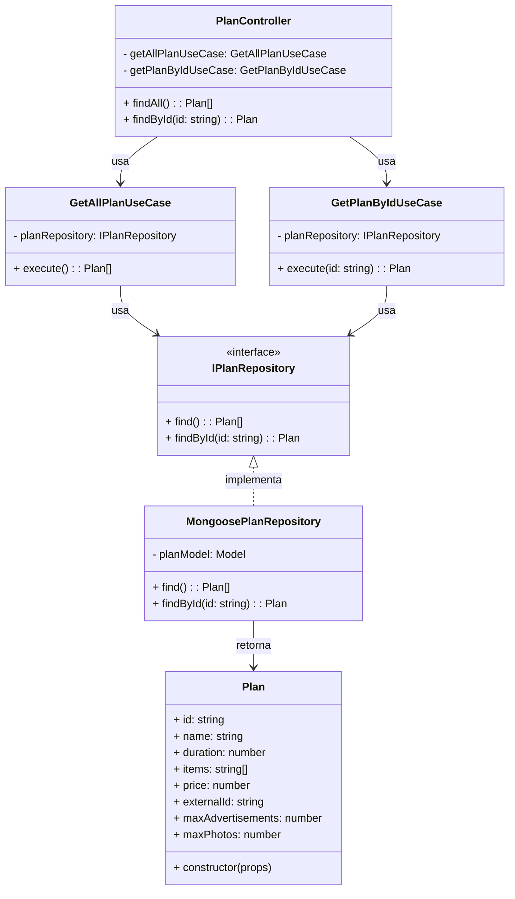

# Diagrama de Classes - Consulta de Planos

## Descrição das Classes

### Camada de Interface

#### PlanController
- **Descrição**: Controlador HTTP que expõe endpoints para consulta de planos.
- **Atributos**:
  - `getAllPlanUseCase`: Caso de uso para listar todos os planos
  - `getPlanByIdUseCase`: Caso de uso para buscar um plano específico
- **Métodos**:
  - `findAll()`: Endpoint HTTP para listar todos os planos
  - `findById(id)`: Endpoint HTTP para buscar um plano específico pelo ID

### Camada de Aplicação

#### GetAllPlanUseCase
- **Descrição**: Caso de uso responsável por recuperar todos os planos disponíveis.
- **Atributos**:
  - `planRepository`: Repositório de planos injetado via construtor
- **Métodos**:
  - `execute()`: Executa o caso de uso de listagem de planos

#### GetPlanByIdUseCase
- **Descrição**: Caso de uso responsável por recuperar um plano específico pelo ID.
- **Atributos**:
  - `planRepository`: Repositório de planos injetado via construtor
- **Métodos**:
  - `execute(id)`: Executa o caso de uso de busca de plano por ID

### Interfaces

#### IPlanRepository
- **Descrição**: Interface que define os métodos necessários para consulta de planos.
- **Métodos**:
  - `find()`: Recupera todos os planos
  - `findById(id)`: Busca um plano pelo ID

### Camada de Domínio

#### Plan
- **Descrição**: Entidade de domínio que representa um plano no sistema.
- **Atributos**:
  - `id`: Identificador único do plano
  - `name`: Nome do plano
  - `duration`: Duração do plano em dias
  - `items`: Lista de itens/benefícios incluídos no plano
  - `price`: Preço do plano
  - `externalId`: Identificador externo para integração com gateway de pagamento
  - `maxAdvertisements`: Número máximo de anúncios permitidos (opcional)
  - `maxPhotos`: Número máximo de fotos por anúncio permitidas (opcional)
- **Métodos**:
  - `constructor(props)`: Inicializa uma nova instância de Plan

### Camada de Infraestrutura

#### MongoosePlanRepository
- **Descrição**: Implementação concreta do repositório de planos usando Mongoose/MongoDB.
- **Atributos**:
  - `planModel`: Modelo Mongoose para a entidade Plan
- **Métodos**:
  - `find()`: Implementa a busca de todos os planos
  - `findById(id)`: Implementa a busca de um plano pelo ID

## Fluxo de Consulta de Planos

### Fluxo de Listagem de Todos os Planos
1. O cliente envia uma requisição HTTP GET para o endpoint de listagem de planos.
2. O `PlanController` recebe a requisição e chama o método `execute` do `GetAllPlanUseCase`.
3. O `GetAllPlanUseCase` chama o método `find` do `IPlanRepository`.
4. O `MongoosePlanRepository` implementa a busca no MongoDB e retorna uma lista de planos.
5. O resultado é retornado através das camadas até o cliente.

### Fluxo de Busca de Plano por ID
1. O cliente envia uma requisição HTTP GET para o endpoint de busca de plano por ID.
2. O `PlanController` recebe a requisição e chama o método `execute` do `GetPlanByIdUseCase`, passando o ID do plano.
3. O `GetPlanByIdUseCase` chama o método `findById` do `IPlanRepository`.
4. O `MongoosePlanRepository` implementa a busca no MongoDB e retorna o plano encontrado (ou null se não existir).
5. O resultado é retornado através das camadas até o cliente.

## Observações

- O diagrama segue os princípios de Clean Architecture, separando claramente as camadas de domínio, aplicação, infraestrutura e interface.
- A injeção de dependências é utilizada para garantir o baixo acoplamento entre os componentes.
- As interfaces são utilizadas para definir contratos entre as camadas, permitindo a substituição de implementações concretas sem afetar o restante do sistema.
- O controlador expõe dois endpoints distintos para atender diferentes necessidades de consulta: listagem completa e busca por ID.
