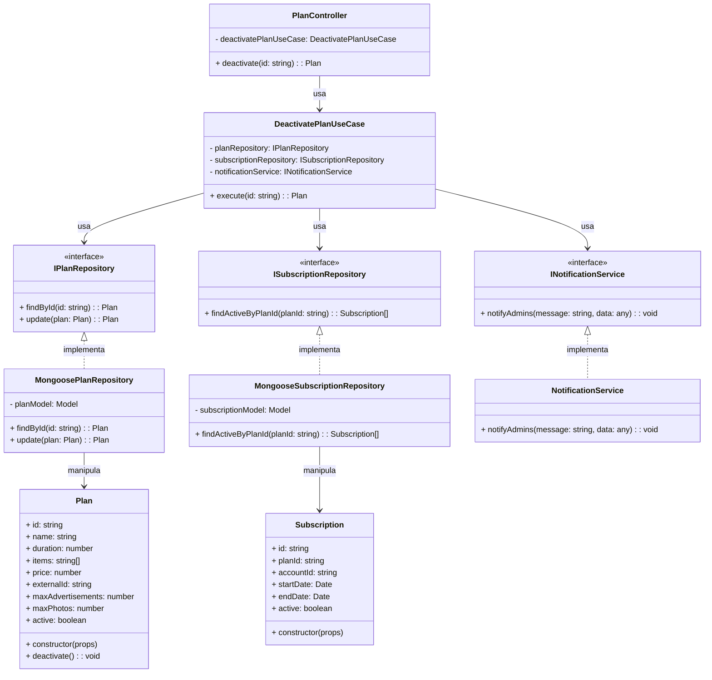

# Diagrama de Classes - Desativação de Planos

## Descrição das Classes

### Camada de Interface

#### PlanController
- **Descrição**: Controlador HTTP que expõe endpoints para gerenciamento de planos.
- **Atributos**:
  - `deactivatePlanUseCase`: Caso de uso para desativação de planos
- **Métodos**:
  - `deactivate(id)`: Endpoint HTTP para desativar um plano específico

### Camada de Aplicação

#### DeactivatePlanUseCase
- **Descrição**: Caso de uso responsável pela desativação de planos existentes.
- **Atributos**:
  - `planRepository`: Repositório de planos injetado via construtor
  - `subscriptionRepository`: Repositório de assinaturas injetado via construtor
  - `notificationService`: Serviço de notificação injetado via construtor
- **Métodos**:
  - `execute(id)`: Executa o caso de uso de desativação de plano

### Interfaces

#### IPlanRepository
- **Descrição**: Interface que define os métodos necessários para persistência de planos.
- **Métodos**:
  - `findById(id)`: Busca um plano pelo ID
  - `update(plan)`: Atualiza um plano existente no repositório

#### ISubscriptionRepository
- **Descrição**: Interface que define os métodos necessários para consulta de assinaturas.
- **Métodos**:
  - `findActiveByPlanId(planId)`: Busca assinaturas ativas vinculadas a um plano específico

#### INotificationService
- **Descrição**: Interface que define os métodos necessários para envio de notificações.
- **Métodos**:
  - `notifyAdmins(message, data)`: Envia uma notificação para todos os administradores

### Camada de Domínio

#### Plan
- **Descrição**: Entidade de domínio que representa um plano no sistema.
- **Atributos**:
  - `id`: Identificador único do plano
  - `name`: Nome do plano
  - `duration`: Duração do plano em dias
  - `items`: Lista de itens/benefícios incluídos no plano
  - `price`: Preço do plano
  - `externalId`: Identificador externo para integração com gateway de pagamento
  - `maxAdvertisements`: Número máximo de anúncios permitidos (opcional)
  - `maxPhotos`: Número máximo de fotos por anúncio permitidas (opcional)
  - `active`: Indica se o plano está ativo ou não
- **Métodos**:
  - `constructor(props)`: Inicializa uma nova instância de Plan
  - `deactivate()`: Marca o plano como inativo

#### Subscription
- **Descrição**: Entidade de domínio que representa uma assinatura no sistema.
- **Atributos**:
  - `id`: Identificador único da assinatura
  - `planId`: Identificador do plano associado
  - `accountId`: Identificador da conta associada
  - `startDate`: Data de início da assinatura
  - `endDate`: Data de término da assinatura
  - `active`: Indica se a assinatura está ativa ou não
- **Métodos**:
  - `constructor(props)`: Inicializa uma nova instância de Subscription

### Camada de Infraestrutura

#### MongoosePlanRepository
- **Descrição**: Implementação concreta do repositório de planos usando Mongoose/MongoDB.
- **Atributos**:
  - `planModel`: Modelo Mongoose para a entidade Plan
- **Métodos**:
  - `findById(id)`: Implementa a busca de um plano pelo ID
  - `update(plan)`: Implementa a atualização de um plano no MongoDB

#### MongooseSubscriptionRepository
- **Descrição**: Implementação concreta do repositório de assinaturas usando Mongoose/MongoDB.
- **Atributos**:
  - `subscriptionModel`: Modelo Mongoose para a entidade Subscription
- **Métodos**:
  - `findActiveByPlanId(planId)`: Implementa a busca de assinaturas ativas por ID de plano

#### NotificationService
- **Descrição**: Implementação concreta do serviço de notificação.
- **Métodos**:
  - `notifyAdmins(message, data)`: Implementa o envio de notificações para administradores

## Fluxo de Desativação de Plano

1. O cliente envia uma requisição HTTP PUT para o endpoint de desativação de plano, especificando o ID do plano.
2. O `PlanController` recebe a requisição e chama o método `execute` do `DeactivatePlanUseCase`, passando o ID do plano.
3. O `DeactivatePlanUseCase` chama o método `findById` do `IPlanRepository` para buscar o plano existente.
4. O `DeactivatePlanUseCase` chama o método `findActiveByPlanId` do `ISubscriptionRepository` para verificar se existem assinaturas ativas vinculadas ao plano.
5. Se existirem assinaturas ativas, o `DeactivatePlanUseCase` pode solicitar confirmação adicional ou prosseguir conforme configuração.
6. O `DeactivatePlanUseCase` chama o método `deactivate` da entidade `Plan` para marcar o plano como inativo.
7. O `DeactivatePlanUseCase` chama o método `update` do `IPlanRepository` para persistir a alteração.
8. O `DeactivatePlanUseCase` chama o método `notifyAdmins` do `INotificationService` para notificar os administradores sobre a desativação.
9. O resultado é retornado através das camadas até o cliente.

## Observações

- O diagrama segue os princípios de Clean Architecture, separando claramente as camadas de domínio, aplicação, infraestrutura e interface.
- A injeção de dependências é utilizada para garantir o baixo acoplamento entre os componentes.
- As interfaces são utilizadas para definir contratos entre as camadas, permitindo a substituição de implementações concretas sem afetar o restante do sistema.
- A verificação de assinaturas ativas é realizada para alertar sobre possíveis impactos da desativação do plano.
- O serviço de notificação é utilizado para informar os administradores sobre a desativação do plano, garantindo que todos estejam cientes da alteração.
