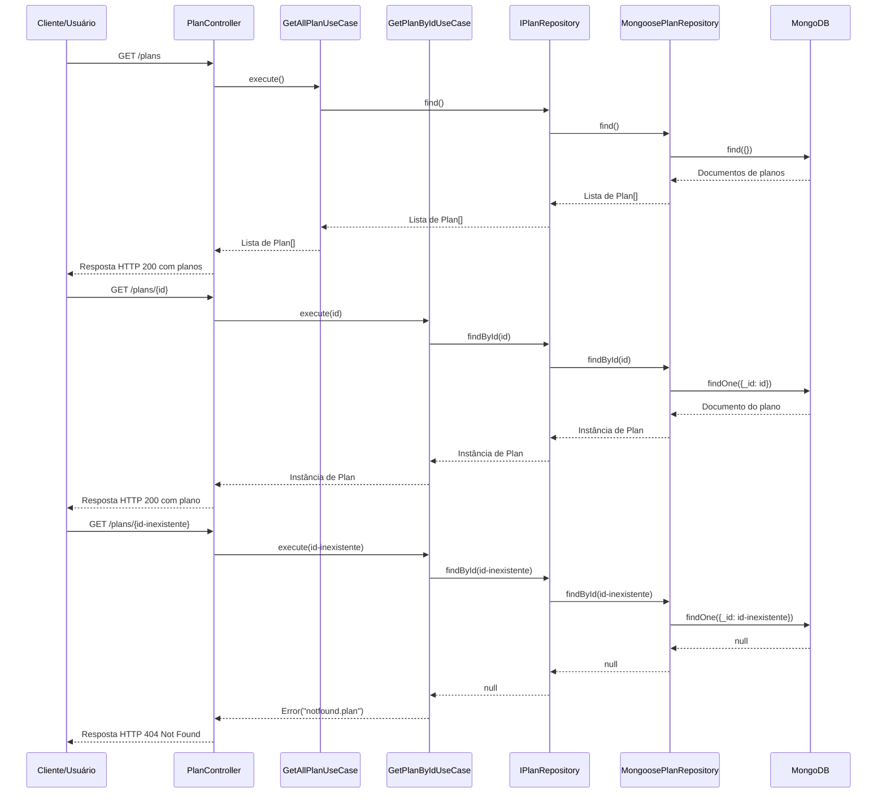

# Diagrama de Sequência - Consulta de Planos

## Descrição
Este diagrama descreve a sequência de interações entre os componentes do sistema durante o processo de consulta de planos, seguindo os princípios de Clean Architecture e Domain-Driven Design.

## Diagrama

## Descrição do Fluxo

### Fluxo de Listagem de Todos os Planos

1. **Cliente → PlanController**:
   - O Cliente envia uma requisição HTTP GET para o endpoint `/plans`.

2. **PlanController → GetAllPlanUseCase**:
   - O PlanController recebe a requisição e chama o método `execute` do GetAllPlanUseCase.

3. **GetAllPlanUseCase → IPlanRepository**:
   - O GetAllPlanUseCase chama o método `find` da interface IPlanRepository.

4. **IPlanRepository → MongoosePlanRepository**:
   - A implementação concreta MongoosePlanRepository recebe a chamada para buscar todos os planos.

5. **MongoosePlanRepository → MongoDB**:
   - O MongoosePlanRepository executa uma consulta no MongoDB para recuperar todos os documentos de planos.

6. **MongoDB → MongoosePlanRepository → IPlanRepository → GetAllPlanUseCase → PlanController → Cliente**:
   - O MongoDB retorna os documentos encontrados.
   - O MongoosePlanRepository converte os documentos em instâncias da entidade Plan.
   - A interface IPlanRepository repassa a lista de planos para o GetAllPlanUseCase.
   - O GetAllPlanUseCase retorna a lista de planos para o PlanController.
   - O PlanController formata a resposta e retorna um HTTP 200 OK com a lista de planos.

### Fluxo de Busca de Plano por ID

1. **Cliente → PlanController**:
   - O Cliente envia uma requisição HTTP GET para o endpoint `/plans/{id}`.

2. **PlanController → GetPlanByIdUseCase**:
   - O PlanController recebe a requisição e chama o método `execute` do GetPlanByIdUseCase, passando o ID do plano.

3. **GetPlanByIdUseCase → IPlanRepository**:
   - O GetPlanByIdUseCase chama o método `findById` da interface IPlanRepository.

4. **IPlanRepository → MongoosePlanRepository**:
   - A implementação concreta MongoosePlanRepository recebe a chamada para buscar o plano pelo ID.

5. **MongoosePlanRepository → MongoDB**:
   - O MongoosePlanRepository executa uma consulta no MongoDB para recuperar o documento do plano com o ID especificado.

6. **MongoDB → MongoosePlanRepository → IPlanRepository → GetPlanByIdUseCase → PlanController → Cliente**:
   - O MongoDB retorna o documento encontrado.
   - O MongoosePlanRepository converte o documento em uma instância da entidade Plan.
   - A interface IPlanRepository repassa o plano para o GetPlanByIdUseCase.
   - O GetPlanByIdUseCase retorna o plano para o PlanController.
   - O PlanController formata a resposta e retorna um HTTP 200 OK com o plano.

### Fluxo Alternativo - Plano Não Encontrado

1. **Cliente → PlanController**:
   - O Cliente envia uma requisição HTTP GET para o endpoint `/plans/{id-inexistente}` com um ID que não existe.

2. **PlanController → GetPlanByIdUseCase**:
   - O PlanController recebe a requisição e chama o método `execute` do GetPlanByIdUseCase, passando o ID inexistente.

3. **GetPlanByIdUseCase → IPlanRepository**:
   - O GetPlanByIdUseCase chama o método `findById` da interface IPlanRepository.

4. **IPlanRepository → MongoosePlanRepository**:
   - A implementação concreta MongoosePlanRepository recebe a chamada para buscar o plano pelo ID.

5. **MongoosePlanRepository → MongoDB**:
   - O MongoosePlanRepository executa uma consulta no MongoDB para recuperar o documento do plano com o ID especificado.

6. **MongoDB → MongoosePlanRepository → IPlanRepository → GetPlanByIdUseCase**:
   - O MongoDB retorna null, pois não encontrou nenhum documento com o ID especificado.
   - O MongoosePlanRepository repassa o null para a interface IPlanRepository.
   - A interface IPlanRepository repassa o null para o GetPlanByIdUseCase.

7. **GetPlanByIdUseCase → PlanController**:
   - O GetPlanByIdUseCase lança um erro com a mensagem "notfound.plan".

8. **PlanController → Cliente**:
   - O PlanController captura o erro e retorna um HTTP 404 Not Found para o cliente.

## Observações

- O diagrama segue os princípios de Clean Architecture, com fluxo de controle passando pelas camadas de interface, aplicação, domínio e infraestrutura.
- A injeção de dependências é utilizada para garantir o baixo acoplamento entre os componentes.
- As interfaces são utilizadas para definir contratos entre as camadas, permitindo a substituição de implementações concretas sem afetar o restante do sistema.
- O sistema implementa tratamento adequado para casos em que o plano não é encontrado, retornando um código de status HTTP apropriado.
- Os dois fluxos principais (listagem de todos os planos e busca por ID) são implementados como casos de uso separados, seguindo o princípio de responsabilidade única.
