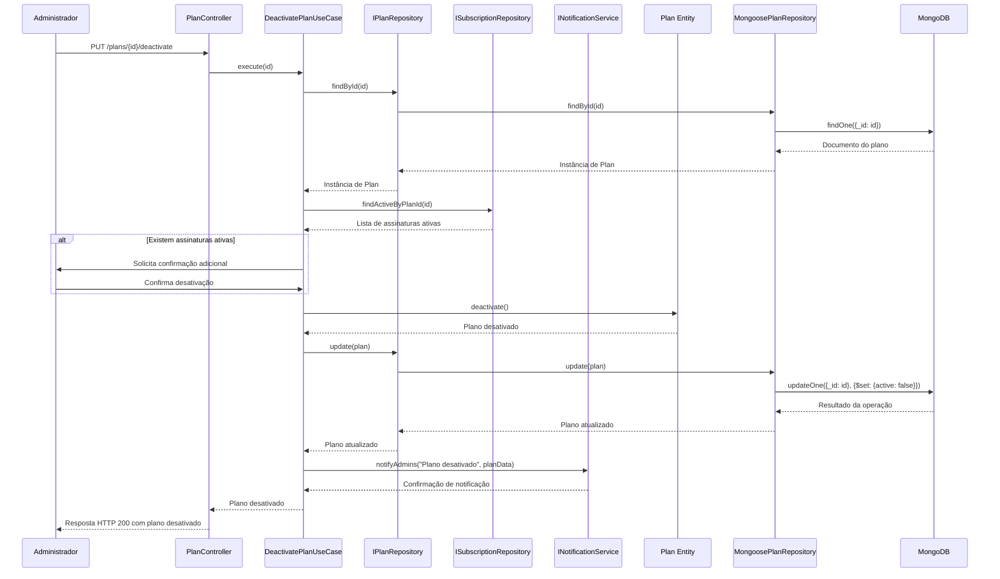

# Diagrama de Sequência - Desativação de Planos

## Descrição
Este diagrama descreve a sequência de interações entre os componentes do sistema durante o processo de desativação de um plano existente, seguindo os princípios de Clean Architecture e Domain-Driven Design.

## Diagrama

## Descrição do Fluxo

### Fluxo Principal

1. **Administrador → PlanController**:
   - O Administrador envia uma requisição HTTP PUT para o endpoint `/plans/{id}/deactivate`.

2. **PlanController → DeactivatePlanUseCase**:
   - O PlanController recebe a requisição e chama o método `execute` do DeactivatePlanUseCase, passando o ID do plano.

3. **DeactivatePlanUseCase → IPlanRepository → MongoosePlanRepository → MongoDB**:
   - O DeactivatePlanUseCase chama o método `findById` da interface IPlanRepository para buscar o plano existente.
   - A implementação concreta MongoosePlanRepository executa uma consulta no MongoDB para recuperar o documento do plano.
   - O MongoDB retorna o documento encontrado.
   - O MongoosePlanRepository converte o documento em uma instância da entidade Plan.
   - A interface IPlanRepository repassa o plano para o DeactivatePlanUseCase.

4. **DeactivatePlanUseCase → ISubscriptionRepository**:
   - O DeactivatePlanUseCase chama o método `findActiveByPlanId` da interface ISubscriptionRepository para verificar se existem assinaturas ativas vinculadas ao plano.
   - O ISubscriptionRepository retorna a lista de assinaturas ativas encontradas.

5. **Verificação de Assinaturas Ativas**:
   - Se existirem assinaturas ativas:
     - O DeactivatePlanUseCase solicita confirmação adicional do Administrador.
     - O Administrador confirma a desativação mesmo com assinaturas ativas.

6. **DeactivatePlanUseCase → Plan Entity**:
   - O DeactivatePlanUseCase chama o método `deactivate` da entidade Plan para marcar o plano como inativo.
   - A entidade Plan atualiza seu estado interno e retorna a instância atualizada.

7. **DeactivatePlanUseCase → IPlanRepository → MongoosePlanRepository → MongoDB**:
   - O DeactivatePlanUseCase chama o método `update` da interface IPlanRepository para persistir a alteração.
   - A implementação concreta MongoosePlanRepository executa uma atualização no MongoDB.
   - O MongoDB atualiza o documento e retorna o resultado da operação.
   - O MongoosePlanRepository converte o documento atualizado em uma instância da entidade Plan.
   - A interface IPlanRepository repassa o plano atualizado para o DeactivatePlanUseCase.

8. **DeactivatePlanUseCase → INotificationService**:
   - O DeactivatePlanUseCase chama o método `notifyAdmins` da interface INotificationService para notificar os administradores sobre a desativação do plano.
   - O INotificationService envia as notificações e retorna a confirmação.

9. **DeactivatePlanUseCase → PlanController → Administrador**:
   - O DeactivatePlanUseCase retorna o plano desativado para o PlanController.
   - O PlanController formata a resposta e retorna um HTTP 200 OK com o plano desativado.

## Fluxos Alternativos

### FA1. Plano Não Encontrado

Se no passo 3 o plano não for encontrado:
1. O MongoDB retorna null.
2. O MongoosePlanRepository repassa o null para a interface IPlanRepository.
3. A interface IPlanRepository repassa o null para o DeactivatePlanUseCase.
4. O DeactivatePlanUseCase lança um erro com a mensagem "notfound.plan".
5. O PlanController captura o erro e retorna um HTTP 404 Not Found para o Administrador.

### FA2. Cancelamento da Desativação

Se no passo 5, após verificar assinaturas ativas, o Administrador decidir cancelar a operação:
1. O Administrador cancela a desativação.
2. O DeactivatePlanUseCase interrompe o fluxo e retorna um status de cancelamento.
3. O PlanController retorna um HTTP 200 OK com uma mensagem informando que a operação foi cancelada.

## Observações

- O diagrama segue os princípios de Clean Architecture, com fluxo de controle passando pelas camadas de interface, aplicação, domínio e infraestrutura.
- A injeção de dependências é utilizada para garantir o baixo acoplamento entre os componentes.
- As interfaces são utilizadas para definir contratos entre as camadas, permitindo a substituição de implementações concretas sem afetar o restante do sistema.
- A verificação de assinaturas ativas é realizada para alertar sobre possíveis impactos da desativação do plano.
- O serviço de notificação é utilizado para informar os administradores sobre a desativação do plano, garantindo que todos estejam cientes da alteração.
- A desativação de um plano não remove o plano do sistema, apenas o marca como inativo, permitindo que seja reativado posteriormente se necessário.
