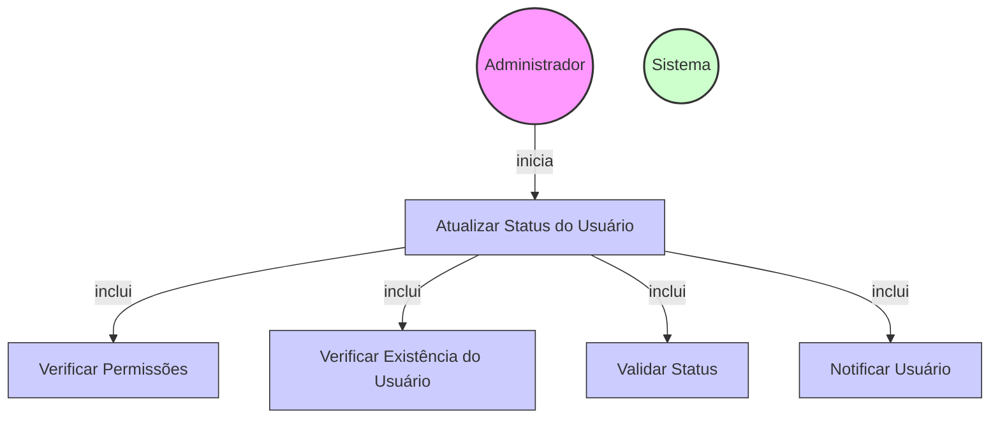

# Diagrama de Caso de Uso - Atualização de Status de Usuários

## Descrição do Diagrama de Caso de Uso

Este diagrama representa o processo de atualização de status de usuários no sistema tuhogar-api.

### Atores
- **Administrador**: Usuário com privilégios elevados que pode alterar o status de qualquer usuário
- **Sistema**: O sistema tuhogar-api

### Casos de Uso
1. **Atualizar Status do Usuário**: Caso de uso principal que representa o processo completo de atualização de status
2. **Verificar Permissões**: Validação se o solicitante tem permissão para atualizar o status do usuário
3. **Verificar Existência do Usuário**: Validação se o usuário a ter o status atualizado existe
4. **Validar Status**: Verificação se o novo status é válido
5. **Notificar Usuário**: Envio de notificação ao usuário sobre a mudança de status

### Relacionamentos
- O Administrador inicia o processo de atualização de status
- O processo de atualização de status inclui verificação de permissões, verificação de existência do usuário, validação do status e notificação do usuário

### Regras de Negócio
- Apenas administradores podem atualizar o status de usuários
- O usuário deve existir no sistema
- O novo status deve ser um valor válido (ACTIVE ou INACTIVE)
- O usuário deve ser notificado sobre a mudança de status
- A atualização de status pode afetar o acesso do usuário ao sistema
