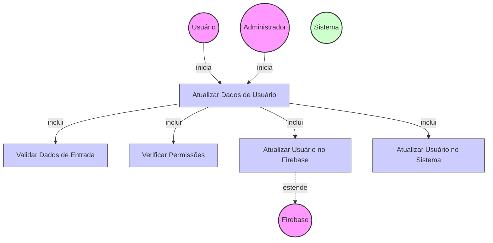

# Diagrama de Caso de Uso - Atualização de Dados de Usuários

## Descrição do Diagrama de Caso de Uso

Este diagrama representa o processo de atualização de dados de usuários no sistema tuhogar-api.

### Atores
- **Usuário**: Pessoa que deseja atualizar seus próprios dados
- **Administrador**: Pessoa com permissões para atualizar dados de outros usuários
- **Firebase**: Serviço externo de autenticação
- **Sistema**: O sistema tuhogar-api

### Casos de Uso
1. **Atualizar Dados de Usuário**: Caso de uso principal que representa o processo completo de atualização
2. **Validar Dados de Entrada**: Verificação dos dados fornecidos para atualização
3. **Verificar Permissões**: Verificação se o usuário tem permissão para realizar a atualização
4. **Atualizar Usuário no Firebase**: Atualização dos dados do usuário na plataforma Firebase
5. **Atualizar Usuário no Sistema**: Persistência dos dados atualizados no banco de dados do sistema

### Relacionamentos
- O Usuário ou Administrador inicia o processo de atualização
- O processo de atualização inclui validação de dados, verificação de permissões, atualização no Firebase e atualização no sistema
- A atualização no Firebase é uma extensão que depende do serviço externo Firebase
