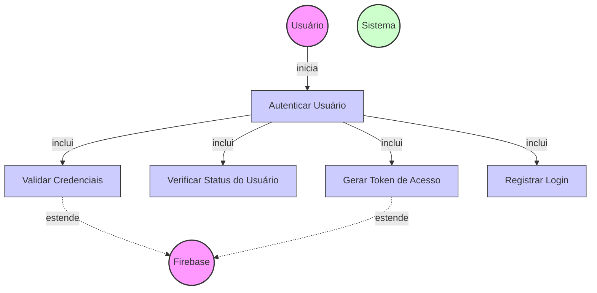

# Diagrama de Caso de Uso - Autenticação de Usuários (Login)

## Descrição do Diagrama de Caso de Uso

Este diagrama representa o processo de autenticação de usuários (login) no sistema tuhogar-api.

### Atores
- **Usuário**: Pessoa que deseja se autenticar no sistema
- **Firebase**: Serviço externo de autenticação
- **Sistema**: O sistema tuhogar-api

### Casos de Uso
1. **Autenticar Usuário**: Caso de uso principal que representa o processo completo de login
2. **Validar Credenciais**: Verificação das credenciais fornecidas pelo usuário
3. **Verificar Status do Usuário**: Verificação se o usuário está ativo no sistema
4. **Gerar Token de Acesso**: Geração de token JWT para autorização
5. **Registrar Login**: Registro da atividade de login no sistema

### Relacionamentos
- O Usuário inicia o processo de autenticação
- O processo de autenticação inclui validação de credenciais, verificação de status, geração de token e registro de login
- A validação de credenciais e a geração de token são extensões que dependem do serviço externo Firebase
