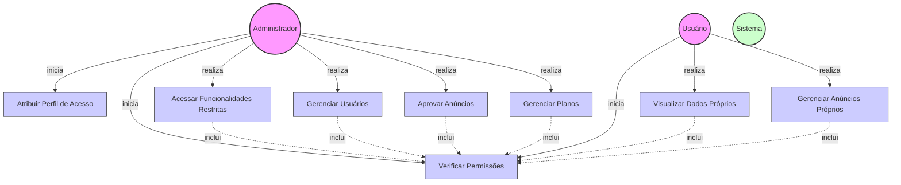

# Diagrama de Caso de Uso - Controle de Níveis de Acesso por Perfis

## Descrição do Diagrama de Caso de Uso

Este diagrama representa o sistema de controle de níveis de acesso por perfis no sistema tuhogar-api.

### Atores
- **Administrador**: Usuário com privilégios elevados no sistema
- **Usuário**: Usuário comum com acesso limitado
- **Sistema**: O sistema tuhogar-api

### Casos de Uso
1. **Atribuir Perfil de Acesso**: Definição do nível de acesso de um usuário (ADMIN ou USER)
2. **Verificar Permissões**: Validação se o usuário tem permissão para acessar determinada funcionalidade
3. **Acessar Funcionalidades Restritas**: Acesso a funcionalidades disponíveis apenas para administradores
4. **Gerenciar Usuários**: Criação, edição, exclusão e visualização de usuários
5. **Aprovar Anúncios**: Moderação e aprovação de anúncios submetidos pelos usuários
6. **Gerenciar Planos**: Criação, edição e exclusão de planos de assinatura
7. **Visualizar Dados Próprios**: Acesso aos próprios dados de perfil
8. **Gerenciar Anúncios Próprios**: Criação, edição e exclusão dos próprios anúncios

### Relacionamentos
- O Administrador pode atribuir perfis de acesso, verificar permissões e acessar todas as funcionalidades do sistema
- O Usuário comum pode verificar suas próprias permissões, visualizar seus dados e gerenciar seus próprios anúncios
- Todas as funcionalidades incluem a verificação de permissões antes de permitir o acesso

### Níveis de Acesso
- **ADMIN**: Acesso completo ao sistema, incluindo gerenciamento de usuários, aprovação de anúncios e gerenciamento de planos
- **USER**: Acesso limitado às próprias informações e anúncios
