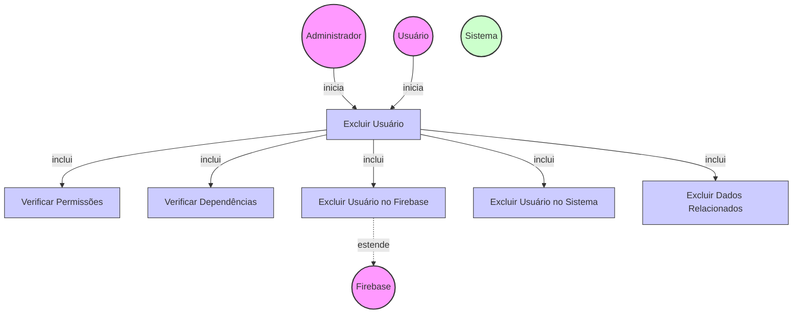

# Diagrama de Caso de Uso - Exclusão de Usuários

## Descrição do Diagrama de Caso de Uso

Este diagrama representa o processo de exclusão de usuários no sistema tuhogar-api.

### Atores
- **Administrador**: Usuário com privilégios elevados que pode excluir qualquer usuário
- **Usuário**: Pessoa que pode solicitar a exclusão de sua própria conta
- **Firebase**: Serviço externo de autenticação
- **Sistema**: O sistema tuhogar-api

### Casos de Uso
1. **Excluir Usuário**: Caso de uso principal que representa o processo completo de exclusão
2. **Verificar Permissões**: Validação se o solicitante tem permissão para excluir o usuário
3. **Verificar Dependências**: Verificação de dados relacionados que podem impedir a exclusão
4. **Excluir Usuário no Firebase**: Remoção do usuário na plataforma Firebase
5. **Excluir Usuário no Sistema**: Remoção dos dados do usuário no banco de dados do sistema
6. **Excluir Dados Relacionados**: Remoção ou atualização de dados relacionados ao usuário

### Relacionamentos
- O Administrador ou o próprio Usuário iniciam o processo de exclusão
- O processo de exclusão inclui verificação de permissões, verificação de dependências, exclusão no Firebase, exclusão no sistema e exclusão de dados relacionados
- A exclusão no Firebase é uma extensão que depende do serviço externo Firebase

### Regras de Negócio
- Um usuário comum só pode excluir sua própria conta
- Um administrador pode excluir qualquer conta de usuário
- A exclusão só é permitida se não houver dependências críticas
- A exclusão no sistema só ocorre após a exclusão bem-sucedida no Firebase
- Dados relacionados (como favoritos, anúncios, etc.) devem ser tratados adequadamente
