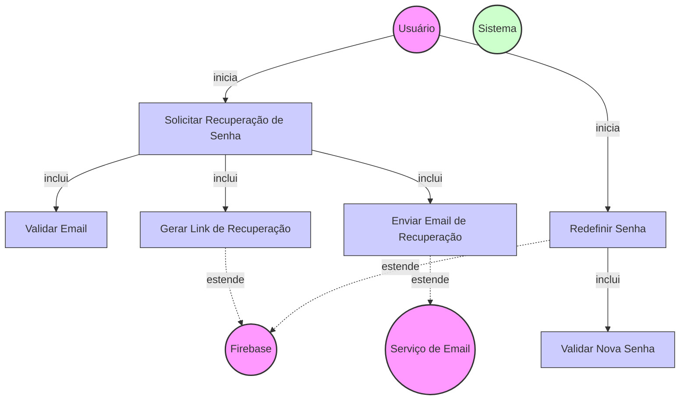

# Diagrama de Caso de Uso - Recuperação de Senha

## Descrição do Diagrama de Caso de Uso

Este diagrama representa o processo de recuperação de senha no sistema tuhogar-api.

### Atores
- **Usuário**: Pessoa que deseja recuperar sua senha
- **Firebase**: Serviço externo de autenticação
- **Serviço de Email**: Serviço responsável pelo envio de emails
- **Sistema**: O sistema tuhogar-api

### Casos de Uso
1. **Solicitar Recuperação de Senha**: Caso de uso principal que representa o início do processo de recuperação
2. **Validar Email**: Verificação se o email fornecido está associado a uma conta existente
3. **Gerar Link de Recuperação**: Criação de um link seguro para redefinição de senha
4. **Enviar Email de Recuperação**: Envio do email contendo o link de recuperação
5. **Redefinir Senha**: Processo de definição de uma nova senha pelo usuário
6. **Validar Nova Senha**: Verificação se a nova senha atende aos requisitos de segurança

### Relacionamentos
- O Usuário inicia o processo de solicitação de recuperação de senha
- O processo de solicitação inclui validação de email, geração de link e envio de email
- O Usuário também inicia o processo de redefinição de senha (após acessar o link)
- O processo de redefinição inclui validação da nova senha
- A geração de link e a redefinição de senha são extensões que dependem do serviço Firebase
- O envio de email é uma extensão que depende do serviço de Email
