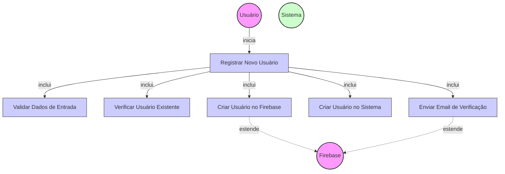

# Diagrama de Caso de Uso - Registro de Novos Usuários

## Descrição do Diagrama de Caso de Uso

Este diagrama representa o processo de registro de novos usuários no sistema tuhogar-api.

### Atores
- **Usuário**: Pessoa que deseja se registrar no sistema
- **Firebase**: Serviço externo de autenticação
- **Sistema**: O sistema tuhogar-api

### Casos de Uso
1. **Registrar Novo Usuário**: Caso de uso principal que representa o processo completo de registro
2. **Validar Dados de Entrada**: Verificação dos dados fornecidos pelo usuário
3. **Verificar Usuário Existente**: Verificação se o usuário já existe no sistema
4. **Criar Usuário no Firebase**: Criação do usuário na plataforma Firebase
5. **Criar Usuário no Sistema**: Persistência dos dados do usuário no banco de dados do sistema
6. **Enviar Email de Verificação**: Envio de email para verificação da conta

### Relacionamentos
- O Usuário inicia o processo de registro
- O processo de registro inclui validação de dados, verificação de existência, criação no Firebase, criação no sistema e envio de email
- A criação no Firebase e o envio de email são extensões que dependem do serviço externo Firebase
