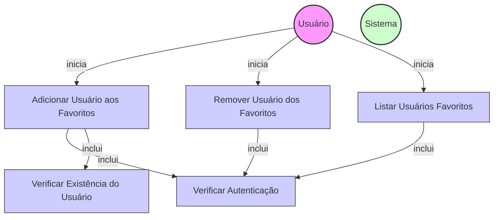

# Diagrama de Caso de Uso - Gerenciamento de Usuários Favoritos

## Descrição do Diagrama de Caso de Uso

Este diagrama representa o sistema de gerenciamento de usuários favoritos no sistema tuhogar-api.

### Atores
- **Usuário**: Pessoa que utiliza o sistema e deseja gerenciar sua lista de usuários favoritos
- **Sistema**: O sistema tuhogar-api

### Casos de Uso
1. **Adicionar Usuário aos Favoritos**: Processo de adicionar um usuário à lista de favoritos
2. **Remover Usuário dos Favoritos**: Processo de remover um usuário da lista de favoritos
3. **Listar Usuários Favoritos**: Consulta da lista de usuários favoritos
4. **Verificar Autenticação**: Validação se o usuário está autenticado no sistema
5. **Verificar Existência do Usuário**: Validação se o usuário a ser adicionado aos favoritos existe

### Relacionamentos
- O Usuário inicia os processos de adicionar, remover e listar usuários favoritos
- O processo de adicionar usuário aos favoritos inclui verificação de autenticação e existência do usuário
- Os processos de remover e listar usuários favoritos incluem verificação de autenticação

### Funcionalidades
- Um usuário pode adicionar outros usuários à sua lista de favoritos
- Um usuário pode remover usuários de sua lista de favoritos
- Um usuário pode consultar sua lista de usuários favoritos
- Todas as operações requerem que o usuário esteja autenticado
- A adição aos favoritos requer que o usuário a ser adicionado exista no sistema
